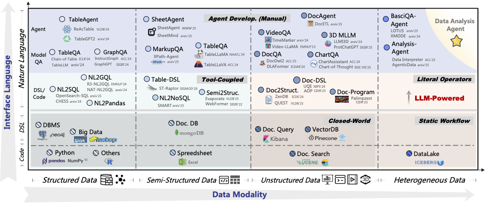

# LLM × DATA 综述

[English](README.md) | [中文](README_CN.md)

> 本仓库汇集了大语言模型（LLMs）及其数据中心化方法相关的论文与项目。[](https://arxiv.org/abs/2505.18458)
>
> 其他公开资料：[[Slides]](./assets/DATA4LLM-10-22-en.pdf)
>
> 如果您觉得我们的综述有用，请引用以下论文：

```
@article{LLMDATASurvey,
    title={A Survey of LLM × DATA},
    author={Xuanhe Zhou, Junxuan He, Wei Zhou, Haodong Chen, Zirui Tang, Haoyu Zhao, Xin Tong, Guoliang Li, Youmin Chen, Jun Zhou, Zhaojun Sun, Binyuan Hui, Shuo Wang, Conghui He, Zhiyuan Liu, Jingren Zhou, Fan Wu},
    year={2025},
    journal={arXiv preprint arXiv:2505.18458},
    url={https://arxiv.org/abs/2505.18458}
}
@article{tangllmasanalyst,
    title={LLM/Agent-as-Data-Analyst: A Survey},
    author={Zirui Tang, Weizheng Wang, Zihang Zhou, Yang Jiao, Bangrui Xu, Boyu Niu, Xuanhe Zhou, Guoliang Li, Yeye He, Wei Zhou, Yitong Song, Cheng Tan, Bin Wang, Conghui He, Xiaoyang Wang, Fan Wu},
    year={2025},
    journal={arXiv preprint arXiv:2509.23988},
    url={https://arxiv.org/abs/2509.23988}
}
```

## 🌤 DATA4LLM 的 IaaS 理念

**IaaS** 理念（与 *Infrastructure as a Service* 谐音）从四个关键维度定义了 LLM 高质量数据集的特征：(1) **Inclusiveness（包容性）** 确保跨领域、任务、来源、语言、风格和模态的广泛覆盖；(2) **Abundance（丰富性）** 强调充足且均衡的数据量，以支持模型扩展、微调和持续学习而不发生过拟合；(3) **Articulation（清晰性）** 要求内容清晰、连贯且具有指导性，通过逐步推理增强模型理解和任务表现；(4) **Sanitization（净化性）** 涉及严格过滤以去除隐私、有毒、不道德和误导性内容，确保数据安全、中立和合规。[](https://arxiv.org/abs/2505.18458)

[](https://github.com/SUPERZJ827/LLM4DB/blob/main/assets/iaas_overview_v2.png)

## 🌟 LLM/Agent-as-Data-Analyst

我们观察到 **LLM/Agent-as-Data-Analyst** 技术的演进遵循五个维度的发展轨迹：(1) Data Modality（数据模态）：同质 → 异构；(2) Analysis Functionality（分析功能）：字面 → 语义；(3) Knowledge Scope（知识范围）：封闭世界 → 开放世界；(4) Tool Integration（工具集成）：工具耦合 → 工具辅助；(5) Development Autonomy（开发自主性）：人工 → 全自主。[](https://arxiv.org/abs/2509.23988)

[](assets/data_analysis_survey_v2.png)

## 目录

- [数据集](#数据集)
- [0 LLM 各阶段的数据特征](#0-llm-各阶段的数据特征)
  - [预训练数据](#预训练数据)
  - [持续预训练数据](#持续预训练数据)
  - [监督微调数据 (SFT)](#监督微调数据-sft)
  - [强化学习数据 (RL)](#强化学习数据-rl)
  - [检索增强生成数据 (RAG)](#检索增强生成数据-rag)
  - [LLM 评估数据](#llm-评估数据)
  - [LLM Agent 数据](#llm-agent-数据)
- [1 面向 LLM 的数据处理](#1-面向-llm-的数据处理)
  - [1.1 数据获取](#11-数据获取)
  - [1.2 数据去重](#12-数据去重)
  - [1.3 数据过滤](#13-数据过滤)
  - [1.4 数据选择](#14-数据选择)
  - [1.5 数据混合](#15-数据混合)
  - [1.6 数据蒸馏与合成](#16-数据蒸馏与合成)
  - [1.7 端到端数据处理流水线](#17-端到端数据处理流水线)
- [2 面向 LLM 的数据存储](#2-面向-llm-的数据存储)
  - [2.1 数据格式](#21-数据格式)
  - [2.2 数据分发](#22-数据分发)
  - [2.3 数据组织](#23-数据组织)
  - [2.4 数据移动](#24-数据移动)
  - [2.5 数据容错](#25-数据容错)
  - [2.6 KV Cache](#26-kv-cache)
- [3 面向 LLM 的数据服务](#3-面向-llm-的数据服务)
  - [3.1 数据混洗](#31-数据混洗)
  - [3.2 数据压缩](#32-数据压缩)
  - [3.3 数据打包](#33-数据打包)
  - [3.4 数据溯源](#34-数据溯源)
- [4 面向数据管理的 LLM](#4-面向数据管理的-llm)
  - [4.1 LLM 用于数据操作](#41-llm-用于数据操作)
  - [4.2 LLM 用于数据系统优化](#42-llm-用于数据系统优化)
- [5 LLM 作为数据分析师](#5-llm-作为数据分析师)
  - [5.1 LLM 用于结构化数据分析](#51-llm-用于结构化数据分析)
  - [5.2 LLM 用于半结构化数据分析](#52-llm-用于半结构化数据分析)
  - [5.3 LLM 用于非结构化数据分析](#53-llm-用于非结构化数据分析)
  - [5.4 LLM 用于异构数据分析](#54-llm-用于异构数据分析)

## 数据集

1. **CommonCrawl**：覆盖多种语言和领域的大规模网络爬取数据集；广泛用于 LLM 预训练。[[Source](https://commoncrawl.org/latest-crawl)]

1. **The Stack**：包含多种编程语言的大规模许可开源代码数据集；用于代码 LLM 训练。[[HuggingFace](https://huggingface.co/datasets/bigcode/the-stack-v2)]

1. **RedPajama**：复现 LLaMA 训练数据配方的开放数据集；涵盖网页、书籍、arXiv 等。[[Github](https://github.com/togethercomputer/RedPajama-Data)]

1. **SlimPajama-627B-DC**：RedPajama 的去重和过滤子集（627B tokens）；针对干净高效的训练进行了优化。[[HuggingFace](https://huggingface.co/datasets/MBZUAI-LLM/SlimPajama-627B-DC)]

1. **Alpaca-CoT**：增强了 Chain-of-Thought (CoT) 推理提示的指令跟随数据集；用于对话微调。[[Github](https://github.com/PhoebusSi/Alpaca-CoT?tab=readme-ov-file)]

1. **LLaVA-Pretrain**：包含图像-文本对的多模态数据集，用于训练如 LLaVA 等视觉语言模型。[[HuggingFace](https://huggingface.co/datasets/liuhaotian/LLaVA-Pretrain)]

1. **Wikipedia**：结构化的百科全书式内容；通用语言模型的基础数据源。[[HuggingFace](https://huggingface.co/datasets/wikimedia/wikipedia)]

1. **C4**：CommonCrawl 数据的清洗版本，在 T5 等模型中广泛用于高质量网页文本训练。[[HuggingFace](https://huggingface.co/datasets/allenai/c4)]

1. **BookCorpus**：包含免费小说书籍；常用于训练模型的长文本理解能力。[[HuggingFace](https://huggingface.co/datasets/bookcorpus/bookcorpus)]

1. **Arxiv**：来自 arXiv 的科学论文语料库，涵盖物理学、数学、计算机科学等；适用于学术语言建模。[[HuggingFace](https://huggingface.co/datasets/arxiv-community/arxiv_dataset)]

1. **PubMed**：来自 PubMed 数据库的生物医学文献数据集；医疗领域模型的关键资源。[[Source](https://pubmed.ncbi.nlm.nih.gov/download/)]

1. **StackExchange**：覆盖编程、数学、哲学等领域的社区问答数据；适用于问答和对话任务。[[Source](https://archive.org/details/stackexchange)]

1. **OpenWebText2**：基于 Reddit 常引用 URL 的高质量开源网页文本数据集；GPT 风格的训练语料。[[Source](https://openwebtext2.readthedocs.io/en/latest/)]

1. **OpenWebMath**：数学问题与解答数据集；旨在提升 LLM 的数学推理能力。[[HuggingFace](https://huggingface.co/datasets/open-web-math/open-web-math)]

1. **Falcon-RefinedWeb**：用于训练 Falcon 模型的过滤网页数据；通过严格预处理强调数据质量。[[HuggingFace](https://huggingface.co/datasets/tiiuae/falcon-refinedweb)]

1. **CCI 3.0**：大规模多领域中文网页语料库，适用于训练高质量中文 LLM。[[HuggingFace](https://huggingface.co/datasets/BAAI/CCI3-Data)]

1. **OmniCorpus**：统一的多模态数据集（文本、图像、音频），为通用 AI 训练设计。[[Github](https://github.com/OpenGVLab/OmniCorpus?tab=readme-ov-file)]

1. **WanJuan3.0**：包含新闻、小说、问答等的多样化大规模中文数据集；由 OpenDataLab 发布。[[Source](https://opendatalab.org.cn/OpenDataLab/WanJuan3)]


## 0 LLM 各阶段的数据特征

[**⬆️返回目录**](#目录)

### 预训练数据

1. **OBELICS: An Open Web-Scale Filtered Dataset of Interleaved Image-Text Documents**  
   Hugo Laurençon, Lucile Saulnier, Léo Tronchon, et al. *NeurIPS 2023*. [[Paper](https://neurips.cc/virtual/2023/poster/73589 )] 
2. **Aligning Books and Movies: Towards Story-like Visual Explanations by Watching Movies and Reading Books**  
   Yukun Zhu, Ryan Kiros, Richard Zemel, et al. *ICCV 2015*. [[Paper](https://www.cv-foundation.org/openaccess/content_iccv_2015/papers/Zhu_Aligning_Books_and_ICCV_2015_paper.pdf)] 

### 持续预训练数据

1. **MedicalGPT: Training Medical GPT Model**   
   Ming Xu. 2025. [[Github](https://github.com/shibing624/MedicalGPT)]
2. **BBT-Fin: Comprehensive Construction of Chinese Financial Domain Pre-trained Language Model, Corpus and Benchmark**   
   Dakuan Lu, Hengkui Wu, Jiaqing Liang, et al. *arXiv 2023*. [[Paper](https://arxiv.org/abs/2302.09432 )] 

### 监督微调数据 (SFT)

#### 通用指令跟随

1. **Free dolly: Introducing the world's first truly open instruction-tuned llm**    
Mike Conover, Matt Hayes, Ankit Mathur, et al. *2023*. [[Source](https://www.databricks.com/blog/2023/04/12/dolly-first-open-commercially-viable-instruction-tuned-llm)]

#### 特定领域应用

1. **MedicalGPT: Training Medical GPT Model** [[Github](https://github.com/shibing624/MedicalGPT)]
2. **DISC-LawLLM: Fine-tuning Large Language Models for Intelligent Legal Services**  
   Shengbin Yue, Wei Chen, Siyuan Wang, et al. *arXiv 2023*. [[Paper](https://arxiv.org/abs/2309.11325)]

### 强化学习数据 (RL)

#### RLHF

1. **MedicalGPT: Training Medical GPT Model** [[Github](https://github.com/shibing624/MedicalGPT)]
2. **UltraFeedback: Boosting Language Models with Scaled AI Feedback**  
   Ganqu Cui, Lifan Yuan, Ning Ding, et al. *ICML 2024*. [[Paper](https://arxiv.org/abs/2310.01377)]

#### RoRL

1. **DeepSeek-R1: Incentivizing Reasoning Capability in LLMs via Reinforcement Learning**  
   DeepSeek-AI. *arXiv 2025*. [[Paper](https://arxiv.org/abs/2501.12948)]
2. **Kimi k1.5: Scaling Reinforcement Learning with LLMs**  
   Kimi Team. *arXiv 2025*. [[Paper](https://arxiv.org/abs/2501.12599)]

### 检索增强生成数据 (RAG)

1. **DH-RAG: A Dynamic Historical Context-Powered Retrieval-Augmented Generation Method for Multi-Turn Dialogue**  
   Feiyuan Zhang, Dezhi Zhu, James Ming, et al. *arXiv 2025*. [[Paper](https://arxiv.org/abs/2502.13847)]
2. **Medical Graph RAG: Towards Safe Medical Large Language Model via Graph Retrieval-Augmented Generation**  
   Junde Wu, Jiayuan Zhu, Yunli Qi, et al. *arXiv 2024*. [[Paper](https://arxiv.org/abs/2408.04187)]
3. **ERAGent: Enhancing Retrieval-Augmented Language Models with Improved Accuracy, Efficiency, and Personalization**  
   Yunxiao Shi, Xing Zi, Zijing Shi, et al. *arXiv 2024.* [[Paper](https://arxiv.org/abs/2405.06683)]
4. **PersonaRAG: Enhancing Retrieval-Augmented Generation Systems with User-Centric Agents**  
   Saber Zerhoudi, Michael Granitzer. *arXiv 2024*. [[Paper](https://arxiv.org/abs/2407.09394)]
5. **DISC-LawLLM: Fine-tuning Large Language Models for Intelligent Legal Services** [[Paper](https://arxiv.org/abs/2309.11325)]

### LLM 评估数据

1. **MMMU: A Massive Multi-discipline Multimodal Understanding and Reasoning Benchmark for Expert AGI**  
   Xiang Yue, Yuansheng Ni, Kai Zhang, et al. *CVPR 2024*. [[Paper](https://openaccess.thecvf.com/content/CVPR2024/papers/Yue_MMMU_A_Massive_Multi-discipline_Multimodal_Understanding_and_Reasoning_Benchmark_for_CVPR_2024_paper.pdf)]
2. **LexEval: A Comprehensive Chinese Legal Benchmark for Evaluating Large Language Models**  
   Haitao Li, You Chen, Qingyao Ai, et al. *NeurIPS 2024*. [[Paper](https://arxiv.org/abs/2409.20288)]
3. **What disease does this patient have? a large-scale open domain question answering dataset from medical exams**   
   Di Jin, Eileen Pan, Nassim Oufattole, et al. *AAAI 2021*. [[Paper](https://arxiv.org/abs/2009.13081)]
4. **Evaluating Large Language Models Trained on Code**  
   Mark Chen, Jerry Tworek, Heewoo Jun, et al. *arXiv 2021*. [[Paper](https://arxiv.org/abs/2107.03374)]

### LLM Agent 数据

1. **STeCa: Step-level Trajectory Calibration for LLM Agent Learning**  
   Hanlin Wang, Jian Wang, Chak Tou Leong, Wenjie Li. *arXiv 2025*. [[Paper](https://arxiv.org/abs/2502.14276)]
2. **Large Language Model-Based Agents for Software Engineering: A Survey**  
   Junwei Liu, Kaixin Wang, Yixuan Chen, et al. *arXiv 2024*. [[Paper](https://arxiv.org/abs/2409.02977)]
3. **Advancing LLM Reasoning Generalists with Preference Trees**  
   Lifan Yuan, Ganqu Cui, Hanbin Wang, et al. *arXiv 2024*. [[Paper](https://arxiv.org/abs/2404.02078)]
4. **Tool Learning in the Wild: Empowering Language Models as Automatic Tool Agents**  
   Zhengliang Shi, Shen Gao, Lingyong Yan, et al. *arXiv 2024*. [[Paper](https://arxiv.org/abs/2405.16533)]
5. **Enhancing Chat Language Models by Scaling High-quality Instructional Conversations**  
   Ning Ding, Yulin Chen, Bokai Xu, et al. *EMNLP 2023*. [[Paper](https://aclanthology.org/2023.emnlp-main.183/)]

## 1 面向 LLM 的数据处理

[⬆️返回目录](#目录)

### 1.1 数据获取

#### 数据来源

##### 公开数据

1. **Project Gutenberg**：来自公共领域的大量免费电子书集合；支持基于长篇文学文本训练语言模型。[[Source](https://www.gutenberg.org/)]
2. **Open Library**：包含元数据和部分开放获取内容的全球图书目录；适用于多语言和知识增强的语言建模。[[Source](https://openlibrary.org/)]
3. **GitHub**：全球最大的开源代码托管平台；支持代码生成和理解模型的训练。[[Source](https://github.com/)]
4. **GitLab**：托管私有和开源项目的 DevOps 平台；提供高质量的编程和文档数据。[[Source]( https://gitlab.com/)]
5. **Bitbucket**：Atlassian 的源代码托管平台；适合挖掘企业级软件开发数据。[[Source](https://bitbucket.org/product/)] 
6. **CulturaX: A Cleaned, Enormous, and Multilingual Dataset for Large Language Models in 167 Languages**  
   Thuat Nguyen, Chien Van Nguyen, Viet Dac Lai, et al. *LREC-COLING 2024.* [[Paper](https://aclanthology.org/2024.lrec-main.377.pdf)]
7. **The Stack: 3 TB of permissively licensed source code**  
   Denis Kocetkov, Raymond Li, Loubna Ben Allal, et al. *arXiv 2022*. [[Paper](https://arxiv.org/abs/2211.15533)]
8. **mT5: A Massively Multilingual Pre-trained Text-to-Text Transformer**  
   Linting Xue, Noah Constant, Adam Roberts, et al. *NAACL 2021.* [[Paper](https://aclanthology.org/2021.naacl-main.41.pdf)]
9. **Exploring the limits of transfer learning with a unified text-to-text transformer**  
     Colin Raffel, Noam Shazeer, Adam Roberts, et al. *JMLR 2020.* [[Paper](https://arxiv.org/abs/1910.10683)]
10. **CodeSearchNet Challenge: Evaluating the State of Semantic Code Search**  
    Hamel Husain, Ho-Hsiang Wu, Tiferet Gazit, et al. *arXiv 2019*. [[Paper](https://arxiv.org/abs/1909.09436)]
11. **Aligning Books and Movies: Towards Story-like Visual Explanations by Watching Movies and Reading Books** [[Paper](https://www.cv-foundation.org/openaccess/content_iccv_2015/papers/Zhu_Aligning_Books_and_ICCV_2015_paper.pdf)] 


#### 数据获取方法

##### 网页爬取

1. **Beautiful Soup**：基于 Python 的 HTML 和 XML 文档解析库；支持从静态网页提取结构化信息。[[Source](https://beautiful-soup-4.readthedocs.io/en/latest/)]
2. **Selenium**：浏览器自动化工具，可与动态网页交互；适合爬取 JavaScript 重度内容。[[Github]( https://github.com/seleniumhq/selenium)]
3. **Playwright**：Microsoft 开发的浏览器自动化框架；支持多浏览器环境,是高质量并发网页爬取任务的理想选择。[[Source](https://playwright.dev/)]
4. **Puppeteer**：提供高级 API 来控制无头 Chrome 或 Chromium 的 Node.js 库；适用于爬取复杂页面、截图或生成 PDF。[[Source](https://pptr.dev/)]
5. **An Empirical Comparison of Web Content Extraction Algorithms**  
   Janek Bevendorff, Sanket Gupta, Johannes Kiesel, Benno Stein. *SIGIR 2023*. [[Paper](https://dl.acm.org/doi/10.1145/3539618.3591920)]
6. **Trafilatura: A Web Scraping Library and Command-Line Tool for Text Discovery and Extraction**  
   Adrien Barbaresi. *ACL 2021 Demo*. [[Paper](https://aclanthology.org/2021.acl-demo.15/)]
7. **Fact or Fiction: Content Classification for Digital Libraries**  
   Aidan Finn, N. Kushmerick, Barry Smyth. *DELOS Workshops / Conferences 2001.* [[Paper](https://www.semanticscholar.org/paper/Fact-or-Fiction%3A-Content-Classification-for-Digital-Finn-Kushmerick/73ccd5c477b37a082f66557a1793852d405e4b6d)]

##### 版面分析

1. **PaddleOCR**：基于 PaddlePaddle 深度学习框架的开源光学字符识别 (OCR) 工具包；支持多语言文本检测和识别,是从图像中提取文本和文档版面分析的理想选择。[[Github](https://github.com/paddlepaddle/paddleocr)]
2. **YOLOv10: Real-Time End-to-End Object Detection**  
   Ao Wang, Hui Chen, Lihao Liu, et al. *NeurIPS 2024.* [[Paper](https://arxiv.org/abs/2405.14458)]
3. **UMIE: Unified Multimodal Information Extraction with Instruction Tuning**  
   Lin Sun, Kai Zhang, Qingyuan Li, Renze Lou. *AAAI 2024.* [[Paper](https://ojs.aaai.org/index.php/AAAI/article/view/29873)]
4. **ChatEL: Entity Linking with Chatbots**  
   Yifan Ding, Qingkai Zeng, Tim Weninger. *LREC-COLING 2024*. [[Paper](https://aclanthology.org/2024.lrec-main.275/)]
5. **Vary: Scaling up the Vision Vocabulary for Large Vision-Language Models**  
   Haoran Wei, Lingyu Kong, Jinyue Chen, et al. *ECCV 2024.* [[Paper](https://link.springer.com/chapter/10.1007/978-3-031-73235-5_23)]
6. **General OCR Theory: Towards OCR - 2.0 via a Unified End - to - end Model**  
   Haoran Wei, Chenglong Liu, Jinyue Chen, et al. *arXiv 2024.* [[Paper](https://arxiv.org/abs/2409.01704v1)]
7. **Focus Anywhere for Fine-grained Multi-page Document Understanding**  
   Chenglong Liu, Haoran Wei, Jinyue Chen, et al. *arXiv 2024.* [[Paper](https://arxiv.org/abs/2405.14295)]
8. **MinerU: An Open-Source Solution for Precise Document Content Extraction**  
   Bin Wang, Chao Xu, Xiaomeng Zhao, et al. *arXiv 2024.* [[Paper](https://arxiv.org/abs/2409.18839)]
9. **WebIE: Faithful and Robust Information Extraction on the Web**  
   Chenxi Whitehouse, Clara Vania, Alham Fikri Aji, et al. *ACL 2023.* [[Paper](https://aclanthology.org/2023.acl-long.428/)]
10. **ReFinED: An Efficient Zero-shot-capable Approach to End-to-End Entity Linking**  
    Tom Ayoola, Shubhi Tyagi, Joseph Fisher, et al. *NAACL 2022 Industry Track.* [[Paper](https://aclanthology.org/2022.naacl-industry.24.pdf)]
11. **Alignment-Augmented Consistent Translation for Multilingual Open Information Extraction**  
    Keshav Kolluru, Muqeeth Mohammed, Shubham Mittal, et al. *ACL 2022.* [[Paper](https://aclanthology.org/2022.acl-long.179/)]
12. **LayoutLMv3: Pre-training for Document AI with Unified Text and Image Masking**  
    Yupan Huang, Tengchao Lv, Lei Cui, et al. *ACM Multimedia 2022.* [[Paper](https://dl.acm.org/doi/abs/10.1145/3503161.3548112)]
13. **Learning Transferable Visual Models From Natural Language Supervision**  
    Alec Radford, Jong Wook Kim, Chris Hallacy, et al. *ICML 2021.* [[Paper](https://proceedings.mlr.press/v139/radford21a)]
14. **Tesseract: an open-source optical character recognition engine**  
    Anthony Kay. *Linux Journal, Volume 2007*. [[Paper](https://dl.acm.org/doi/10.5555/1288165.1288167)]


### 1.2 数据去重

[⬆️返回目录](#目录)

1. **Analysis of the Reasoning with Redundant Information Provided Ability of Large Language Models**  
   Wenbei Xie. *arXiv 2023.* [[Paper](https://arxiv.org/abs/2310.04039v1)]
2. **Scaling Laws and Interpretability of Learning from Repeated Data**  
   Danny Hernandez, Tom Brown, Tom Conerly, et al. *arXiv 2022.* [[Paper](https://arxiv.org/abs/2205.10487)]

#### 精确子串匹配

1. **BaichuanSEED: Sharing the Potential of ExtensivE Data Collection and     Deduplication by Introducing a Competitive Large Language Model Baseline**    
   Guosheng Dong, Da Pan, Yiding Sun, et al. *arXiv 2024.* [[Paper](https://arxiv.org/abs/2408.15079)]
2. **Deduplicating Training Data Makes Language Models Better**    
   Katherine Lee, Daphne Ippolito, Andrew Nystrom, et al. *ACL 2022.* [[Paper](https://arxiv.org/abs/2107.06499)]
3. **Suffix arrays: a new method for on-line string searches**  
   Udi Manber, Gene Myers. *SIAM Journal on Computing 1993.* [[Paper](https://doi.org/10.1137/0222058)]

#### 基于哈希的近似去重

1. **BaichuanSEED: Sharing the Potential of ExtensivE Data Collection and Deduplication by Introducing a Competitive Large Language Model Baseline** [[Paper](https://arxiv.org/abs/2408.15079)]
2. **LSHBloom: Memory-efficient, Extreme-scale Document Deduplication**  
   Arham Khan, Robert Underwood, Carlo Siebenschuh, et al. *arXiv 2024.* [[Paper](https://arxiv.org/abs/2411.04257)]
3. **SimiSketch: Efficiently Estimating Similarity of streaming Multisets**   
   Fenghao Dong, Yang He, Yutong Liang, et al. *arXiv 2024*. [[Paper](https://arxiv.org/abs/2405.19711)] 
4. **DotHash: Estimating Set Similarity Metrics for Link Prediction and Document Deduplication**  
   Igor Nunes, Mike Heddes, Pere Vergés, et al. *KDD 2023.* [[Paper](https://doi.org/10.1145/3580305.3599314)]
5. **Formalizing BPE Tokenization**  
   Martin Berglund (Umeå University), Brink van der Merwe (Stellenbosch University). *NCMA 2023*. [[Paper](https://arxiv.org/abs/2309.08715)]
6. **SlimPajama-DC: Understanding Data Combinations for LLM Training**  
   Zhiqiang Shen, Tianhua Tao, Liqun Ma, et al. *arXiv 2023.* [[Paper](https://arxiv.org/abs/2309.10818)]
7. **Deduplicating Training Data Makes Language Models Better** [[Paper](https://arxiv.org/abs/2107.06499)]
8. **Noise-Robust De-Duplication at Scale**  
   Emily Silcock, Luca D'Amico-Wong, Jinglin Yang, Melissa Dell. *arXiv 2022.* [[Paper](https://arxiv.org/abs/2210.04261)]
9. **In Defense of Minhash over Simhash**  
   Anshumali Shrivastava, Ping Li. *AISTATS 2014.* [[Paper](https://proceedings.mlr.press/v33/shrivastava14.html)]
10. **Similarity estimation techniques from rounding algorithms**  
    Moses S. Charikar. *STOC 2002.* [[Paper](https://doi.org/10.1145/509907.509965)]
11. **On the Resemblance and Containment of Documents**  
    A. Broder. *Compression and Complexity of SEQUENCES 1997.* [[Paper](https://doi.org/10.1109/SEQUEN.1997.666900)]

#### 基于频率的近似降权

1. **SoftDedup: an Efficient Data Reweighting Method for Speeding Up Language Model Pre-training**  
   Nan He, Weichen Xiong, Hanwen Liu, et al. *ACL 2024.* [[Paper](https://aclanthology.org/2024.acl-long.220/)]

#### 基于嵌入的聚类

1. **FairDeDup: Detecting and Mitigating Vision-Language Fairness Disparities in Semantic Dataset Deduplication**  
   Eric Slyman, Stefan Lee, Scott Cohen, Kushal Kafle. *CVPR 2024.* [[Paper](https://arxiv.org/abs/2404.16123)]
2. **Effective Pruning of Web-Scale Datasets Based on Complexity of Concept Clusters**  
   Amro Abbas, Evgenia Rusak, Kushal Tirumala, et al. *ICLR 2024.* [[Paper](https://doi.org/10.48550/arXiv.2401.04578)]
3. **D4: Improving LLM Pretraining via Document De-Duplication and Diversification**  
   Kushal Tirumala, Daniel Simig, Armen Aghajanyan, Ari Morcos. *NeurIPS 2023.* [[Paper](https://proceedings.neurips.cc/paper_files/paper/2023/hash/a8f8cbd7f7a5fb2c837e578c75e5b615-Abstract-Datasets_and_Benchmarks.html)]
4. **SemDeDup: Data-efficient learning at web-scale through semantic deduplication**  
   Amro Abbas, Kushal Tirumala, Dániel Simig, et al. *ICLR 2023.* [[Paper](https://iclr.cc/virtual/2023/13610)]
5. **OPT: Open Pre-trained Transformer Language Models**  
   Susan Zhang, Stephen Roller, Naman Goyal, et al. *arXiv 2022.* [[Paper](https://arxiv.org/abs/2205.01068v4)]
6. **Learning Transferable Visual Models From Natural Language Supervision** [[Paper](https://proceedings.mlr.press/v139/radford21a)]
7. **OpenCLIP**     
   Gabriel Ilharco, Mitchell Wortsman, Ross Wightman, et al. *2021*. [[Paper](https://doi.org/10.5281/zenodo.5143773)]
8. **LAION-400M: Open Dataset of CLIP-Filtered 400 Million Image-Text Pairs**  
   Christoph Schuhmann, Richard Vencu, Romain Beaumont, et al. *NeurIPS 2021.* [[Paper](https://doi.org/10.48550/arXiv.2111.02114)]

#### 非文本数据去重

1. **DataComp: In search of the next generation of multimodal datasets**  
   Samir Yitzhak Gadre, Gabriel Ilharco, Alex Fang, et al. *NeurIPS 2023*. [[Paper](https://arxiv.org/abs/2304.14108)]
2. **SemDeDup: Data-efficient learning at web-scale through semantic deduplication** [[Paper](https://iclr.cc/virtual/2023/13610)]
3. **Contrastive Learning with Large Memory Bank and Negative Embedding Subtraction for Accurate Copy Detection**  
   Shuhei Yokoo. *arXiv 2021*. [[Paper](https://arxiv.org/abs/2112.04323)]
4. **Learning Transferable Visual Models From Natural Language Supervision** [[Paper](https://proceedings.mlr.press/v139/radford21a)]


### 1.3 数据过滤

[⬆️返回目录](#目录)

#### 样本级过滤

##### (1) 统计评估

1. **Perplexed by Perplexity: Perplexity-Based Data Pruning With Small Reference Models**  
   Zachary Ankner, Cody Blakeney, Kartik Sreenivasan, et al. *ICLR 2025.* [[Paper](https://iclr.cc/virtual/2025/poster/31214)]
2. **Data-efficient Fine-tuning for LLM-based Recommendation**  
   Xinyu Lin, Wenjie Wang, Yongqi Li, et al. *SIGIR 2024.* [[Paper](https://arxiv.org/abs/2401.17197)]
3. **SHED: Shapley-Based Automated Dataset Refinement for Instruction Fine-Tuning**  
   Yexiao He, Ziyao Wang, Zheyu Shen, et al. *NeurIPS 2024.* [[Paper](https://arxiv.org/abs/2405.00705)]
4. **SmallToLarge (S2L): Scalable Data Selection for Fine-tuning Large Language Models by Summarizing Training Trajectories of Small Models**  
   Yu Yang, Siddhartha Mishra, Jeffrey Chiang, et al. *NeurIPS 2024.* [[Paper](https://neurips.cc/virtual/2024/poster/95679)]
5. **Effective Pruning of Web-Scale Datasets Based on Complexity of Concept Clusters** [[Paper](https://doi.org/10.48550/arXiv.2401.04578)]
6. **WizardLM: Empowering Large Pre-Trained Language Models to Follow Complex Instructions**  
   Can Xu, Qingfeng Sun, Kai Zheng, et al. *ICLR 2024.* [[Paper](https://iclr.cc/virtual/2024/poster/19164)]
7. **Superfiltering: Weak-to-Strong Data Filtering for Fast Instruction-Tuning**  
   Ming Li, Yong Zhang, Shwai He, et al. *ACL 2024.* [[Paper](https://doi.org/10.48550/arXiv.2402.00530)]
8. **Smaller Language Models are capable of selecting Instruction-Tuning Training Data for Larger Language Models**  
   Dheeraj Mekala, Alex Nguyen, Jingbo Shang. *ACL 2024*. [[Paper](https://aclanthology.org/2024.findings-acl.623/)]
9. **Dolma: an Open Corpus of Three Trillion Tokens for Language Model Pretraining Research**  
   Luca Soldaini, Rodney Kinney, Akshita Bhagia, et al. *ACL 2024*. [[Paper](https://arxiv.org/abs/2402.00159)]
10. **From Quantity to Quality: Boosting LLM Performance with Self-Guided Data Selection for Instruction Tuning**  
    Ming Li, Yong Zhang, Zhitao Li, et al. *NAACL 2024*. [[Paper](https://arxiv.org/abs/2308.12032)]
11. **Improving Pretraining Data Using Perplexity Correlations**  
    Tristan Thrush, Christopher Potts, Tatsunori Hashimoto. *arXiv 2024*. [[Paper](https://arxiv.org/abs/2409.05816)]
12. **Introducing MPT-7B: A New Standard for Open-Source, Commercially Usable LLMs**  
    The Mosaic Research Team. *2023*. [[Paper](https://www.databricks.com/blog/mpt-7b)]
13. **Instruction Tuning with GPT-4**  
    Baolin Peng, Chunyuan Li, Pengcheng He, et al. *arXiv 2023*. [[Paper](https://arxiv.org/abs/2304.03277)]
14. **DINOv2: Learning Robust Visual Features without Supervision**  
    Maxime Oquab, Timothée Darcet, Théo Moutakanni, et al. *arXiv 2023*. [[Paper](https://arxiv.org/abs/2304.07193)]
15. **The Pile: An 800GB Dataset of Diverse Text for Language Modeling**  
    Leo Gao, Stella Biderman, Sid Black, et al. *arXiv 2021*. [[Paper](https://arxiv.org/abs/2101.00027)]
16. **Language Models are Unsupervised Multitask Learners**  
    Alec Radford, Jeffrey Wu, Rewon Child, et al. *OpenAI blog 2019*. [[Paper](https://cdn.openai.com/better-language-models/language_models_are_unsupervised_multitask_learners.pdf)]
17. **Bag of Tricks for Efficient Text Classification**  
    Armand Joulin, Edouard Grave, Piotr Bojanowski, Tomas Mikolov. *EACL 2017.* [[Paper](https://aclanthology.org/E17-2068.pdf)]
18. **The Shapley Value: Essays in Honor of Lloyd S. Shapley**  
    A. E. Roth, Ed. *Cambridge: Cambridge University Press, 1988*. [[Source](https://www.cambridge.org/core/books/shapley-value/D3829B63B5C3108EFB62C4009E2B966E)]

##### (2) 模型评分

1. **SEAL: Safety-enhanced Aligned LLM Fine-tuning via Bilevel Data Selection**  
   Han Shen, Pin-Yu Chen, Payel Das, Tianyi Chen. *ICLR 2025.* [[Paper](https://iclr.cc/virtual/2025/poster/29422)]
2. **SCAR: Data Selection via Style-Consistency-Aware Response Ranking for Efficient Instruction Tuning of Large Language Models**  
   Zhuang Li, Yuncheng Hua, Thuy-Trang Vu, et al. *ACL 2025.* [[Paper](https://arxiv.org/abs/2406.10882)]
3. **QuRating: Selecting High-Quality Data for Training Language Models**  
   Alexander Wettig, Aatmik Gupta, Saumya Malik, Danqi Chen. *ICML 2024.* [[Paper](https://arxiv.org/abs/2402.09739)]
4. **What Makes Good Data for Alignment? A Comprehensive Study of Automatic Data Selection in Instruction Tuning**  
   Wei Liu, Weihao Zeng, Keqing He, et al. *ICLR 2024.* [[Paper](https://arxiv.org/abs/2312.15685)]
5. **LAB: Large-Scale Alignment for ChatBots**  
   Shivchander Sudalairaj, Abhishek Bhandwaldar, Aldo Pareja, et al. *arXiv 2024.* [[Paper](https://doi.org/10.48550/arXiv.2403.01081)]
6. **Biases in Large Language Models: Origins, Inventory, and Discussion**  
   Roberto Navigli, Simone Conia, Björn Ross. *ACM JDIQ, 2023.* [[Paper](https://doi.org/10.1145/3597307)]

##### (3) 混合方法

1. **Emergent and predictable memorization in large language models**  
   Stella Biderman, USVSN Sai Prashanth, Lintang Sutawika, et al. *NeurIPS 2023*. [[Paper](https://dl.acm.org/doi/10.5555/3666122.3667341?__cf_chl_tk=sWnInkGSOKRsrS.z3RwRKDT836eoSy1i.k5oxZcfDzA-1748509375-1.0.1.1-lmH0EWkZpuiyEr5uZPEd_C92GFkM6u6BY416q24qBww)]
2. **When Less is More: Investigating Data Pruning for Pretraining LLMs at Scale**  
   Max Marion, Ahmet Üstün, Luiza Pozzobon, et al. *arXiv 2023.* [[Paper](https://arxiv.org/abs/2309.04564)]
3. **Instruction Mining: Instruction Data Selection for Tuning Large Language Models**  
   Yihan Cao, Yanbin Kang, Chi Wang, Lichao Sun. *arXiv 2023.* [[Paper](https://arxiv.org/abs/2307.06290)]
4. **Llama 2: Open Foundation and Fine-Tuned Chat Models**  
   Hugo Touvron, Louis Martin, Kevin Stone, et al. *arXiv 2023*. [[Paper](https://arxiv.org/abs/2307.09288)]
5. **MoDS: Model-oriented Data Selection for Instruction Tuning**  
   Qianlong Du, Chengqing Zong, Jiajun Zhang. *arXiv 2023.* [[Paper](https://doi.org/10.48550/arXiv.2311.15653)]
6. **Economic Hyperparameter Optimization With Blended Search Strategy**  
   Chi Wang, Qingyun Wu, Silu Huang, Amin Saied. *ICLR 2021.* [[Paper](https://iclr.cc/virtual/2021/poster/3052)]
7. **BERT: Pre-training of Deep Bidirectional Transformers for Language Understanding**  
   Jacob Devlin, Ming-Wei Chang, Kenton Lee, et al. *NAACL 2019.* [[Paper](https://aclanthology.org/N19-1423.pdf)]
8. **Active Learning for Convolutional Neural Networks: A Core-Set Approach**  
   Ozan Sener, Silvio Savarese. *ICLR 2018.* [[Paper](https://doi.org/10.48550/arXiv.1708.00489)]

#### 内容级过滤

1. **spaCy**：工业级自然语言处理 (NLP) 库，支持分词、词性标注、命名实体识别、依存句法分析等；非常适合快速准确的文本处理和信息抽取。[[Source](https://spacy.io/)]
2. **CogVideoX: Text-to-Video Diffusion Models with An Expert Transformer**  
   Zhuoyi Yang, Jiayan Teng, Wendi Zheng, et al. *ICLR 2025*. [[Paper](https://arxiv.org/abs/2408.06072)]
3. **HunyuanVideo: A Systematic Framework For Large Video Generative Models**  
   Weijie Kong, Qi Tian, Zijian Zhang, et al. *arXiv 2025*. [[Paper](https://arxiv.org/abs/2412.03603v6)]
4. **Wan: Open and Advanced Large-Scale Video Generative Models**  
   Team Wan et al. *arXiv 2025*. [[Paper](https://arxiv.org/abs/2503.20314)]
5. **Video-LLaMA: An Instruction-tuned Audio-Visual Language Model for Video Understanding**   
   Hang Zhang, Xin Li, Lidong Bing. *EMNLP 2023 (System Demonstrations)*. [[Paper](https://arxiv.org/abs/2306.02858)]
6. **Analyzing Leakage of Personally Identifiable Information in Language Models**  
   Nils Lukas, Ahmed Salem, Robert Sim, et al. *IEEE S&P 2023.* [[Paper](https://arxiv.org/abs/2302.00539)]
7. **DeID-GPT: Zero-shot Medical Text De-Identification by GPT-4**  
   Zhengliang Liu, Yue Huang, Xiaowei Yu, et al. *arXiv 2023.* [[Paper](https://arxiv.org/abs/2303.11032)]
8. **Baichuan 2: Open Large-scale Language Models**  
   Aiyuan Yang, Bin Xiao, Bingning Wang, et al. *arXiv 2023.* [[Paper](https://arxiv.org/abs/2309.10305)]
9. **Exploring Video Quality Assessment on User Generated Contents from Aesthetic and Technical Perspectives**  
   Haoning Wu, Erli Zhang, Liang Liao, et al. *arXiv 2022*. [[Paper](https://arxiv.org/abs/2211.04894)]
10. **LAION-400M: Open Dataset of CLIP-Filtered 400 Million Image-Text Pairs** [[Paper](https://doi.org/10.48550/arXiv.2111.02114)]
11. **YOLOX: Exceeding YOLO Series in 2021**  
      Zheng Ge, Songtao Liu, Feng Wang, et al. *arXiv 2021*. [[Paper](https://arxiv.org/abs/2107.08430)]
12. **FLAIR: An Easy-to-Use Framework for State-of-the-Art NLP**  
    Alan Akbik, Tanja Bergmann, Duncan Blythe, et al. *NAACL 2019 Demos.* [[Paper](https://aclanthology.org/N19-4010/)]

### 1.4 数据选择

[⬆️返回目录](#目录)

1. **A Survey on Data Selection for Language Models**  
   Alon Albalak, Yanai Elazar, Sang Michael Xie, et al. *arXiv 2024*. [[Paper](https://arxiv.org/abs/2402.16827)]

2. **A Survey on Data Selection for LLM Instruction Tuning**  
   Jiahao Wang, Bolin Zhang, Qianlong Du, et al. *arXiv 2024.* [[Paper](https://arxiv.org/abs/2402.05123)]

#### 基于相似度的数据选择

1. **spaCy**:  [[Source](https://spacy.io/)]
2. **Enabling On-Device Large Language Model Personalization with Self-Supervised Data Selection and Synthesis**  
   Ruiyang Qin, Jun Xia, Zhenge Jia, et al. *DAC 2024.* [[Paper](https://doi.org/10.1145/3649329.3655665)]
3. **CoLoR-Filter: Conditional Loss Reduction Filtering for Targeted Language Model Pre-training**  
   David Brandfonbrener, Hanlin Zhang, Andreas Kirsch, et al. *NeurIPS 2024.* [[Paper](https://proceedings.neurips.cc/paper_files/paper/2024/hash/b0f25f0a63cc544d506e4c1374a3c807-Abstract-Conference.html)]
4. **Efficient Continual Pre-training for Building Domain Specific Large Language Models**  
   Yong Xie, Karan Aggarwal, Aitzaz Ahmad. *Findings of ACL 2024*. [[Paper](https://aclanthology.org/2024.findings-acl.606/)]
5. **Data Selection for Language Models via Importance Resampling**  
   Sang Michael Xie, Shibani Santurkar, Tengyu Ma, Percy Liang. *NeurIPS 2023.* [[Paper](https://doi.org/10.48550/arXiv.2302.03169)]

#### 基于优化的数据选择

1. **DSDM: model-aware dataset selection with datamodels**  
   Logan Engstrom, Axel Feldmann, Aleksander Mądry. *ICML 2024.* [[Paper](https://dl.acm.org/doi/10.5555/3692070.3692568)]
2. **LESS: Selecting Influential Data for Targeted Instruction Tuning**  
   Mengzhou Xia, Sadhika Malladi, Suchin Gururangan, et al. *ICML 2024.* [[Paper](https://doi.org/10.48550/arXiv.2402.04333)]
3. **TSDS: Data Selection for Task-Specific Model Finetuning**  
   Zifan Liu, Amin Karbasi, Theodoros Rekatsinas. *arXiv 2024*. [[Paper](https://arxiv.org/abs/2410.11303)]
4. **Datamodels: Understanding Predictions with Data and Data with Predictions**  
   Andrew Ilyas, Sung Min Park, Logan Engstrom, et al. *ICML 2022.* [[Paper](https://proceedings.mlr.press/v162/ilyas22a.html)]

#### 基于模型的数据选择

1. **Autonomous Data Selection with Language Models for Mathematical Texts**  
   Yifan Zhang, Yifan Luo, Yang Yuan, et al. *ICLR 2024.* [[Paper](https://iclr.cc/virtual/2024/22423)]


### 1.5 数据混合

[⬆️返回目录](#目录)

1. **Mixtera: A Data Plane for Foundation Model Training**    
   Maximilian Böther, Xiaozhe Yao, Tolga Kerimoglu, Dan Graur, Viktor Gsteiger, Ana Klimovic. *arXiv 2025.* [[Paper](https://arxiv.org/abs/2502.19790)]
2. **Scalable Data Ablation Approximations for Language Models through Modular Training and Merging**  
   Clara Na, Ian Magnusson, Ananya Harsh Jha, et al. *EMNLP 2024.* [[Paper](https://arxiv.org/abs/2410.15661v1)]
3. **Mixture-of-LoRAs: An Efficient Multitask Tuning for Large Language Models**  
   Wenfeng Feng, Chuzhan Hao, Yuewei Zhang, et al. *COLING 2024.* [[Paper](https://arxiv.org/abs/2403.03432v1)]

#### 启发式优化

1. **BiMix: Bivariate Data Mixing Law for Language Model Pretraining**  
   Ce Ge, Zhijian Ma, Daoyuan Chen, et al. *arXiv 2024.* [[Paper](https://arxiv.org/abs/2405.14908)]
2. **Maximize Your Data's Potential: Enhancing LLM Accuracy with Two-Phase Pretraining**  
   Steven Feng, Shrimai Prabhumoye, Kezhi Kong, et al. *arXiv 2024.* [[Paper](https://arxiv.org/abs/2412.15285)]
3. **SlimPajama-DC: Understanding Data Combinations for LLM Training** [[Paper](https://arxiv.org/abs/2309.10818)]
4. **Evaluating Large Language Models Trained on Code** [[Paper](https://arxiv.org/abs/2107.03374)]
5. **Exploring the limits of transfer learning with a unified text-to-text transformer** [[Paper](https://arxiv.org/abs/1910.10683v4)]
6. **CommonsenseQA: A Question Answering Challenge Targeting Commonsense Knowledge**  
   Alon Talmor, Jonathan Herzig, Nicholas Lourie, et al. *NAACL 2019*. [[Paper](https://arxiv.org/abs/1811.00937)]
7. **A mathematical theory of communication**  
   C. E. Shannon. *The Bell system technical journal 1948*. [[Paper](https://ieeexplore.ieee.org/document/6773024)]

#### 双层优化

1. **ScaleBiO: Scalable Bilevel Optimization for LLM Data Reweighting**  
   Rui Pan, Jipeng Zhang, Xingyuan Pan, et al. *ACL 2025.* [[Paper](https://arxiv.org/abs/2406.19976)]
2. **DoGE: Domain Reweighting with Generalization Estimation**  
   Simin Fan, Matteo Pagliardini, Martin Jaggi. *ICML 2024.* [[Paper](https://icml.cc/virtual/2024/poster/34869)]
3. **An overview of bilevel optimization**  
   Benoît Colson, Patrice Marcotte, Gilles Savard. *AOR 2007.* [[Paper](https://link.springer.com/article/10.1007/s10479-007-0176-2)]

#### 分布鲁棒优化

1. **Task-level Distributionally Robust Optimization for Large Language Model-based Dense Retrieval**  
   Guangyuan Ma, Yongliang Ma, Xing Wu, et al. *AAAI 2025.* [[Paper](https://arxiv.org/abs/2408.10613)]
2. **DoReMi: Optimizing Data Mixtures Speeds Up Language Model Pretraining**  
   Sang Michael Xie, Hieu Pham, Xuanyi Dong, et al. *NeurIPS 2023.* [[Paper](https://arxiv.org/abs/2305.10429)]
3. **Qwen Technical Report**  
   Jinze Bai, Shuai Bai, Yunfei Chu, Zeyu Cui, et al. *arXiv 2023.* [[Paper](https://arxiv.org/abs/2309.16609v1)]

#### 基于模型的优化

1. **RegMix: Data Mixture as Regression for Language Model Pre-training**  
   Qian Liu, Xiaosen Zheng, Niklas Muennighoff, et al. *ICLR 2025.* [[Paper](https://iclr.cc/virtual/2025/poster/30960)]
2. **Data Mixing Laws: Optimizing Data Mixtures by Predicting Language Modeling Performance**  
   Jiasheng Ye, Peiju Liu, Tianxiang Sun, et al. *ICLR 2025.* [[Paper](https://arxiv.org/abs/2403.16952)]
3. **CMR Scaling Law: Predicting Critical Mixture Ratios for Continual Pre-training of Language Models**  
   Jiawei Gu, Zacc Yang, Chuanghao Ding, et al. *EMNLP 2024.* [[Paper](https://aclanthology.org/2024.emnlp-main.903)]
4. **TinyLlama: An Open-Source Small Language Model**  
   Peiyuan Zhang, Guangtao Zeng, Tianduo Wang, Wei Lu. *arXiv 2024*. [[Paper](https://arxiv.org/abs/2401.02385)]
5. **BiMix: Bivariate Data Mixing Law for Language Model Pretraining** [[Paper](https://arxiv.org/abs/2405.14908)]
6. **D-CPT Law: Domain-specific Continual Pre-Training Scaling Law for Large Language Models**  
   Haoran Que, Jiaheng Liu, Ge Zhang, et al. *arXiv 2024.* [[Paper](https://doi.org/10.48550/arXiv.2406.01375)]
7. **Data Proportion Detection for Optimized Data Management for Large Language Models**  
   Hao Liang, Keshi Zhao, Yajie Yang, et al. *arXiv 2024.* [[Paper](https://doi.org/10.48550/arXiv.2409.17527)]
8. **DoReMi: Optimizing Data Mixtures Speeds Up Language Model Pretraining** [[Paper](https://arxiv.org/abs/2305.10429)]
9. **Training compute-optimal large language models**  
   Jordan Hoffmann, Sebastian Borgeaud, Arthur Mensch, et al. *NeurIPS 2022.* [[Paper](https://dl.acm.org/doi/10.5555/3600270.3602446)]
10. **LightGBM: a highly efficient gradient boosting decision tree**  
    Guolin Ke, Qi Meng, Thomas Finley, et al. *NeurIPS 2017.* [[Paper](https://dl.acm.org/doi/10.5555/3294996.3295074)]


### 1.6 数据蒸馏与合成

[⬆️返回目录](#目录)

1. **How to Synthesize Text Data without Model Collapse?**  
   Xuekai Zhu, Daixuan Cheng, Hengli Li, et al. *ICML 2025*. [[Paper](https://arxiv.org/abs/2412.14689)]
2. **Differentially Private Synthetic Data via Foundation Model APIs 2: Text**  
   Chulin Xie, Zinan Lin, Arturs Backurs, et al. *ICML 2024.* [[Paper](https://arxiv.org/abs/2403.01749v2)]
3. **LLM See, LLM Do: Leveraging Active Inheritance to Target Non-Differentiable Objectives**  
   Luísa Shimabucoro, Sebastian Ruder, Julia Kreutzer, et al. *EMNLP 2024.* [[Paper](https://aclanthology.org/2024.emnlp-main.521)]
4. **WizardLM: Empowering Large Pre-Trained Language Models to Follow Complex Instructions** [[Paper](https://iclr.cc/virtual/2024/poster/19164)]
5. **Augmenting Math Word Problems via Iterative Question Composing**  
   Haoxiong Liu, Yifan Zhang, Yifan Luo, et al. *arXiv 2024.* [[Paper](https://doi.org/10.48550/arXiv.2401.09003)]

#### 知识蒸馏

1. **Multistage Collaborative Knowledge Distillation from a Large Language Model for Semi-Supervised Sequence Generation**   
   Jiachen Zhao, Wenlong Zhao, Andrew Drozdov, et al. *ACL 2024*. [[Paper](https://arxiv.org/abs/2311.08640)]
2. **PaD: Program-aided Distillation Can Teach Small Models Reasoning Better than Chain-of-thought Fine-tuning**  
   Xuekai Zhu, Biqing Qi, Kaiyan Zhang, et al. *NAACL 2024*. [[Paper](https://arxiv.org/abs/2305.13888)]
3. **Knowledge Distillation Using Frontier Open-source LLMs: Generalizability and the Role of Synthetic Data**   
   Anup Shirgaonkar, Nikhil Pandey, Nazmiye Ceren Abay, et al. *arXiv 2024*. [[Paper](https://arxiv.org/abs/2410.18588)]
4. **Symbolic chain-of-thought distillation: Small models can also "think" step-by-step**  
   Liunian Harold Li, Jack Hessel, Youngjae Yu, et al. *arXiv 2024*. [[Paper](https://arxiv.org/abs/2306.14050)]
5. **Knowledge-augmented reasoning distillation for small language models in knowledge-intensive tasks**  
   Minki Kang, Seanie Lee, Jinheon Baek, et al. *NeurIPS 2023*. [[Paper](https://proceedings.neurips.cc/paper_files/paper/2023/hash/97faedc90260eae5c400f92d5831c3d7-Abstract-Conference.html)]
6. **Dialogue chain-of-thought distillation for commonsense-aware conversational agents**  
   Hyungjoo Chae, Yongho Song, Kai Tzu-iunn Ong, et al. *arXiv 2023*. [[Paper](https://arxiv.org/abs/2310.09343)]
7. **MCC-KD: Multi-CoT consistent knowledge distillation**  
   Hongzhan Chen, Siyue Wu, Xiaojun Quan, et al. *arXiv 2023*. [[Paper](https://arxiv.org/abs/2310.14747)]
8. **Large language models are reasoning teachers**  
   Namgyu Ho, Laura Schmid, Se-Young Yun. *arXiv 2023*. [[Paper](https://arxiv.org/abs/2212.10071)]
9. **Leveraging training data in few-shot prompting for numerical reasoning**  
   Zhanming Jie, Wei Lu. *arXiv 2023*. [[Paper](https://arxiv.org/abs/2305.18170)]
10. **Distilling reasoning capabilities into smaller language models**  
    Kumar Shridhar, Alessandro Stolfo, Mrinmaya Sachan. *arXiv 2023*. [[Paper](https://arxiv.org/abs/2212.00193)]
11. **SCOTT: Self-consistent chain-of-thought distillation**  
    Peifeng Wang, Zhengyang Wang, Zheng Li, et al. *arXiv 2023*. [[Paper](https://arxiv.org/abs/2305.01879)]
12. **Democratizing reasoning ability: Tailored learning from large language model**  
    Zhaoyang Wang, Shaohan Huang, Yuxuan Liu, et al. *arXiv 2023*. [[Paper](https://arxiv.org/abs/2310.13332)]
13. **Explanations from large language models make small reasoners better**  
    Shiyang Li, Jianshu Chen, Yelong Shen, et al. *arXiv 2022*. [[Paper](https://arxiv.org/abs/2210.06726)]
14. **Training Verifiers to Solve Math Word Problems**  
    Karl Cobbe, Vineet Kosaraju, Mohammad Bavarian, et al. *arXiv 2021*. [[Paper](https://arxiv.org/abs/2110.14168)]

#### 预训练数据增强

1. **BERT-Tiny-Chinese**：CKIP Lab 发布的轻量级中文 BERT 预训练模型，参数量小；适合作为预训练数据增强任务中的编码器,提升紧凑模型的效率。[[Source](https://huggingface.co/ckiplab/bert-tiny-chinese)]
2. **Case2Code: Scalable Synthetic Data for Code Generation**   
   Yunfan Shao, Linyang Li, Yichuan Ma, et al. *COLING 2025*. [[Paper](https://aclanthology.org/2025.coling-main.733/)]
3. **Advancing Mathematical Reasoning in Language Models: The Impact of Problem-Solving Data, Data Synthesis Methods, and Training Stages**  
   Zui Chen, Tianqiao Liu, Mi Tian, et al. *ICLR 2025*. [[Paper](https://arxiv.org/abs/2501.14002)]
4. **Florence-2: Advancing a Unified Representation for a Variety of Vision Tasks**  
   Bin Xiao, Haiping Wu, Weijian Xu, et al. *CVPR 2024*. [[Paper](https://openaccess.thecvf.com/content/CVPR2024/papers/Xiao_Florence-2_Advancing_a_Unified_Representation_for_a_Variety_of_Vision_CVPR_2024_paper.pdf)]
5. **DiffuseMix: Label-Preserving Data Augmentation with Diffusion Models**  
   Khawar Islam, Muhammad Zaigham Zaheer, Arif Mahmood, et al. *CVPR 2024*. [[Paper](https://arxiv.org/abs/2405.14881)]
6. **Magicoder: Empowering Code Generation with OSS-Instruct**   
   Yuxiang Wei, Zhe Wang, Jiawei Liu, et al. *ICML 2024*. [[Paper](https://dl.acm.org/doi/10.5555/3692070.3694228)]
7. **Instruction Pre-Training: Language Models are Supervised Multitask Learners**  
   Daixuan Cheng, Yuxian Gu, Shaohan Huang, et al. *EMNLP 2024*. [[Paper](https://arxiv.org/abs/2406.14491)]
8. **Dolma: an Open Corpus of Three Trillion Tokens for Language Model Pretraining Research** [[Paper](https://arxiv.org/abs/2402.00159)]
9. **Rephrasing the Web: A Recipe for Compute and Data-Efficient Language Modeling**   
   Pratyush Maini, Skyler Seto, Richard Bai, et al. *ACL 2024*. [[Paper](https://aclanthology.org/2024.acl-long.757/)]
10. **VeCLIP: Improving CLIP Training via Visual-Enriched Captions**  
    Zhengfeng Lai, Haotian Zhang, Bowen Zhang, et al. *ECCV 2024*. [[Paper](https://dl.acm.org/doi/10.1007/978-3-031-72946-1_7)]
11. **JiuZhang3.0: Efficiently Improving Mathematical Reasoning by Training Small Data Synthesis Models**  
    Kun Zhou, Beichen Zhang, Jiapeng Wang, et al. *arXiv 2024.* [[Paper](https://arxiv.org/abs/2405.14365)]
12. **Diffusion Models and Representation Learning: A Survey**  
    Michael Fuest, Pingchuan Ma, Ming Gui, et al. *arXiv 2024*. [[Paper](https://arxiv.org/abs/2407.00783)]
13. **CtrlSynth: Controllable Image Text Synthesis for Data-Efficient Multimodal Learning**  
    Qingqing Cao, Mahyar Najibi, Sachin Mehta. *arXiv 2024*. [[Paper](https://arxiv.org/abs/2410.11963)]
14. **Qwen2 Technical Report**  
    An Yang, Baosong Yang, Binyuan Hui, et al. *arXiv 2024*. [[Paper](https://arxiv.org/abs/2407.10671)]
15. **TinyLlama: An Open-Source Small Language Model** [[Paper](https://arxiv.org/abs/2401.02385)]
16. **On the Diversity of Synthetic Data and its Impact on Training Large Language Models**  
    Hao Chen, Abdul Waheed, Xiang Li, et al. *arXiv 2024*. [[Paper](https://arxiv.org/abs/2410.15226)]
17. **Towards Effective and Efficient Continual Pre-training of Large Language Models**  
    Jie Chen, Zhipeng Chen, Jiapeng Wang, et al. *arXiv 2024*. [[Paper](https://arxiv.org/abs/2407.18743)]
18. **Improving CLIP Training with Language Rewrites**  
    Lijie Fan, Dilip Krishnan, Phillip Isola, et al. *NeurIPS 2023*. [[Paper](https://arxiv.org/abs/2305.20088)]
19. **Effective Data Augmentation With Diffusion Models**  
    Brandon Trabucco, Kyle Doherty, Max Gurinas, et al. *arXiv 2023*. [[Paper](https://arxiv.org/abs/2302.07944)]
20. **Mistral 7B**  
    Albert Q. Jiang, Alexandre Sablayrolles, Arthur Mensch, et al. *arXiv 2023.* [[Paper](https://doi.org/10.48550/arXiv.2310.06825)]
21. **Llama 2: Open Foundation and Fine-Tuned Chat Models** [[Paper](https://arxiv.org/abs/2307.09288)]
22. **SDXL: Improving Latent Diffusion Models for High-Resolution Image Synthesis**  
    Dustin Podell, Zion English, Kyle Lacey, et al. *arXiv 2023*. [[Paper](https://arxiv.org/abs/2307.01952)]
23. **Documenting Large Webtext Corpora: A Case Study on the Colossal Clean Crawled Corpus**  
    Jesse Dodge, Maarten Sap, Ana Marasović, et al. *EMNLP 2021*. [[Paper](https://arxiv.org/abs/2104.08758)]
24. **The Pile: An 800GB Dataset of Diverse Text for Language Modeling** [[Paper](https://arxiv.org/abs/2101.00027)]
25. **First Steps of an Approach to the ARC Challenge based on Descriptive Grid Models and the Minimum Description Length Principle**  
    Sébastien Ferré (Univ Rennes, CNRS, IRISA). *arXiv 2021*. [[Paper](https://arxiv.org/abs/2112.00848)]
26. **TinyBERT: Distilling BERT for Natural Language Understanding**  
    Xiaoqi Jiao, Yichun Yin, Lifeng Shang, et al. *Findings of EMNLP 2020*. [[Paper](https://arxiv.org/abs/1909.10351)]
27. **HellaSwag: Can a Machine Really Finish Your Sentence?**  
    Rowan Zellers, Ari Holtzman, Yonatan Bisk, et al. *ACL 2019*. [[Paper](https://arxiv.org/abs/1905.07830)]

#### SFT 数据增强

1. **Key-Point-Driven Data Synthesis with its Enhancement on Mathematical Reasoning**  
   Yiming Huang, Xiao Liu, Yeyun Gong, et al. *arXiv 2024.* [[Paper](https://doi.org/10.48550/arXiv.2403.02333)]
2. **Augmenting Math Word Problems via Iterative Question Composing** [[Paper](https://doi.org/10.48550/arXiv.2401.09003)]
3. **AgentInstruct: Toward Generative Teaching with Agentic Flows**  
   Arindam Mitra, Luciano Del Corro, Guoqing Zheng, et al. *arXiv 2024.* [[Paper](https://doi.org/10.48550/arXiv.2407.03502)]
4. **Synthetic Data (Almost) from Scratch: Generalized Instruction Tuning for Language Models**  
   Haoran Li, Qingxiu Dong, Zhengyang Tang, et al. *arXiv 2024.* [[Paper](https://doi.org/10.48550/arXiv.2402.13064)]
5. **Self-Instruct: Aligning Language Models with Self-Generated Instructions**  
   Yizhong Wang, Yeganeh Kordi, Swaroop Mishra, et al. *ACL 2023.* [[Paper](https://aclanthology.org/2023.acl-long.754)]

#### SFT 推理数据增强

1. **DeepSeek-R1: Incentivizing Reasoning Capability in LLMs via Reinforcement Learning** [[Paper](https://arxiv.org/abs/2501.12948)]
2. **LIMO: Less is More for Reasoning**  
   Yixin Ye, Zhen Huang, Yang Xiao, et al. *COLM 2025.* [[Paper](https://doi.org/10.48550/arXiv.2502.03387)]
3. **LLMs Can Easily Learn to Reason from Demonstrations: Structure, Not Content, Is What Matters!**  
   Dacheng Li, Shiyi Cao, Tyler Griggs, et al. *arXiv 2025.* [[Paper](https://doi.org/10.48550/arXiv.2502.07374)]
4. **Satori: Reinforcement Learning with Chain-of-Action-Thought Enhances LLM Reasoning via Autoregressive Search**  
   Maohao Shen, Guangtao Zeng, Zhenting Qi, et al. *arXiv 2025.* [[Paper](https://doi.org/10.48550/arXiv.2502.02508)]
5. **Advancing Language Model Reasoning through Reinforcement Learning and Inference Scaling**  
   Zhenyu Hou, Xin Lv, Rui Lu, et al. *arXiv 2025.* [[Paper](https://doi.org/10.48550/arXiv.2501.11651)]
6. **MUSTARD: Mastering Uniform Synthesis of Theorem and Proof Data**  
   Yinya Huang, Xiaohan Lin, Zhengying Liu, et al. *ICLR 2024.* [[Paper](https://arxiv.org/abs/2402.08957v3)]
7. **Math-Shepherd: Verify and Reinforce LLMs Step-by-step without Human Annotations**  
   Peiyi Wang, Lei Li, Zhihong Shao, et al. *ACL 2024.* [[Paper](https://aclanthology.org/2024.acl-long.510)]
8. **NuminaMath: The largest public dataset in AI4Maths with 860k pairs of competition math problems and solutions**   
   Jia Li, Edward Beeching, Lewis Tunstall, et al. *2024*. [[Paper](http://faculty.bicmr.pku.edu.cn/~dongbin/Publications/numina_dataset.pdf)]
9. **QwQ: Reflect Deeply on the Boundaries of the Unknown**   
   Qwen Team. *2024*. [[Source](https://qwenlm.github.io/blog/qwq-32b-preview/)]
10. **Let's Verify Step by Step**  
    Hunter Lightman, Vineet Kosaraju, Yura Burda, et al. *arXiv 2023*. [[Paper](https://arxiv.org/abs/2305.20050)]

#### 强化学习

1. **Judging LLM-as-a-Judge with MT-Bench and Chatbot Arena**  
   Lianmin Zheng, Wei-Lin Chiang, Ying Sheng, et al. *NeurIPS 2023*. [[Paper](https://dl.acm.org/doi/10.5555/3666122.3668142)]
2. **Training a Helpful and Harmless Assistant with Reinforcement Learning from Human Feedback**  
   Yuntao Bai, Andy Jones, Kamal Ndousse, et al. *arXiv 2022.* [[Paper](https://doi.org/10.48550/arXiv.2204.05862)]

#### 检索增强生成

1. **Mitigating the Privacy Issues in Retrieval-Augmented Generation (RAG) via Pure Synthetic Data**  
   Shenglai Zeng, Jiankun Zhang, Pengfei He, et al. *arXiv 2024.* [[Paper](https://doi.org/10.48550/arXiv.2406.14773)]


### 1.7 端到端数据处理流水线

[⬆️返回目录](#目录)

#### 1.7.1 典型数据处理框架

1. **Mixtera: A Data Plane for Foundation Model Training**     
   Maximilian Böther, Xiaozhe Yao, Tolga Kerimoglu, et al. *arXiv 2025.* [[Paper](https://arxiv.org/abs/2502.19790)]
2. **Data-Juicer: A One-Stop Data Processing System for Large Language Models**  
   Daoyuan Chen, Yilun Huang, Zhijian Ma, et al. *SIGMOD 2024.* [[Paper](https://doi.org/10.1145/3626246.3653385)]
3. **An Integrated Data Processing Framework for Pretraining Foundation Models**  
   Yiding Sun, Feng Wang, Yutao Zhu, et al. *SIGIR 2024.* [[Paper](https://doi.org/10.1145/3626772.3657671)]
4. **Dataverse: Open-Source ETL (Extract, Transform, Load) Pipeline for Large Language Models**  
   Hyunbyung Park, Sukyung Lee, Gyoungjin Gim, et al. *arXiv 2024.* [[Paper](https://arxiv.org/abs/2403.19340v1)]

#### 1.7.2 典型数据流水线

1. **Common Crawl**：大规模公开可访问的网络爬取数据集，提供海量原始网页和元数据。它是典型预训练数据流水线中的关键原始数据源,经过清洗、去重和格式化等多个处理步骤后,为下游模型训练生成高质量语料。[[Source](https://commoncrawl.org/)]
2. **The RefinedWeb dataset for falcon LLM: outperforming curated corpora with web data only**  
   Guilherme Penedo, Quentin Malartic, Daniel Hesslow, et al. *NeurIPS 2023.* [[Paper](https://dl.acm.org/doi/10.5555/3666122.3669586)]
3. **Trafilatura: A Web Scraping Library and Command-Line Tool for Text Discovery and Extraction** [[Paper](https://aclanthology.org/2021.acl-demo.15.pdf)]
4. **Scaling Language Models: Methods, Analysis & Insights from Training Gopher**  
   Jack W. Rae, Sebastian Borgeaud, Trevor Cai, et al. *arXiv 2021.* [[Paper](https://arxiv.org/abs/2112.11446v2)]
5. **CCNet: Extracting High Quality Monolingual Datasets from Web Crawl Data**  
   Guillaume Wenzek, Marie - Anne Lachaux, Alexis Conneau, et al. *LREC 2020.* [[Paper](https://aclanthology.org/2020.lrec-1.494/)]
6. **Exploring the limits of transfer learning with a unified text-to-text transformer** [[Paper](https://arxiv.org/abs/1910.10683v4)]  
7. **Bag of Tricks for Efficient Text Classification** [[Paper](https://aclanthology.org/E17-2068.pdf)]

#### 1.7.3 数据流水线编排

1. **Data-Juicer Sandbox: A Feedback-Driven Suite for Multimodal Data-Model Co-development**  
   Daoyuan Chen, Haibin Wang, Yilun Huang, et al. *ICML 2025 (Spotlight)*. [[Paper](https://doi.org/10.48550/arXiv.2407.11784)]


## 2 面向 LLM 的数据存储

[⬆️返回目录](#目录)

### 2.1 数据格式

#### 训练数据格式

1. **TFRecord**：TensorFlow 推荐的二进制数据存储格式，适合高效存储和读取大规模训练数据。[[Source](https://www.tensorflow.org/tutorials/load_data/tfrecord)]
2. **MindRecord**：MindSpore 使用的高效数据存储格式，支持多平台数据管理。[[Source](https://www.mindspore.cn/)]
3. **tf.data.Dataset**：TensorFlow 中表示训练数据集合的抽象接口，支持灵活的数据操作。[[Source](https://www.tensorflow.org/guide/data)]
4. **COCO JSON**：COCO JSON 格式使用结构化 JSON 存储图像及其对应标签，在计算机视觉数据集中广泛使用。[[Source](https://cocodataset.org/)]

#### 模型数据格式

1. **PyTorch-specific formats (.pt, .pth)**：PyTorch 的 .pt 和 .pth 格式用于保存模型参数和架构，支持模型存储和加载。[[Source](https://pytorch.org/)]
2. **TensorFlow(SavedModel, .ckpt)**：TensorFlow 的 SavedModel 和检查点格式保存完整的模型信息，便于模型复现和部署。[[Source](https://www.tensorflow.org)]
3. **Hugging Face Transformers library**：Hugging Face 提供统一的模型格式接口，便于保存和使用各种预训练模型。[[Source]( https://huggingface.co/)]
4. **Pickle (.pkl)**：Pickle 格式用于序列化模型和数据，适合快速保存和加载。[[Source](https://docs.python.org/3/library/pickle.html)]
5. **ONNX**：开放的跨平台模型格式，支持不同框架间的模型转换和部署。[[Source](https://onnx.ai)]
6. **An Empirical Study of Safetensors' Usage Trends and Developers' Perceptions**  
   Beatrice Casey, Kaia Damian, Andrew Cotaj, et al. *arXiv 2025.* [[Paper](https://doi.org/10.48550/arXiv.2501.02170)]


### 2.2 数据分发

[⬆️返回目录](#目录)

1. **DeepSeek-R1: Incentivizing Reasoning Capability in LLMs via Reinforcement Learning** [[Paper](https://arxiv.org/abs/2501.12948)]
2. **CC-GPX: Extracting High-Quality Annotated Geospatial Data from Common Crawl**  
   Ilya Ilyankou, Meihui Wang, Stefano Cavazzi, et al. *SIGSPATIAL 2024.* [[Paper](https://doi.org/10.1145/3678717.3691215)]

#### 分布式存储系统

1. **JuiceFS**：高性能云原生分布式文件系统，旨在高效存储和访问大规模数据。[[Github](https://github.com/juicedata/juicefs)]
2. **3FS**：为深度学习和大规模数据处理设计的分布式文件系统，强调高吞吐量和可靠性。[[Github](https://github.com/deepseek-ai/3fs)]
3. **S3**：广泛使用的云存储服务，提供安全、可扩展和高可用的对象存储解决方案。[[Source](https://aws.amazon.com/s3)]
4. **Hdfs architecture guide. Hadoop apache project**  
    D. Borthakur et al. *Hadoop apache project, 53(1-13):2, 2008*. [[Source](https://hadoop.apache.org/docs/r1.2.1/hdfs_design.html)]

#### 异构存储系统

1. **ProTrain: Efficient LLM Training via Memory-Aware Techniques**  
   Hanmei Yang, Jin Zhou, Yao Fu, et al. *arXiv 2024.* [[Paper](https://arxiv.org/abs/2406.08334)]
2. **ZeRO-infinity: breaking the GPU memory wall for extreme scale deep learning**  
   Samyam Rajbhandari, Olatunji Ruwase, Jeff Rasley, et al. *SC 2021.* [[Paper](https://doi.org/10.1145/3458817.3476205)]
3. **ZeRO-Offload: Democratizing Billion-Scale Model Training**  
   Jie Ren, Samyam Rajbhandari, Reza Yazdani Aminabadi, et al. *USENIX ATC 2021.* [[Paper](https://www.usenix.org/system/files/atc21-ren-jie.pdf)]
4. **ZeRO: memory optimizations toward training trillion parameter models**  
   Samyam Rajbhandari, Jeff Rasley, Olatunji Ruwase, et al. *SC 2020.* [[Paper](https://dl.acm.org/doi/10.5555/3433701.3433727)]
5. **vDNN: virtualized deep neural networks for scalable, memory-efficient neural network design**  
   Minsoo Rhu, Natalia Gimelshein, Jason Clemons, et al. *MICRO-49 2016.* [[Paper](https://dl.acm.org/doi/10.5555/3195638.3195660)]


### 2.3 数据组织

[⬆️返回目录](#目录)

1. **Survey of Hallucination in Natural Language Generation**  
   Ziwei Ji, Nayeon Lee, Rita Frieske, et al. *ACM Computing Surveys (2022)*. [[Paper](https://dl.acm.org/doi/10.1145/3571730)]
2. **Retrieval-Augmented Generation for Knowledge-Intensive NLP Tasks**  
   Patrick Lewis, Ethan Perez, Aleksandra Piktus, et al. *NeurIPS 2020.* [[Paper](https://doi.org/10.48550/arXiv.2005.11401)]

#### 基于向量的组织

1. **STELLA**：大规模中文向量数据库，支持高效的向量搜索和语义检索应用。[[Source](https://huggingface.co/infgrad/stella-large-zh-v2)]
2. **Milvus**：专注于大规模、高性能相似度搜索和分析的开源向量数据库。[[Source](https://milvus.io)]
3. **Weaviate**：提供云原生向量搜索引擎，支持多模态数据的智能搜索和知识图谱构建。[[Source](https://weaviate.io)]
4. **LanceDB**：为大规模机器学习和推荐系统设计的高效向量数据库。[[Source](https://lancedb.com)]
5. **Mix-of-Granularity: Optimize the Chunking Granularity for Retrieval-Augmented Generation**  
   Zijie Zhong, Hanwen Liu, Xiaoya Cui, et al. *COLING 2025.* [[Paper](https://doi.org/10.48550/arXiv.2406.00456)]
6. **Dense X Retrieval: What Retrieval Granularity Should We Use?**  
   Tong Chen, Hongwei Wang, Sihao Chen, et al. *EMNLP 2024*. [[Paper](https://aclanthology.org/2024.emnlp-main.845/)]
7. **Scalable and Domain-General Abstractive Proposition Segmentation**  
   Mohammad Javad Hosseini, Yang Gao, Tim Baumgärtner, et al. *Findings of EMNLP 2024*. [[Paper](https://aclanthology.org/2024.findings-emnlp.517/)]
8. **A Hierarchical Context Augmentation Method to Improve Retrieval-Augmented LLMs on Scientific Papers**  
   Tian-Yi Che, Xian-Ling Mao, Tian Lan, et al. *KDD 2024*. [[Paper](https://dl.acm.org/doi/10.1145/3637528.3671847)]
9. **M3-Embedding: Multi-Linguality, Multi-Functionality, Multi-Granularity Text Embeddings Through Self-Knowledge Distillation**  
   Jianlyu Chen, Shitao Xiao, Peitian Zhang, et al. *Findings of ACL 2024.* [[Paper](https://aclanthology.org/2024.findings-acl.137.pdf)]
10. **Thread: A Logic-Based Data Organization Paradigm for How-To Question Answering with Retrieval Augmented Generation**  
    Kaikai An, Fangkai Yang, Liqun Li, et al. *arXiv 2024*. [[Paper](https://arxiv.org/abs/2406.13372)]
11. **GleanVec: Accelerating Vector Search with Minimalist Nonlinear Dimensionality Reduction**  
    Mariano Tepper, Ishwar Singh Bhati, Cecilia Aguerrebere, et al. *arXiv 2024.* [[Paper](https://doi.org/10.48550/arXiv.2410.22347)]
12. **The Faiss Library**  
    Matthijs Douze, Alexandr Guzhva, Chengqi Deng, et al. *arXiv 2024.* [[Paper](https://doi.org/10.48550/arXiv.2401.08281)]
13. **Similarity Search in the Blink of an Eye with Compressed Indices**  
    Cecilia Aguerrebere, Ishwar Singh Bhati, Mark Hildebrand, et al. *VLDB Endowment 2023.* [[Paper](https://doi.org/10.14778/3611479.3611537)]
14. **LeanVec: Searching Vectors Faster by Making Them Fit**  
    Mariano Tepper, Ishwar Singh Bhati, Cecilia Aguerrebere, et al. *arXiv 2023.* [[Paper](https://doi.org/10.48550/arXiv.2312.16335)]
15. **Towards General Text Embeddings with Multi-stage Contrastive Learning**  
    Zehan Li, Xin Zhang, Yanzhao Zhang, et al. *arXiv 2023.* [[Paper](https://arxiv.org/abs/2308.03281)]

#### 基于图的组织

1. **ArangoDB**：支持图、文档和键值数据的多模型数据库，适合处理复杂关系查询。[[Source](https://arangodb.com/)]
2. **MiniRAG: Towards Extremely Simple Retrieval-Augmented Generation**  
   Tianyu Fan, Jingyuan Wang, Xubin Ren, et al. *arXiv 2025.* [[Paper](https://doi.org/10.48550/arXiv.2501.06713)]
3. **From Local to Global: A Graph RAG Approach to Query-Focused Summarization**  
   Darren Edge, Ha Trinh, Newman Cheng, et al. *arXiv 2024.* [[Paper](https://doi.org/10.48550/arXiv.2404.16130)]
4. **LightRAG: Simple and Fast Retrieval-Augmented Generation**  
   Zirui Guo, Lianghao Xia, Yanhua Yu, et al. *arXiv 2024.* [[Paper](https://arxiv.org/abs/2410.05779)]
5. **Graph Databases Assessment: JanusGraph, Neo4j, and TigerGraph**  
   Jéssica Monteiro, et al. *Perspectives and Trends in Education and Technology 2023.* [[Paper](https://doi.org/10.1007/978-981-19-6585-2_58)]
6. **Empirical Evaluation of a Cloud-Based Graph Database: the Case of Neptune**  
   Ghislain Auguste Atemezing. *KGSWC 2021.* [[Paper](https://doi.org/10.1007/978-3-030-91305-2_3)]


### 2.4 数据移动

[⬆️返回目录](#目录)

#### 数据缓存

1. **CacheLib**：Meta 开发的开源高性能嵌入式缓存库，用于加速数据访问和提高系统吞吐量。[[Source](https://cachelib.org/)]
2. **Tectonic-Shift: A Composite Storage Fabric for Large-Scale ML Training**  
   Mark Zhao, Satadru Pan, Niket Agarwal, et al. *USENIX ATC 2023.* [[Paper](https://www.usenix.org/conference/atc23/presentation/zhao)]
3. **Fluid: Dataset Abstraction and Elastic Acceleration for Cloud-native Deep Learning Training Jobs**  
   Rong Gu, Kai Zhang, Zhihao Xu, et al. *ICDE 2022.* [[Paper](https://doi.org/10.1109/ICDE53745.2022.00209)]
4. **Quiver: An Informed Storage Cache for Deep Learning**  
   Abhishek Kumar, Muthian Sivathanu. *USENIX FAST 2020.* [[Paper](https://www.usenix.org/conference/fast20/presentation/kumar)]

#### 数据/算子卸载

1. **cedar: Optimized and Unified Machine Learning Input Data Pipelines**  
   Mark Zhao, et al. *Proceedings of the VLDB Endowment, Volume 18, Issue 2, 2025.* [[Paper](https://dl.acm.org/doi/10.14778/3705829.3705861)]
2. **Pecan: cost-efficient ML data preprocessing with automatic transformation ordering and hybrid placement**  
   Dan Graur, Oto Mraz, Muyu Li, et al. *USENIX ATC 2024.* [[Paper](https://dl.acm.org/doi/10.5555/3691992.3692032)]
3. **tf.data service: A Case for Disaggregating ML Input Data Processing**  
   Andrew Audibert, Yang Chen, Dan Graur, et al. *SoCC 2023.* [[Paper](https://doi.org/10.1145/3620678.3624666)]
4. **Cachew: Machine Learning Input Data Processing as a Service**  
   Dan Graur, Damien Aymon, Dan Kluser, et al. *USENIX ATC 2022.* [[Paper](https://www.usenix.org/conference/atc22/presentation/graur)]
5. **Borg: the next generation**  
   Muhammad Tirmazi, Adam Barker, Nan Deng, et al. *EuroSys 2020*. [[Paper](https://dl.acm.org/doi/10.1145/3342195.3387517)]

#### 存储与计算重叠

1. **Optimizing RLHF Training for Large Language Models with Stage Fusion**  
   Yinmin Zhong, Zili Zhang, Bingyang Wu, et al. *NSDI 2025*. [[Paper](https://www.usenix.org/conference/nsdi25/presentation/zhong)]
2. **SiloD: A Co-design of Caching and Scheduling for Deep Learning Clusters**  
   Hanyu Zhao, Zhenhua Han, Zhi Yang, et al. *EuroSys 2023.* [[Paper](https://doi.org/10.1145/3552326.3567499)]
3. **Optimization by Simulated Annealing**  
   S. Kirkpatrick, C. D. Gelatt, Jr., M. P. Vecchi. *Science, 220(4598):671–680, 1983*. [[Paper](https://www.science.org/doi/10.1126/science.220.4598.671)]


### 2.5 数据容错

[⬆️返回目录](#目录)

#### 检查点

1. **PaddleNLP**：PaddleNLP 支持训练期间的检查点保存和恢复，为长时间运行的训练任务提供容错和恢复能力。[[Source](https://paddlenlp.readthedocs.io)]
2. **MegaScale: Scaling Large Language Model Training to More Than 10,000 GPUs**  
   Ziheng Jiang, Haibin Lin, Yinmin Zhong, et al. *USENIX NSDI 2024.* [[Paper](https://www.usenix.org/conference/nsdi24/presentation/jiang-ziheng)]
3. **ByteCheckpoint: A Unified Checkpointing System for Large Foundation Model Development**  
   Borui Wan, Mingji Han, Yiyao Sheng, et al. *arXiv 2024.* [[Paper](https://doi.org/10.48550/arXiv.2407.20143)]
4. **GEMINI: Fast Failure Recovery in Distributed Training with In-Memory Checkpoints**  
   Zhuang Wang, Zhen Jia, Shuai Zheng, et al. *SOSP 2023.* [[Paper](https://doi.org/10.1145/3600006.3613145)]
5. **CheckFreq: Frequent, Fine-Grained DNN Checkpointing**  
   Jayashree Mohan, Amar Phanishayee, Vijay Chidambaram. *USENIX FAST 2021.* [[Paper](https://www.usenix.org/conference/fast21/presentation/mohan)]

#### 冗余计算

1. **ReCycle: Resilient Training of Large DNNs using Pipeline Adaptation**  
   Swapnil Gandhi, Mark Zhao, Athinagoras Skiadopoulos, et al. *SOSP 2024*. [[Paper](https://arxiv.org/abs/2405.14009)]
2. **Bamboo: Making Preemptible Instances Resilient for Affordable Training of Large DNNs**  
   John Thorpe, Pengzhan Zhao, Jonathan Eyolfson, et al.  *NSDI 2023* . [[Paper](https://www.usenix.org/conference/nsdi23/presentation/thorpe)]
3. **Oobleck: Resilient Distributed Training of Large Models Using Pipeline Templates**  
   Insu Jang, Zhenning Yang, Zhen Zhang, et al. *SOSP 2023*. [[Paper](https://dl.acm.org/doi/10.1145/3600006.3613152)]


### 2.6 KV Cache

[⬆️返回目录](#目录)

#### 缓存空间管理

1. **Efficient Memory Management for Large Language Model Serving with PagedAttention**  
   Woosuk Kwon, Zhuohan Li, Siyuan Zhuang, et al. *SOSP 2023.* [[Paper](https://arxiv.org/abs/2309.06180)]
2. **VTensor: Using Virtual Tensors to Build a Layout-oblivious AI Programming Framework**  
   Feng Yu, Jiacheng Zhao, Huimin Cui, et al. *PACT 2020.* [[Paper](https://dl.acm.org/doi/pdf/10.1145/3410463.3414664)]

#### KV 放置

1. **Cost-Efficient Large Language Model Serving for Multi-turn Conversations with CachedAttention**  
   Bin Gao, Zhuomin He, Puru Sharma, et al. *USENIX ATC 2024.* [[Paper](https://arxiv.org/abs/2403.19708)]
2. **RAGCache: Efficient Knowledge Caching for Retrieval-Augmented Generation**  
   Chao Jin, Zili Zhang, Xuanlin Jiang, et al. *arXiv 2024.* [[Paper](https://arxiv.org/abs/2404.12457)]

#### KV 压缩

1. **Adaptive KV-Cache Compression without Manually Setting Budget**     
   Chenxia Tang, Jianchun Liu, Hongli Xu, et al. *arXiv 2025*. [[Paper](https://arxiv.org/abs/2509.03136)]
2. **Fast State Restoration in LLM Serving with HCache**  
   Shiwei Gao, Youmin Chen, Jiwu Shu. *EuroSys 2025.* [[Paper](https://arxiv.org/abs/2410.05004)]
3. **CacheGen: KV Cache Compression and Streaming for Fast Large Language Model Serving**  
   Yuhan Liu, Hanchen Li, Yihua Cheng, et al. *SIGCOMM 2024.* [[Paper](https://dl.acm.org/doi/abs/10.1145/3651890.3672274)]
4. **MiniCache: KV Cache Compression in Depth Dimension for Large Language Models**  
   Akide Liu, Jing Liu, Zizheng Pan, et al. *NeurIPS 2024*. [[Paper](https://neurips.cc/virtual/2024/poster/93380)]
5. **Animating rotation with quaternion curves**  
   Ken Shoemake. *ACM SIGGRAPH Computer Graphics, Volume 19, Issue 3. 1985*. [[Paper](https://dl.acm.org/doi/10.1145/325165.325242)]

#### KV 索引

1. **ChunkAttention: Efficient Self-Attention with Prefix-Aware KV Cache and Two-Phase Partition**  
   Lu Ye, Ze Tao, Yong Huang, et al. *ACL 2024.* [[Paper](https://aclanthology.org/2024.acl-long.623/)]
2. **BatchLLM: Optimizing Large Batched LLM Inference with Global Prefix Sharing and Throughput-oriented Token Batching**  
   Zhen Zheng, Xin Ji, Taosong Fang, et al. *arXiv 2024.* [[Paper](https://arxiv.org/abs/2412.03594)]


## 3 面向 LLM 的数据服务

[⬆️返回目录](#目录)

### 3.1 数据混洗

#### 训练数据混洗

1. **Velocitune: A Velocity-based Dynamic Domain Reweighting Method for Continual Pre-training**  
   Zheheng Luo, Xin Zhang, Xiao Liu, et al. *ACL 2025*. [[Paper](https://arxiv.org/abs/2411.14318)]
2. **Mixtera: A Data Plane for Foundation Model Training**      
   Maximilian Böther, Xiaozhe Yao, Tolga Kerimoglu, et al. *arXiv 2025.* [[Paper](https://arxiv.org/abs/2502.19790)]
3. **How Abilities in Large Language Models are Affected by Supervised Fine-tuning Data Composition**  
   Guanting Dong, Hongyi Yuan, Keming Lu, et al. *ACL 2024.* [[Paper](https://aclanthology.org/2024.acl-long.12/)]
4. **Mixture-of-Skills: Learning to Optimize Data Usage for Fine-Tuning Large Language Models**    
   Minghao Wu, Thuy-Trang Vu, Lizhen Qu, et al. *EMNLP 2024.* [[Paper](https://aclanthology.org/2024.emnlp-main.787/)]
5. **Strategic Data Ordering: Enhancing Large Language Model Performance through Curriculum Learning**  
   Jisu Kim, Juhwan Lee. *arXiv 2024.* [[Paper](https://doi.org/10.48550/arXiv.2405.07490)]
6. **Data Pruning via Moving-one-Sample-out**  
   Haoru Tan, Sitong Wu, Fei Du, et al. *NeurIPS 2023*. [[Paper](https://arxiv.org/abs/2310.14664)]
7. **NLU on Data Diets: Dynamic Data Subset Selection for NLP Classification Tasks**  
   Jean-michel Attendu, Jean-philippe Corbeil. *SustaiNLP @ ACL 2023.* [[Paper](https://aclanthology.org/2023.sustainlp-1.9/)]
8. **Efficient Online Data Mixing For Language Model Pre-Training**  
   Alon Albalak, Liangming Pan, Colin Raffel, et al. *arXiv 2023*. [[Paper](https://arxiv.org/abs/2312.02406)]
9. **BERT on a Data Diet: Finding Important Examples by Gradient-Based Pruning**  
   Mohsen Fayyaz, Ehsan Aghazadeh, Ali Modarressi, et al. *ENLSP @ NeurIPS2022.* [[Paper](https://doi.org/10.48550/arXiv.2211.05610)]
10. **Scaling Laws for Neural Language Models**  
      Jared Kaplan, Sam McCandlish, Tom Henighan, et al. *arXiv 2020*. [[Paper](https://arxiv.org/abs/2001.08361)]
11. **Why there are complementary learning systems in the hippocampus and neocortex: insights from the successes and failures of connectionist models of learning and memory**  
    James L. McClelland, Bruce L. McNaughton, Randall C. O'Reilly. *Psychological Review 1995.* [[Paper](https://cseweb.ucsd.edu/~gary/258/jay.pdf)]
12. **Catastrophic Interference in Connectionist Networks: The Sequential Learning Problem**  
    M. McCloskey, N. J. Cohen. *Psychology of Learning and Motivation 1989.* [[Paper](https://www.sciencedirect.com/science/article/abs/pii/S0079742108605368)]


#### RAG 数据选择

1. **Cohere rerank**：Cohere 的重排序模型对初始检索结果重新排序以提高与查询的相关性,是构建高质量 RAG 系统的关键组件。[[Source](https://docs.cohere.com)]
2. **ASRank: Zero-Shot Re-Ranking with Answer Scent for Document Retrieval**  
   Abdelrahman Abdallah, Jamshid Mozafari, Bhawna Piryani, et al. *NAACL 2025.* [[Paper](https://doi.org/10.48550/arXiv.2501.15245)]
3. **MAIN-RAG: Multi-Agent Filtering Retrieval-Augmented Generation**  
   Chia-Yuan Chang, Zhimeng Jiang, Vineeth Rakesh, et al. *arXiv 2025*. [[Paper](https://arxiv.org/abs/2501.00332)]
4. **ARAGOG: Advanced RAG Output Grading**  
   Matouš Eibich, Shivay Nagpal, Alexander Fred-Ojala. *arXiv 2024.* [[Paper](https://doi.org/10.48550/arXiv.2404.01037)]
5. **Large Language Model Is Not a Good Few-shot Information Extractor, but a Good Reranker for Hard Samples!**  
   Yubo Ma, Yixin Cao, YongChing Hong, et al. *Findings of EMNLP 2023*. [[Paper](https://aclanthology.org/2023.findings-emnlp.710/)]
6. **Chatlaw: A Multi-Agent Collaborative Legal Assistant with Knowledge Graph Enhanced Mixture-of-Experts Large Language Model**  
   Jiaxi Cui, Munan Ning, Zongjian Li, et al. *arXiv 2023*. [[Paper](https://arxiv.org/abs/2306.16092v2)]
7. **RankVicuna: Zero-Shot Listwise Document Reranking with Open-Source Large Language Models**  
   Ronak Pradeep, Sahel Sharifymoghaddam, Jimmy Lin. *arXiv 2023.* [[Paper](https://doi.org/10.48550/arXiv.2309.15088)]


### 3.2 数据压缩

[⬆️返回目录](#目录)

#### RAG 知识压缩

1. **Context Embeddings for Efficient Answer Generation in RAG**  
   David Rau, Shuai Wang, Hervé Déjean, et al. *WSDM 2025.* [[Paper](https://doi.org/10.48550/arXiv.2407.09252)]
2. **xRAG: Extreme Context Compression for Retrieval-augmented Generation with One Token**  
   Xin Cheng, Xun Wang, Xingxing Zhang, et al. *NeurIPS 2024.* [[Paper](https://doi.org/10.48550/arXiv.2405.13792)]
3. **RECOMP: Improving Retrieval-Augmented LMs with Context Compression and Selective Augmentation**  
   Fangyuan Xu, Weijia Shi, Eunsol Choi. *ICLR 2024.* [[Paper](https://iclr.cc/virtual/2024/poster/17885)]
4. **Compressing Long Context for Enhancing RAG with AMR-based Concept Distillation**   
   Kaize Shi, Xueyao Sun, Qing Li, et al. *arXiv 2024.* [[Paper](https://doi.org/10.48550/arXiv.2405.03085)]
5. **Familiarity-Aware Evidence Compression for Retrieval-Augmented Generation**  
   Dongwon Jung, Qin Liu, Tenghao Huang, et al. *arXiv 2024*. [[Paper](https://arxiv.org/abs/2409.12468)]

#### Prompt 压缩

1. **LongLLMLingua: Accelerating and Enhancing LLMs in Long Context Scenarios via Prompt Compression**  
   Huiqiang Jiang, Qianhui Wu, Xufang Luo, et al. *ACL 2024.* [[Paper](https://aclanthology.org/2024.acl-long.91/)]
2. **LLMLingua-2: Data Distillation for Efficient and Faithful Task-Agnostic Prompt Compression**  
   Zhuoshi Pan, Qianhui Wu, Huiqiang Jiang, et al. *Findings of ACL 2024.* [[Paper](https://aclanthology.org/2024.findings-acl.57/)]
3. **Learning to Compress Prompts with Gist Tokens**  
   Jesse Mu, Xiang Lisa Li, Noah Goodman. *NeurIPS 2023.* [[Paper](https://arxiv.org/abs/2304.08467)]
4. **LLMLingua: Compressing Prompts for Accelerated Inference of Large Language Models**  
   Huiqiang Jiang, Qianhui Wu, Chin-Yew Lin, et al. *EMNLP 2023.* [[Paper](https://aclanthology.org/2023.emnlp-main.825.pdf)]
5. **Adapting Language Models to Compress Contexts**  
   Alexis Chevalier, Alexander Wettig, Anirudh Ajith, et al. *EMNLP 2023.* [[Paper](https://aclanthology.org/2023.emnlp-main.232.pdf)]


### 3.3 数据打包

[⬆️返回目录](#目录)

#### 短序列插入

1. **Fewer Truncations Improve Language Modeling**  
   Hantian Ding, Zijian Wang, Giovanni Paolini, et al. *ICML 2024.* [[Paper](https://doi.org/10.48550/arXiv.2404.10830)]
2. **Bucket Pre-training is All You Need**  
   Hongtao Liu, Qiyao Peng, Qing Yang, et al. *arXiv 2024*. [[Paper](https://arxiv.org/abs/2407.07495)]

#### 序列组合优化

1. **Dataset Decomposition: Faster LLM Training with Variable Sequence Length Curriculum**  
   Hadi Pouransari, Chun-Liang Li, Jen-Hao Rick Chang, et al. *NeurIPS 2024.* [[Paper](https://doi.org/10.48550/arXiv.2405.13226)]
2. **Efficient Sequence Packing without Cross-contamination: Accelerating Large Language Models without Impacting Performance**  
   Mario Michael Krell, Matej Kosec, Sergio P. Perez, et al. *arXiv 2021.* [[Paper](https://doi.org/10.48550/arXiv.2107.02027)]

#### 基于语义的打包

1. **Structured Packing in LLM Training Improves Long Context Utilization**  
   Konrad Staniszewski, Szymon Tworkowski, Sebastian Jaszczur, et al. *AAAI 2025.* [[Paper](https://doi.org/10.48550/arXiv.2312.17296)]
2. **In-context Pretraining: Language Modeling Beyond Document Boundaries**  
   Weijia Shi, Sewon Min, Maria Lomeli, et al. *ICLR 2024.* [[Paper](https://doi.org/10.48550/arXiv.2310.10638)]


### 3.4 数据溯源

[⬆️返回目录](#目录)

1. **A comprehensive survey on data provenance: : State-of-the-art approaches and their deployments for IoT security enforcement**   
   Md Morshed Alam, Weichao Wang. *Journal of Computer Security, Volume 29, Issue 4. 2021*. [[Paper](https://dl.acm.org/doi/abs/10.3233/JCS-200108)]

#### 嵌入标记

1. **Bileve: Securing Text Provenance in Large Language Models Against Spoofing with Bi-level Signature**  
   Tong Zhou, Xuandong Zhao, Xiaolin Xu, et al. *NeurIPS 2024*. [[Paper](https://arxiv.org/abs/2406.01946)]
2. **Undetectable Watermarks for Language Models**  
   Miranda Christ, et al. in *Proceedings of the 37th Annual Conference on Learning Theory (COLT 2024)*. [[Paper](https://arxiv.org/abs/2306.09194)]
3. **An Unforgeable Publicly Verifiable Watermark for Large Language Models**  
   Aiwei Liu, Leyi Pan, Xuming Hu, et al. *ICLR 2024*. [[Paper](https://arxiv.org/abs/2307.16230)]
4. **A Watermark for Large Language Models**  
   John Kirchenbauer, Jonas Geiping, Yuxin Wen, et al. *ICML 2023*. [[Paper](https://arxiv.org/abs/2301.10226)]
5. **Publicly-Detectable Watermarking for Language Models**   
   Jaiden Fairoze, Sanjam Garg, Somesh Jha, et al. *arXiv 2023*. [[Paper](https://arxiv.org/abs/2310.18491)]

#### 统计溯源

1. **A Watermark for Large Language Models** [[Paper](https://arxiv.org/abs/2301.10226)]


## 4 面向数据管理的 LLM

[⬆️返回目录](#目录)

### 4.1 LLM 用于数据操作

#### 4.1.1 LLM 用于数据清洗

##### 数据标准化

1. **Exploring the Feasibility of Automated Data Standardization using Large Language Models for Seamless Positioning**    
   Lee, Max JL, et al.  *2024 14th International Conference on Indoor Positioning and Indoor Navigation (IPIN)*. IEEE, 2024. [[Paper](https://arxiv.org/abs/2408.12080)]
   
2. **CleanAgent: Automating Data Standardization with LLM-based Agents**  
   Danrui Qi, Jiannan Wang. *arXiv 2024.* [[Paper](https://arxiv.org/pdf/2403.08291)]

3. **AutoDCWorkflow: LLM-based Data Cleaning Workflow Auto-Generation and Benchmark**  
   Lan Li, Liri Fang, Vetle I. Torvik. *arXiv 2024*. [[Paper](https://arxiv.org/abs/2412.06724)]

4. **Language Models Enable Simple Systems for Generating Structured Views of Heterogeneous Data Lakes**  
   Simran Arora, Brandon Yang, Sabri Eyuboglu, et al. *Proceedings of the VLDB Endowment, Volume 17, Issue 2, Pages 92 - 105 (2023)*. [[Paper](https://doi.org/10.14778/3626292.3626294 )]

5. **LLMs with User-defined Prompts as Generic Data Operators for Reliable Data Processing**  
   Luyi Ma, et al. *1st IEEE International Workshop on Data Engineering and Modeling for AI (DEMAI), IEEE BigData 2023.* [[Paper](https://arxiv.org/abs/2312.16351)]

6. **Large language models as data preprocessors**    
Zhang, Haochen, et al. *arXiv 2023*. [[Paper](https://arxiv.org/abs/2308.16361)]

##### 数据错误处理

1. **ZeroED: Hybrid Zero-Shot Error Detection Through Large Language Model Reasoning**  
   Wei Ni, Kaihang Zhang, Xiaoye Miao, et al. *ICDE 2025*. [[Paper](https://doi.org/10.1109/ICDE65448.2025.00234)]

2. **Exploring LLM Agents for Cleaning Tabular Machine Learning Datasets**  
   Tommaso Bendinelli, Artur Dox, Christian Holz. *ICLR 2025 Workshop on Foundation Models in the Wild*. [[Paper](https://doi.org/10.48550/arXiv.2503.06664)]

3. **Data Cleaning Using Large Language Models**  
   Shuo Zhang, Zezhou Huang, Eugene Wu. *ICDE Workshops 2025*. [[Paper](https://doi.org/10.1109/ICDEW67478.2025.00008)]

4. **GIDCL: A Graph-Enhanced Interpretable Data Cleaning Framework with Large Language Models**  
   Mengyi Yan, et al. *Proceedings of the ACM on Management of Data, Volume 2, Issue 6, 2024.* [[Paper](https://dl.acm.org/doi/10.1145/3698811)]

5. **Multi-News+: Cost-efficient Dataset Cleansing via LLM-based Data Annotation**  
   Juhwan Choi, Jungmin Yun, Kyohoon Jin, et al. *EMNLP 2024*. [[Paper](https://arxiv.org/abs/2404.09682)]

6. **Anomaly Detection of Tabular Data Using LLMs**  
   Aodong Li, Yunhan Zhao, Chen Qiu, et al. *Anomaly Detection with Foundation Models Workshop (ICML 2024)*. [[Paper](https://doi.org/10.48550/arXiv.2406.16308)]

7. **LLMClean: Context-Aware Tabular Data Cleaning via LLM-Generated OFDs**  
   Fabian Biester, Mohamed Abdelaal, Daniel Del Gaudio. *arXiv 2024.* [[Paper](https://arxiv.org/abs/2404.18681)]

8. **Cleaning Semi-Structured Errors in Open Data Using Large Language Models**    
   M. Mondal, J. Audiffren, L. Dolamic, et al, *2024 11th IEEE Swiss Conference on Data Science (SDS), 2024*. [[Paper](https://ieeexplore.ieee.org/abstract/document/10675754)]
   
9. **IterClean: An Iterative Data Cleaning Framework with Large Language Models**       
   Wei Ni, et al. *Proceedings of the ACM Turing Award Celebration Conference - China 2024*. [[Paper](https://dl.acm.org/doi/abs/10.1145/3674399.3674436)]

##### 数据填补

1. **On LLM-Enhanced Mixed-Type Data Imputation with High-Order Message Passing**  
   Jianwei Wang, Kai Wang, Ying Zhang, et al. *Proc. VLDB Endow., Vol. 18, No. 10, pp. 3421-3434 (2025)*. [[Paper](https://doi.org/10.14778/3748191.3748205)]

2. **A Context-Aware Approach for Enhancing Data Imputation with Pre-trained Language Models**  
   Ahatsham Hayat, Mohammad R. Hasan. *COLING 2025, pp. 5668-5685 (2025)*. [[Paper](https://aclanthology.org/2025.coling-main.380/)]

3. **Does Prompt Design Impact Quality of Data Imputation by LLMs?**    
   Srinivasan, Shreenidhi, and Lydia Manikonda. *arXiv 2025*. [[Paper](https://arxiv.org/abs/2506.04172)]
   
4. **RetClean: Retrieval-Based Data Cleaning Using LLMs and Data Lakes**  
   Zan Ahmad Naeem, et al. *VLDB Endowment 2024*. [[Paper](https://dl.acm.org/doi/10.14778/3685800.3685890)]

5. **Data Augmentation using LLMs: Data Perspectives, Learning Paradigms and Challenges**  
   Bosheng Ding, Chengwei Qin, Ruochen Zhao, et al. *ACL Findings 2024, pp. 1679-1705 (2024)*. [[Paper](https://aclanthology.org/2024.findings-acl.97/)]

#### 4.1.2 LLM 用于数据集成

##### 实体匹配

1. **A Deep Dive Into Cross-Dataset Entity Matching with Large and Small Language Models**   
   Zhang, Zeyu, et al. *International Conference on Extending Database Technology (EDBT) 2025.* [[Paper](https://deem.berlin/publication/2025-02-05-a-deep-dive-into-cross-dataset-em-with-small-and-large-language-models-edbt/)]

2. **Large Language Models for Data Discovery and Integration: Challenges and Opportunities**      
   Freire, Juliana, et al.   *[IEEE Data Eng. Bull. 49(1)](https://dblp.org/db/journals/debu/debu49.html#FreireFFKLPSSW25): 3-31 (2025)*. [[Paper](http://sites.computer.org/debull/A25mar/p3.pdf)]
   
3. **Entity matching using large language models**  
   Ralph Peeters, Christian Bizer. *EDBT 2025.* [[Paper](https://arxiv.org/abs/2310.11244)]

4. **Match, Compare, or Select? An Investigation of Large Language Models for Entity Matching**  
   Tianshu Wang, Hongyu Lin, Xiaoyang Chen, et al. *COLING 2025.* [[Paper](https://aclanthology.org/2025.coling-main.8/)]

5. **Cost-Effective In-Context Learning for Entity Resolution: A Design Space Exploration**  
   Meihao Fan, Xiaoyue Han, Ju Fan, et al. *ICDE 2024.* [[Paper](https://ieeexplore.ieee.org/document/10597751)]

6. **KcMF: A Knowledge-compliant Framework for Schema and Entity Matching with Fine-tuning-free LLMs**  
   Yongqin Xu, Huan Li, Ke Chen, Lidan Shou. *arXiv 2024.* [[Paper](https://arxiv.org/abs/2410.12480)]

7. **Jellyfish: A Large Language Model for Data Preprocessing**  
   Haochen Zhang, Yuyang Dong, Chuan Xiao, et al. *EMNLP 2024.* [[Paper](https://arxiv.org/abs/2312.01678)]

8. **Fine-tuning Large Language Models for Entity Matching**     
Steiner, Aaron, Ralph Peeters, et al. *arXiv 2024*. [[Paper](https://arxiv.org/abs/2409.08185)]

##### 模式匹配

1. **Towards Scalable Schema Mapping using Large Language Models**  
   Christopher Buss, Mahdis Safari, Arash Termehchy, David Maier, Stefan Lee. *MIDAS '25 Workshop, pp. 12-15 (2025)*. [[Paper](https://doi.org/10.1145/3737412.3743490)]
2. **Interactive Data Harmonization with LLM Agents: Opportunities and Challenges**  
   Aécio Santos, Eduardo H. M. Pena, Roque Lopez, Juliana Freire. *NOVAS '25, Berlin, Germany (2025)*. [[Paper](https://doi.org/10.1145/3735079.3735324)]
3. **SCHEMORA: Schema Matching via Multi-stage Recommendation and Metadata Enrichment using Off-the-Shelf LLMs**    
   Osman Erman Gungor, Derak Paulsen, William Kang. *arXiv 2025.* [[Paper](https://arxiv.org/abs/2507.14376v1)]
4. **Knowledge Graph-based Retrieval-Augmented Generation for Schema Matching**  
   Chuangtao Ma, Sriom Chakrabarti, Arijit Khan, et al. *arXiv 2025.* [[Paper](https://arxiv.org/abs/2501.08686)]
5. **Schema Matching with Large Language Models: an Experimental Study**  
   Marcel Parciak, Brecht Vandevoort, Frank Neven, et al. *TaDA 2024 Workshop, collocated with VLDB 2024.* [[Paper](https://doi.org/10.48550/arXiv.2407.11852)]
6. **Magneto: Combining Small and Large Language Models for Schema Matching**  
   Yurong Liu, Eduardo Pena, Aecio Santos, et al. *VLDB Endowment 2024.*  [[Paper](https://www.vldb.org/pvldb/vol17/p2750-fan.pdf)]
7. **Agent-OM: Leveraging LLM Agents for Ontology Matching**    
   Zhangcheng Qiang, et al. *Proceedings of the VLDB Endowment, Volume 18, Issue 3, 2024.* [[Paper](https://dl.acm.org/doi/10.14778/3712221.3712222)]
8. **Matchmaker: Self-Improving Large Language Model Programs for Schema Matching**  
   Nabeel Seedat, Mihaela van der Schaar. *NeurIPS 2024 (GenAI for Health & Table Representation Learning Workshops)*. [[Paper](https://doi.org/10.48550/arXiv.2410.24105)]
9. **TableGPT2: A Large Multimodal Model with Tabular Data Integration**  
   Aofeng Su, Aowen Wang, Chao Ye, et al. *arXiv 2024.* [[Paper](https://doi.org/10.48550/arXiv.2411.02059)]

#### 4.1.3 LLM 用于数据发现

1. **ArcheType: A Novel Framework for Open-Source Column Type Annotation using Large Language Models**  
   Benjamin Feuer, Yurong Liu, Chinmay Hegde, et al. *VLDB 2024*. [[Paper](https://arxiv.org/abs/2310.18208#:~:text=We%20introduce%20ArcheType%2C%20a%20simple%2C%20practical%20method%20for,solve%20CTA%20problems%20in%20a%20fully%20zero-shot%20manner.)]

##### 数据剖析

1. **Pneuma: Leveraging LLMs for Tabular Data Representation and Retrieval in an End-to-End System**  
   Muhammad Imam Luthfi Balaka, David Alexander, Qiming Wang, et al. *SIGMOD 2025*. [[Paper](https://arxiv.org/abs/2504.09207#:~:text=In%20this%20paper%2C%20we%20introduce%20Pneuma%2C%20a%20retrieval-augmented,designed%20to%20efficiently%20and%20effectively%20discover%20tabular%20data.)]

2. **Flexible Metadata Harvesting for Ecology Using Large Language Models**  
   Zehao Lu, Thijs L van der Plas, Parinaz Rashidi, et al. *EcoDL 2025 Workshop*. [[Paper](https://doi.org/10.48550/arXiv.2508.20115)]

3. **AutoDDG: Automated Dataset Description Generation using Large Language Models**  
   Haoxiang Zhang, Yurong Liu, Wei-Lun (Allen) Hung, et al. *arXiv 2025.* [[Paper](https://arxiv.org/abs/2502.01050)]

4. **LEDD: Large Language Model-Empowered Data Discovery in Data Lakes**  
   Qi An, Chihua Ying, Yuqing Zhu, et al. *arXiv 2025*. [[Paper](https://arxiv.org/abs/2502.15182)]

5. **LLM-Aided Customizable Profiling of Code Data Based On Programming Language Concepts**    
   Thorat, Pankaj, et al. *arXiv 2025.* [[Paper](https://arxiv.org/abs/2503.15571)]
   
6. **Cocoon: Semantic Table Profiling Using Large Language Models**      
Huang, Zezhou, et al. *Proceedings of the 2024 Workshop on Human-In-the-Loop Data Analytics*. 2024. [[Paper](https://dl.acm.org/doi/abs/10.1145/3665939.3665957)]

##### 数据标注

1. **Birdie: Natural Language-Driven Table Discovery Using Differentiable Search Index**  
   Yuxiang Guo, Zhonghao Hu, Yuren Mao, et al. *VLDB 2025*. [[Paper](https://arxiv.org/abs/2504.21282)]

2. **The Promises and Pitfalls of LLM Annotations in Dataset Labeling: a Case Study on Media Bias Detection**  
   Tomáš Horých, Christoph Mandl, Terry Ruas, et al. *NAACL 2025 Findings, pp. 1370-1386 (2025)*. [[Paper](https://aclanthology.org/2025.findings-naacl.75/)]

3. **Mind the Data Gap: Bridging LLMs to Enterprise Data Integration**  
   Moe Kayali, Fabian Wenz, Nesime Tatbul, et al. *CIDR 2025.* [[Paper](https://arxiv.org/abs/2412.20331)]

4. **Open-Source LLMs for Text Annotation: A Practical Guide for Model Setting and Fine-Tuning**    
   Alizadeh, Meysam, et al. *Journal of Computational Social Science* 8.1 (2025): 1-25. [[Paper](https://arxiv.org/abs/2307.02179)]
   
5. **Evaluating Knowledge Generation and Self-Refinement Strategies for LLM-based Column Type Annotation**  
   Keti Korini, Christian Bizer. *arXiv 2025*. [[Paper](https://arxiv.org/abs/2503.02718)]

6. **LLMs as Data Annotators: How Close Are We to Human Performance**     
   Haq, Muhammad Uzair Ul, Davide Rigoni, et al. *arXiv 2025*. [[Paper](https://arxiv.org/abs/2504.15022)]

7. **Columbo: Expanding Abbreviated Column Names for Tabular Data Using Large Language Models**    
   Ting Cai, Stephen Sheen, AnHai Doan. *arXiv 2025*. [[Paper](https://arxiv.org/abs/2508.09403v2)]

8. **An LLM Agent-Based Complex Semantic Table Annotation Approach**    
   Yilin Geng, Shujing Wang, Chuan Wang, et al. *arXiv 2025*. [[Paper](https://arxiv.org/abs/2508.12868)]

9. **Prompt Candidates, then Distill: A Teacher-Student Framework for LLM-driven Data Annotation**    
   Xia, Mingxuan, et al. *arXiv 2025*. [[Paper](https://arxiv.org/abs/2506.03857)]
   
10. **Evaluating how LLM annotations represent diverse views on contentious topics**    
    Brown, Megan A., et al. *arXiv 2025*. [[Paper](https://arxiv.org/abs/2503.23243)]

11. **CHORUS: Foundation Models for Unified Data Discovery and Exploration**  
    Moe Kayali, et al. *Proceedings of the VLDB Endowment, Volume 17, Issue 8, 2024.* [[Paper](https://dl.acm.org/doi/10.14778/3659437.3659461)]

12. **RACOON: An LLM-based Framework for Retrieval-Augmented Column Type Annotation with a Knowledge Graph**  
    Lindsey Linxi Wei, Guorui Xiao, Magdalena Balazinska. *arXiv 2024*. [[Paper](https://arxiv.org/abs/2409.14556)]

13. **AutoLabel: Automated Textual Data Annotation Method Based on Active Learning and Large Language Model**    
    Ming, Xuran, et al. *International Conference on Knowledge Science, Engineering and Management*. 2024. [[Paper](https://dl.acm.org/doi/10.1007/978-981-97-5501-1_30)]

14. **Large Language Models as Annotators: Enhancing Generalization of NLP Models at Minimal Cost**    
Bansal, Parikshit, and Amit Sharma. *arXiv 2023*. [[Paper](https://arxiv.org/abs/2306.15766)]


### 4.2 LLM 用于数据分析

[⬆️返回目录](#目录)

#### 4.2.1 LLM 用于结构化数据分析

##### 4.2.1.1 关系数据分析

###### 自然语言接口的 LLM

1. **RubikSQL: Lifelong Learning Agentic Knowledge Base as an Industrial NL2SQL System**  
   Zui Chen, Han Li, Xinhao Zhang, et al. *submitted to VLDB 2026 (PVLDB Vol. 19)*. [[Paper](https://doi.org/10.48550/arXiv.2508.17590)]
2. **Cracking SQL Barriers: An LLM-based Dialect Translation System**  
   Wei Zhou, Yuyang Gao, Xuanhe Zhou, Guoliang Li. *SIGMOD 2025*. [[Paper](https://dbgroup.cs.tsinghua.edu.cn/ligl/SIGMOD25-CrackSQL.pdf)]
3. **OpenSearch-SQL: Enhancing Text-to-SQL with Dynamic Few-shot and Consistency Alignment**  
   Xiangjin Xie, Guangwei Xu, Lingyan Zhao, Ruijie Guo. *Proc. ACM Manag. Data, Vol. 3, No. 3, Article 194, pp. 1-24 (2025)*. [[Paper](https://doi.org/10.1145/3725331)]
4. **CrackSQL: A Hybrid SQL Dialect Translation System Powered by Large Language Models**  
   Wei Zhou, Yuyang Gao, Xuanhe Zhou, Guoliang Li. *arXiv 2025 (extended from SIGMOD 2025 demo)*. [[Paper](https://doi.org/10.48550/arXiv.2504.00882)]
5. **Data Interpreter: An LLM Agent for Data Science**  
   Sirui Hong, Yizhang Lin, Bang Liu, et al. *ACL 2025 Findings, pp. 19796-19821 (2025)*. [[Paper](https://aclanthology.org/2025.findings-acl.1016/)]
6. **Reasoning-SQL: Reinforcement Learning with SQL-Tailored Partial Rewards for Reasoning-Enhanced Text-to-SQL**  
   Mohammadreza Pourreza, Shayan Talaei, Ruoxi Sun, et al. *COLM 2025*. [[Paper](https://openreview.net/forum?id=HbwkIDWQgN)]
7. **An advanced AI driven database system**     
   M. Tedeschi, S. Rizwan, C. Shringi, et al. *EDULEARN25 Conference Proceedings. 2025.* [[Paper](https://arxiv.org/abs/2507.17778)]
8. **Text to Query Plans for Question Answering on Large Tables**    
   Yipeng Zhang, Chen Wang, Yuzhe Zhang, et al. *arXiv 2025.* [[Paper](https://arxiv.org/abs/2508.18758v1)]
9. **Automatic Metadata Extraction for Text-to-SQL**     
   Vladislav Shkapenyuk, Divesh Srivastava, Theodore Johnson, et al. *arXiv 2025.* [[Paper](https://arxiv.org/abs/2505.19988)]
10. **CSC-SQL: Corrective Self-Consistency in Text-to-SQL via Reinforcement Learning**     
      Lei Sheng, Shuai-Shuai Xu. *arXiv 2025.* [[Paper](https://arxiv.org/abs/2505.13271)]
11. **OmniSQL: Synthesizing High-quality Text-to-SQL Data at Scale**    
    Haoyang Li, Shang Wu, Xiaokang Zhang, et al. *arXiv 2025.* [[Paper](https://arxiv.org/abs/2503.02240)]
12. **Cheaper, Better, Faster, Stronger: Robust Text-to-SQL without Chain-of-Thought or Fine-Tuning**    
    Yusuf Denizay Dönder, Derek Hommel, Andrea W Wen-Yi, et al. *arXiv 2025.* [[Paper](https://arxiv.org/abs/2505.14174)]
13. **A Preview of XiYan-SQL: A Multi-Generator Ensemble Framework for Text-to-SQL**   
    Yingqi Gao, Yifu Liu, Xiaoxia Li, et al. *arXiv 2025.* [[Paper](https://arxiv.org/abs/2411.08599)]
14. **FinSQL: Model-Agnostic LLMs-based Text-to-SQL Framework for Financial Analysis**  
    Chao Zhang, Yuren Mao, Yijiang Fan, et al. *SIGMOD 2024.* [[Paper](https://doi.org/10.1145/3626246.3653375)]
15. **CodeS: Towards Building Open-source Language Models for Text-to-SQL**  
    Haoyang Li, et al. *Proceedings of the ACM on Management of Data, Volume 2, Issue 3, 2024.* [[Paper](https://doi.org/10.1145/3654930)]
16. **The Dawn of Natural Language to SQL: Are We Fully Ready?**  
    Boyan Li, Yuyu Luo, Chengliang Chai, Guoliang Li, Nan Tang. *VLDB 2024.* [[Paper](https://arxiv.org/abs/2406.01265)]
17. **Contextualized Data-Wrangling Code Generation in Computational Notebooks**  
    Junjie Huang, Daya Guo, Chenglong Wang, et al. *ASE 2024*. [[Paper](https://dl.acm.org/doi/abs/10.1145/3691620.3695503)]
18. **PET-SQL: A Prompt-Enhanced Two-Round Refinement of Text-to-SQL with Cross-consistency**  
    Zhishuai Li, Xiang Wang, Jingjing Zhao, et al. *arXiv 2024.* [[Paper](https://doi.org/10.48550/arXiv.2403.09732)]
19. **CHESS: Contextual Harnessing for Efficient SQL Synthesis**   
    Shayan Talaei, Mohammadreza Pourreza, Yu-Chen Chang, et al. *arXiv 2024.* [[Paper](https://doi.org/10.48550/arXiv.2405.16755)]
20. **DIN-SQL: Decomposed In-Context Learning of Text-to-SQL with Self-Correction**  
    Mohammadreza Pourreza, Davood Rafiei. *NeurIPS 2023*. [[Paper](https://dl.acm.org/doi/10.5555/3666122.3667699)]
21. **Natural Language to Code Generation in Interactive Data Science Notebooks**   
    Pengcheng Yin, Wen-Ding Li, Kefan Xiao, et al. *ACL 2023.* [[Paper](https://aclanthology.org/2023.acl-long.9/)]
22. **PaLM: Scaling Language Modeling with Pathways**   
    Aakanksha Chowdhery, Sharan Narang, Jacob Devlin, et al. *JMLR 2023.* [[Paper](https://dl.acm.org/doi/10.5555/3648699.3648939)]

###### 语义分析的 LLM

1. **TableMaster: A Recipe to Advance Table Understanding with Language Models**  
   Lang Cao. *arXiv 2025.* [[Paper](https://doi.org/10.48550/arXiv.2501.19378)]
2. **RoT: Enhancing Table Reasoning with Iterative Row-Wise Traversals**  
   Xuanliang Zhang, Dingzirui Wang, Keyan Xu, Qingfu Zhu, Wanxiang Che. *arXiv 2025*. [[Paper](https://doi.org/10.48550/arXiv.2505.15110)]
3. **PPT: A Process-based Preference Learning Framework for Self Improving Table Question Answering Models**  
   Wei Zhou, Mohsen Mesgar, Heike Adel, et al. *arXiv 2025.* [[Paper](https://arxiv.org/abs/2505.17565)]
4. **TAT-LLM: A Specialized Language Model for Discrete Reasoning over Financial Tabular and Textual Data**  
   Fengbin Zhu, Ziyang Liu, Fuli Feng, et al. *ICAIF 2024.* [[Paper](https://doi.org/10.1145/3677052.3698685)]
5. **CABINET: Content Relevance based Noise Reduction for Table Question Answering**  
   Sohan Patnaik, Heril Changwal, Milan Aggarwal, et al. *ICLR 2024.* [[Paper](https://doi.org/10.48550/arXiv.2402.01155)]
6. **Multimodal Table Understanding**  
   Mingyu Zheng, Xinwei Feng, Qingyi Si, et al. *ACL 2024*. [[Paper](https://aclanthology.org/2024.acl-long.493/)]
7. **TabPedia: Towards Comprehensive Visual Table Understanding with Concept Synergy**  
   Weichao Zhao, Hao Feng, Qi Liu, et al. *NeurIPS 2024.* [[Paper](https://doi.org/10.48550/arXiv.2406.01326)]
8. **TaPERA: Enhancing Faithfulness and Interpretability in Long-Form Table QA by Content Planning and Execution-based Reasoning**  
   Yilun Zhao, Lyuhao Chen, Arman Cohan, Chen Zhao. *ACL 2024.* [[Paper](https://aclanthology.org/2024.acl-long.692/)]
9. **ReAcTable: Enhancing ReAct for Table Question Answering**  
   Yunjia Zhang, et al. *Proceedings of the VLDB Endowment, Volume 17, Issue 8, 2024.* [[Paper](https://doi.org/10.14778/3659437.3659452)]
10. **Chain-of-Table: Evolving Tables in the Reasoning Chain for Table Understanding**  
    Zilong Wang, Hao Zhang, Chun-Liang Li, et al. *ICLR 2024.* [[Paper](https://doi.org/10.48550/arXiv.2401.04398)]
11. **Table-GPT: Table Fine-tuned GPT for Diverse Table Tasks**  
    Peng Li, et al. *Proceedings of the ACM on Management of Data, Volume 2, Issue 3, 2024*. [[Paper](https://dl.acm.org/doi/10.1145/3654979)]
12. **TableGPT2: A Large Multimodal Model with Tabular Data Integration** [[Paper](https://doi.org/10.48550/arXiv.2411.02059)]
13. **S3HQA: A Three-Stage Approach for Multi-hop Text-Table Hybrid Question Answering**   
    Fangyu Lei, Xiang Li, Yifan Wei, et al. *ACL 2023.* [[Paper](https://aclanthology.org/2023.acl-short.147/)]
14. **Judging LLM-as-a-Judge with MT-Bench and Chatbot Arena** [[Paper](https://doi.org/10.48550/arXiv.2306.05685)]


##### 4.2.1.2 图数据分析

1. **Blazegraph**：支持 RDF/SPARQL 查询的高性能图数据库，常用于语义网和知识图谱分析。[[Source](https://blazegraph.com/)]
2. **GraphDB**：具有本体推理和 SPARQL 查询支持的三元组存储，广泛用于企业知识管理和语义搜索。[[Source](https://graphdb.ontotext.com/)]
3. **Neo4j**：Neo4j 是最流行的图数据库之一，基于属性图模型，支持复杂关系查询和可视化分析。[[Github](https://github.com/neo4j/neo4j)]
4. **A Comparison of Current Graph Database Models**   
   Renzo Angles. *ICDEW 2012.* [[Paper](https://doi.org/10.1109/ICDEW.2012.31)]

###### 自然语言到图分析查询

1. **R3-NL2GQL: A Model Coordination and Knowledge Graph Alignment Approach for NL2GQL**   
   Yuhang Zhou, Yu He, Siyu Tian, et al. *Findings of EMNLP 2024.* [[Paper](https://aclanthology.org/2024.findings-emnlp.800/)]
2. **NAT-NL2GQL: A Novel Multi-Agent Framework for Translating Natural Language to Graph Query Language**  
   Yuanyuan Liang, Tingyu Xie, Gan Peng, et al. *arXiv 2024*. [[Paper](https://arxiv.org/abs/2412.10434)]
3. **Graph Learning in the Era of LLMs: A Survey from the Perspective of Data, Models, and Tasks**  
   Xunkai Li, Zhengyu Wu, Jiayi Wu, et al. *arXiv 2024*. [[Paper](https://arxiv.org/abs/2412.12456)]
4. **Leveraging Biomolecule and Natural Language through Multi-Modal Learning: A Survey**  
   Qizhi Pei, Lijun Wu, Kaiyuan Gao, et al. *arXiv 2024*. [[Paper](https://arxiv.org/abs/2403.01528)]

###### 基于 LLM 的语义分析

1. **GraphGPT: Graph Instruction Tuning for Large Language Models**   
   Jiabin Tang, Yuhao Yang, Wei Wei, et al. *SIGIR 2024.* [[Paper](https://doi.org/10.48550/arXiv.2310.13023)]
2. **Interactive-KBQA: Multi-Turn Interactions for Knowledge Base Question Answering with Large Language Models**   
   Guanming Xiong, Junwei Bao, Wen Zhao. *ACL 2024.* [[Paper](https://aclanthology.org/2024.acl-long.569/)]
3. **FlexKBQA: A Flexible LLM-Powered Framework for Few-Shot Knowledge Base Question Answering**     
   Zhenyu Li, Sunqi Fan, Yu Gu, et al. *AAAI 2024.* [[Paper](https://doi.org/10.48550/arXiv.2308.12060)]
4. **Language is All a Graph Needs**   
   Ruosong Ye, Caiqi Zhang, Runhui Wang, et al. *EACL 2024.* [[Paper](https://aclanthology.org/2024.findings-eacl.132/)]
5. **InstructGraph: Boosting Large Language Models via Graph-centric Instruction Tuning and Preference Alignment**   
   Jianing Wang, Junda Wu, Yupeng Hou, et al. *Findings of ACL 2024.* [[Paper](https://aclanthology.org/2024.findings-acl.801/)]
6. **Call Me When Necessary: LLMs can Efficiently and Faithfully Reason over Structured Environments**  
   Sitao Cheng, Ziyuan Zhuang, Yong Xu, et al. *Findings of ACL 2024.* [[Paper](https://doi.org/10.48550/arXiv.2403.08593)]
7. **Direct Preference Optimization: Your Language Model is Secretly a Reward Model**   
   Rafael Rafailov, Archit Sharma, Eric Mitchell, et al. *NeurIPS 2023.* [[Paper](https://papers.nips.cc/paper_files/paper/2023/hash/a85b405ed65c6477a4fe8302b5e06ce7-Abstract-Conference.html)]
8. **StructGPT: A General Framework for Large Language Model to Reason over Structured Data**   
   Jinhao Jiang, Kun Zhou, Zican Dong, et al. *EMNLP 2023.* [[Paper](https://doi.org/10.48550/arXiv.2305.09645)]
9. **UniKGQA: Unified Retrieval and Reasoning for Solving Multi-hop Question Answering Over Knowledge Graph**   
   Jinhao Jiang, Kun Zhou, Wayne Xin Zhao, et al. *ICLR 2023.* [[Paper](https://doi.org/10.48550/arXiv.2212.00959)]
10. **Subgraph Retrieval Enhanced Model for Multi-hop Knowledge Base Question Answering**   
    Jing Zhang, Xiaokang Zhang, Jifan Yu, et al. *ACL 2022.* [[Paper](https://aclanthology.org/2022.acl-long.396/)]
11. **RoBERTa: A Robustly Optimized BERT Pretraining Approach**  
    Yinhan Liu, Myle Ott, Naman Goyal, et al. *arXiv 2019*. [[Paper](https://arxiv.org/abs/1907.11692)]
12. **Inductive representation learning on large graphs**   
    William L. Hamilton, Rex Ying, Jure Leskovec. *NeurIPS 2017.* [[Paper](https://dl.acm.org/doi/10.5555/3294771.3294869)]
13. **Semi-Supervised Classification with Graph Convolutional Networks**   
    Thomas N. Kipf, Max Welling. *ICLR 2017.* [[Paper](https://doi.org/10.48550/arXiv.1609.02907)]


#### 4.2.2 LLM 用于半结构化数据分析

1. **ST-Raptor: LLM-Powered Semi-Structured Table Question Answering**    
   Zirui Tang, Boyu Niu, Xuanhe Zhou, et al. *SIGMOD 2026.* (2025). [[Paper](https://arxiv.org/abs/2508.18190v3)]
2. **Querying Semi-Structured Data**  
   Serge Abiteboul. *ICDT 1997.* [[Paper](https://dl.acm.org/doi/10.5555/645502.656103)]

##### 4.2.2.1 标记语言

##### 4.2.2.2 半结构化表格

1. **MiMoTable: A Multi-scale Spreadsheet Benchmark with Meta Operations for Table Reasoning**  
   Zheng Li, Yang Du, Mao Zheng, et al. *COLING 2025.* [[Paper](https://doi.org/10.48550/arXiv.2412.11711)]
2. **AOP: Automated and Interactive LLM Pipeline Orchestration for Answering Complex Queries**  
   Jiayi Wang, Guoliang Li. *CIDR 2025* [[Paper](https://vldb.org/cidrdb/papers/2025/p32-wang.pdf)]
3. **SpreadsheetBench: Towards Challenging Real World Spreadsheet Manipulation**  
   Zeyao Ma, Bohan Zhang, Jing Zhang, et al. *NeurIPS 2024.* [[Paper](https://doi.org/10.48550/arXiv.2406.14991)]
4. **TempTabQA: Temporal Question Answering for Semi-Structured Tables**  
   Vivek Gupta, Pranshu Kandoi, Mahek Bhavesh Vora, et al. *EMNLP 2023.* [[Paper](https://doi.org/10.48550/arXiv.2311.08002)]


#### 4.2.3 LLM 用于非结构化数据分析

##### 4.2.3.1 文档

1. **AOP: Automated and Interactive LLM Pipeline Orchestration for Answering Complex Queries** [[Paper](https://vldb.org/cidrdb/papers/2025/p32-wang.pdf)]
2. **Palimpzest: Optimizing AI-Powered Analytics with Declarative Query Processing**  
 Chunwei Liu, Matthew Russo, Michael Cafarella, et al. *CIDR 2025* [[Paper](https://www.vldb.org/cidrdb/papers/2025/p12-liu.pdf)]
3. **Towards Accurate and Efficient Document Analytics with Large Language Models**  
 Y. Lin, M. Hulsebos, R. Ma, et al. *arXiv 2024.* [[Paper](https://arxiv.org/abs/2405.04674/)]
4. **DocFormerv2: Local Features for Document Understanding**  
   Srikar Appalaraju, Peng Tang, Qi Dong, et al. *AAAI 2024.* [[Paper](https://doi.org/10.1609/aaai.v38i2.27828)]
5. **mPLUG-DocOwl 1.5: Unified Structure Learning for OCR-free Document Understanding**  
   Anwen Hu, Haiyang Xu, Jiabo Ye, et al. *Findings of EMNLP 2024.* [[Paper](https://aclanthology.org/2024.findings-emnlp.175/)]
6. **DocPedia: Unleashing the Power of Large Multimodal Model in the Frequency Domain for Versatile Document Understanding**  
   Hao Feng, Qi Liu, Hao Liu, et al. *SCIS 2024.* [[Paper](https://doi.org/10.48550/arXiv.2311.11810)]
7. **Focus Anywhere for Fine-grained Multi-page Document Understanding** [[Paper](https://arxiv.org/abs/2405.14295)]
8. **General OCR Theory: Towards OCR-2.0 via a Unified End-to-end Model** [[Paper](https://arxiv.org/abs/2409.01704v1)]
9. **DUBLIN: Visual Document Understanding By Language-Image Network**  
   Kriti Aggarwal, Aditi Khandelwal, Kumar Tanmay, et al. *EMNLP Industry Track 2023.* [[Paper](https://aclanthology.org/2023.emnlp-industry.65/)]
10. **Pix2Struct: Screenshot Parsing as Pretraining for Visual Language Understanding**  
    Kenton Lee, Mandar Joshi, Iulia Turc, et al. *ICML 2023.* [[Paper](https://dl.acm.org/doi/10.5555/3618408.3619188?ref=localhost)]
11. **Unifying Vision, Text, and Layout for Universal Document Processing**  
    Zineng Tang, Ziyi Yang, Guoxin Wang, et al. *CVPR 2023.* [[Paper](https://arxiv.org/abs/2212.02623v3)]
12. **Exploring the limits of transfer learning with a unified text-to-text transformer** [[Paper](https://arxiv.org/abs/1910.10683v4)]
13. **An Image is Worth 16x16 Words: Transformers for Image Recognition at Scale**  
    Alexey Dosovitskiy, Lucas Beyer, Alexander Kolesnikov, et al. *ICLR  2021.* [[Paper](https://iclr.cc/virtual/2021/oral/3458)]
14. **The JPEG Still Picture Compression Standard**  
    Gregory K. Wallace. *Communications of the ACM 1991.* [[Paper](https://doi.org/10.1145/103085.103089)]


##### 4.2.3.2 程序语言分析

###### 程序漏洞检测工具的 LLM

1. **Pre-training by Predicting Program Dependencies for Vulnerability Analysis Tasks**  
   Zhongxin Liu, Zhijie Tang, Junwei Zhang, et al. *ICSE 2024.* [[Paper](https://doi.org/10.1145/3597503.3639142)]
2. **Large Language Model for Vulnerability Detection: Emerging Results and Future Directions**  
   Xin Zhou, Ting Zhang, David Lo. *ICSE-NIER 2024.* [[Paper](https://doi.org/10.1145/3639476.3639762)]
3. **Vulnerability Detection by Learning From Syntax-Based Execution Paths of Code**  
   Junwei Zhang, Zhongxin Liu, Xing Hu, et al. *IEEE TSE 2023.* [[Paper](https://ieeexplore.ieee.org/document/10153647)]
4. **Software Vulnerability Detection with GPT and In-Context Learning**  
   Zhihong Liu, Qing Liao, Wenchao Gu, et al. *DSC 2023.* [[Paper](https://ieeexplore.ieee.org/abstract/document/10381286)]
5. **CodeBERT: A Pre-Trained Model for Programming and Natural Languages**  
   Zhangyin Feng, Daya Guo, Duyu Tang, et al. *Findings of EMNLP 2020.* [[Paper](https://aclanthology.org/2020.findings-emnlp.139/)]
6. **The Probabilistic Relevance Framework: BM25 and Beyond**  
   Stephen Robertson, et al. *Foundations and Trends in Information Retrieval, Volume 3, Issue 4, 2009.* [[Paper](https://dl.acm.org/doi/10.1561/1500000019)]

###### 基于 LLM 的语义感知分析

1.  **Large Language Models are Few-Shot Summarizers: Multi-Intent Comment Generation via In-Context Learning**  
   Mingyang Geng, Shangwen Wang, Dezun Dong, et al. *ICSE 2024.* [[Paper](https://doi.org/10.1145/3597503.3608134)]
2.  **Automatic Semantic Augmentation of Language Model Prompts (for Code Summarization)**  
   Toufique Ahmed, Kunal Suresh Pai, Premkumar Devanbu, Earl Barr. *ICSE 2024.* [[Paper](https://doi.org/10.1145/3597503.3639183)]
3.  **CoCoMIC: Code Completion by Jointly Modeling In-file and Cross-file Context**  
   Yangruibo Ding, Zijian Wang, Wasi Ahmad, et al. *LREC-COLING 2024.* [[Paper](https://aclanthology.org/2024.lrec-main.305/)]
4.  **Repoformer: Selective Retrieval for Repository-Level Code Completion**  
   Di Wu, Wasi Uddin Ahmad, Dejiao Zhang, et al. *ICML 2024.* [[Paper](https://dl.acm.org/doi/abs/10.5555/3692070.3694253)]
5.  **SCLA: Automated Smart Contract Summarization via LLMs and Semantic Augmentation**  
   Yingjie Mao, Xiaoqi Li, Wenkai Li, et al. *arXiv 2024.* [[Paper](https://doi.org/10.48550/arXiv.2402.04863)]
6.  **Code Structure–Guided Transformer for Source Code Summarization**  
   Shuzheng Gao, et al. *ACM Transactions on Software Engineering and Methodology 2023.* [[Paper](https://doi.org/10.1145/3522674)]
7.  **RepoFusion: Training Code Models to Understand Your Repository**  
   Disha Shrivastava, Denis Kocetkov, Harm de Vries, et al. *arXiv 2023.* [[Paper](https://doi.org/10.48550/arXiv.2306.10998)]


### 4.2 LLM 用于数据系统优化

[⬆️返回目录](#目录)

#### 4.2.1 LLM 用于配置调优

1. **ELMo-Tune-V2: LLM-Assisted Full-Cycle Auto-Tuning to Optimize LSM-Based Key-Value Stores**  
    Viraj Thakkar, Qi Lin, Kenanya Keandra Adriel Prasetyo, et al. *arXiv 2025*. [[Paper](https://arxiv.org/abs/2502.17606)]
2. **MLETune: Streamlining Database Knob Tuning via Multi-LLMs Experts Guided Deep Reinforcement Learning**    
    Wenlong Dong, Wei Liu, Rui Xi, et al. *ICPADS 2024.* [[Paper](https://doi.org/10.1109/ICPADS63350.2024.00038)]

##### 调优任务感知的 Prompt 工程

1. **λ-Tune: Harnessing Large Language Models for Automated Database System Tuning**  
   Victor Giannankouris, Immanuel Trummer. *SIGMOD 2025.* [[Paper](https://doi.org/10.48550/arXiv.2411.03500)]
2. **LLMIdxAdvis: Resource-Efficient Index Advisor Utilizing Large Language Model**  
   Xinxin Zhao, Haoyang Li, Jing Zhang, et al. *arXiv 2025.* [[Paper](https://arxiv.org/abs/2503.07884)]
3. **LATuner: An LLM-Enhanced Database Tuning System Based on Adaptive Surrogate Model**  
   Chongjiong Fan, Zhicheng Pan, Wenwen Sun, et al. *ECML PKDD 2024.* [[Paper](https://doi.org/10.1007/978-3-031-70362-1_22)]
4. **Is Large Language Model Good at Database Knob Tuning? A Comprehensive Experimental Evaluation**  
   Yiyan Li, Haoyang Li, Zhao Pu, et al. *arXiv 2024.* [[Paper](https://doi.org/10.48550/arXiv.2408.02213)]

##### 基于 RAG 的调优经验丰富化

1. **Automatic Database Configuration Debugging using Retrieval-Augmented Language Models**  
   Sibei Chen, Ju Fan, Bin Wu, et al. *Proceedings of the ACM on Management of Data, Volume 3, Issue 1, 2025.* [[Paper](https://dl.acm.org/doi/10.1145/3709663)]
2. **GPTuner: A Manual-Reading Database Tuning System via GPT-Guided Bayesian Optimization**  
   Jiale Lao, Yibo Wang, Yufei Li, et al. *VLDB 2024.* [[Paper](https://doi.org/10.14778/3659437.3659449)]


##### 训练增强的调优目标对齐

1. **E2ETune: End-to-End Knob Tuning via Fine-tuned Generative Language Model**  
   Xinmei Huang, Haoyang Li, Jing Zhang, et al. *VLDB 2025.* [[Paper](https://doi.org/10.48550/arXiv.2404.11581)]
2. **DB-GPT: Large Language Model Meets Database**  
   Xuanhe Zhou, Zhaoyan Sun, Guoliang Li. *Data Science and Engineering 2024.* [[Paper](https://link.springer.com/article/10.1007/s41019-023-00235-6)]
3. **HEBO: Heteroscedastic Evolutionary Bayesian Optimisation**  
   Alexander I. Cowen-Rivers, Wenlong Lyu, Zhi Wang, et al. *NeurIPS 2020*. [[Paper](https://arxiv.org/abs/2012.03826v1)]


#### 4.2.2 LLM 用于查询优化

##### 面向优化的 Prompt 工程

1. **R-Bot: An LLM-Based Query Rewrite System**  
   Zhaoyan Sun, Xuanhe Zhou, Guoliang Li, et al. *Proc. VLDB Endow., Vol. 18, No. 12, pp. 5031-5044 (2025)*. [[Paper](https://doi.org/10.14778/3750601.3750625)]
2. **E3-Rewrite: Learning to Rewrite SQL for Executability, Equivalence,and Efficiency**    
   Dongjie Xu, Yue Cui, Weijie Shi, et al. *arXiv 2025.* [[Paper](https://arxiv.org/abs/2508.09023v2)]
3. **LLM4Hint: Leveraging Large Language Models for Hint Recommendation in Offline Query Optimization**    
   Suchen Liu, Jun Gao, Yinjun Han, et al. *arXiv 2025.* [[Paper](https://arxiv.org/abs/2507.03384v1)]
4. **QUITE: A Query Rewrite System Beyond Rules with LLM Agents**  
   Yuyang Song, Hanxu Yan, Jiale Lao, et al. *arXiv 2025*. [[Paper](https://doi.org/10.48550/arXiv.2506.07675)]
5. **Can Large Language Models Be Query Optimizer for Relational Databases?**  
   Jie Tan, Kangfei Zhao, Rui Li, et al. *arXiv 2025.* [[Paper](https://doi.org/10.48550/arXiv.2502.05562)]
6. **A Query Optimization Method Utilizing Large Language Models**  
   Zhiming Yao, Haoyang Li, Jing Zhang, et al. *arXiv 2025.* [[Paper](https://arxiv.org/abs/2503.06902)]
7. **Query Rewriting via LLMs**  
   Sriram Dharwada, Himanshu Devrani, Jayant Haritsa, et al. *arXiv 2025.* [[Paper](https://doi.org/10.48550/arXiv.2502.12918)]
8. **DB-GPT: Large Language Model Meets Database** [[Paper](https://link.springer.com/article/10.1007/s41019-023-00235-6)]
9. **LLM-R2: A Large Language Model Enhanced Rule-Based Rewrite System for Boosting Query Efficiency**  
   Zhaodonghui Li, Haitao Yuan, Huiming Wang, et al. *VLDB 2024.* [[Paper](https://doi.org/10.14778/3696435.3696440)]
10. **The Unreasonable Effectiveness of LLMs for Query Optimization**  
    Peter Akioyamen, Zixuan Yi, Ryan Marcus. *ML for Systems Workshop at NeurIPS 2024.* [[Paper](https://doi.org/10.48550/arXiv.2411.02862)]
11. **Query Rewriting via Large Language Models**  
       Jie Liu, Barzan Mozafari. *arXiv 2024.* [[Paper](https://doi.org/10.48550/arXiv.2403.09060)]


#### 4.2.3 LLM 用于异常诊断

##### 人工设计的诊断 Prompt

1. **DBG-PT: A Large Language Model Assisted Query Performance Regression Debugger**  
   Victor Giannakouris, Immanuel Trummer. *Proceedings of the VLDB Endowment, Volume 17, Issue 12, 2024.* [[Paper](https://doi.org/10.14778/3685800.3685869)]

##### 基于 RAG 的诊断经验增强

1. **DBAIOps: A Reasoning LLM-Enhanced Database Operation and Maintenance System using Knowledge Graphs**     
   Wei Zhou, Peng Sun, Xuanhe Zhou, et al. *arXiv 2025.* [[Paper](https://arxiv.org/abs/2508.01136)]
2. **Query Performance Explanation through Large Language Model for HTAP Systems**   
   Haibo Xiu, Li Zhang, Tieying Zhang, et al. *ICDE 2025.* [[Paper](https://doi.org/10.48550/arXiv.2412.01709)]
3. **D-Bot: Database Diagnosis System using Large Language Models**  
   Xuanhe Zhou, Guoliang Li, Zhaoyan Sun, et al. *Proceedings of the VLDB Endowment, Volume 17, Issue 10. 2024.* [[Paper](https://dbgroup.cs.tsinghua.edu.cn/ligl/papers/dbot_vldb_camera_ready_v1.pdf)]
4. **LLM As DBA**  
   Xuanhe Zhou, Guoliang Li, Zhiyuan Liu. *arXiv 2023.* [[Paper](https://arxiv.org/abs/2308.05481)]

##### 协同诊断的多智能体机制

1. **GaussMaster: An LLM-based Database Copilot System**  
   Wei Zhou, Ji Sun, Xuanhe Zhou, et al. *arXiv 2025.* [[Paper](https://doi.org/10.48550/arXiv.2506.23322)]
2. **Panda: Performance Debugging for Databases using LLM Agents**  
   Vikramank Singh, Kapil Eknath Vaidya, Vinayshekhar Bannihatti Kumar, et al. *CIDR 2024.* [[Paper](https://www.cidrdb.org/cidr2024/papers/p6-singh.pdf)]
3. **D-Bot: Database Diagnosis System using Large Language Models** [[Paper](https://dbgroup.cs.tsinghua.edu.cn/ligl/papers/dbot_vldb_camera_ready_v1.pdf)]
4. **LLM As DBA** [[Paper](https://arxiv.org/abs/2308.05481)]

##### 通过专门微调的本地化 LLM 增强

1. **LLM for Data Management**     
   Guoliang Li, Xuanhe Zhou, Xinyang Zhao. *PVLDB 17(12).* 2024. [[Paper](https://doi.org/10.14778/3685800.3685838)]
2. **LLM-Enhanced Data Management**     
   Xuanhe Zhou, Xinyang Zhao, Guoliang Li. *arXiv 2024*. [[Paper](https://doi.org/10.48550/arXiv.2402.02643)]
3. **D-Bot: Database Diagnosis System using Large Language Models** [[Paper](https://dbgroup.cs.tsinghua.edu.cn/ligl/papers/dbot_vldb_camera_ready_v1.pdf)]


## 5 LLM 作为数据分析师

### 5.1 LLM 用于结构化数据分析

#### 5.1.1 关系数据

1. **Probabilistic classification and clustering in relational data**    
   Ben Taskar, Eran Segal, Daphne Koller. *IJCAI'01. 2021.* [[Paper](https://dl.acm.org/doi/10.5555/1642194.1642210)]
2. **Multilinear tensor regression for longitudinal relational data**    
   Peter D. Hoff. *Ann. Appl. Stat. 9 (3) 1169 - 1193, September 2015.* [[Paper](https://pmc.ncbi.nlm.nih.gov/articles/PMC4957660/)]
3. **Outlier detection in relational data: A case study in geographical information systems**      
   Joris Maervoet, Celine Vens, Greet Vanden Berghe, et al. *Expert Syst. Appl. 39, 5 (April, 2012).* [[Paper](https://www.sciencedirect.com/science/article/pii/S0957417411014485)]
4. **A relational model of data for large shared data banks**      
   E. F. Codd. *Communications of the ACM, Volume 13, Issue 6. 1970.* [[Paper](https://dl.acm.org/doi/10.1145/362384.362685)]

##### NL2SQL

1. **A Survey of Text-to-SQL in the Era of LLMs: Where Are We, and Where Are We Going?**    
   Xinyu Liu, Shuyu Shen, Boyan Li, et al. *IEEE Transactions on Knowledge and Data Engineering, 2025*. [[Paper](https://doi.org/10.1109/TKDE.2025.3592032)]
2. **Natural Language to SQL: State of the Art and Open Problems**  
   Yuyu Luo, Guoliang Li, Ju Fan, Chengliang Chai, Nan Tang. *Proc. VLDB Endow., Vol. 18, No. 12, pp. 5466-5471 (2025)*. [[Paper](https://doi.org/10.14778/3750601.3750696)]
3. **A Survey on Employing Large Language Models for Text-to-SQL Tasks**  
   Liang Shi, Zhengju Tang, Nan Zhang, et al. *ACM Comput. Surv., Vol. 58, No. 2, Article 54, pp. 1-37 (2025)*. [[Paper](https://doi.org/10.1145/3737873)]
4. **Bridging the Semantic Gap Between Text and Table: A Case Study on NL2SQL**    
   Lin Long, Xijun Gu, Xinjie Sun, et al. *International Conference on Representation Learning 2025 (ICLR 2025)*. [[Paper](https://openreview.net/forum?id=qmsX2R19p9)]
5. **RubikSQL: Lifelong Learning Agentic Knowledge Base as an Industrial NL2SQL System**  
   Zui Chen, Han Li, Xinhao Zhang, et al. *submitted to VLDB 2026 (PVLDB Vol. 19)*. [[Paper](https://doi.org/10.48550/arXiv.2508.17590)]
6. **Combining Small Language Models and Large Language Models for Zero-Shot NL2SQL**     
   Ju Fan, Zihui Gu, Songyue Zhang, et al. *Proceedings of the VLDB Endowment, Volume 17, Issue 11 (2024)*. [[Paper](https://doi.org/10.14778/3681954.3681960)]
7. **Cracking SQL Barriers: An LLM-based Dialect Translation System**  
   Wei Zhou, Yuyang Gao, Xuanhe Zhou, Guoliang Li. *SIGMOD 2025*. [[Paper](https://dbgroup.cs.tsinghua.edu.cn/ligl/SIGMOD25-CrackSQL.pdf)]
8. **OpenSearch-SQL: Enhancing Text-to-SQL with Dynamic Few-shot and Consistency Alignment**  
   Xiangjin Xie, Guangwei Xu, Lingyan Zhao, Ruijie Guo. *Proc. ACM Manag. Data, Vol. 3, No. 3, Article 194, pp. 1-24 (2025)*. [[Paper](https://doi.org/10.1145/3725331)]
9. **Data Interpreter: An LLM Agent for Data Science**  
   Sirui Hong, Yizhang Lin, Bang Liu, et al. *ACL 2025 Findings, pp. 19796-19821 (2025)*. [[Paper](https://aclanthology.org/2025.findings-acl.1016/)]
10. **Reasoning-SQL: Reinforcement Learning with SQL-Tailored Partial Rewards for Reasoning-Enhanced Text-to-SQL**  
    Mohammadreza Pourreza, Shayan Talaei, Ruoxi Sun, et al. *COLM 2025*. [[Paper](https://openreview.net/forum?id=HbwkIDWQgN)]
11. **An advanced AI driven database system**     
    M. Tedeschi, S. Rizwan, C. Shringi, et al. *EDULEARN25 Conference Proceedings. 2025.* [[Paper](https://arxiv.org/abs/2507.17778)]
12. **Text to Query Plans for Question Answering on Large Tables**    
    Yipeng Zhang, Chen Wang, Yuzhe Zhang, et al. *arXiv 2025.* [[Paper](https://arxiv.org/abs/2508.18758v1)]
13. **Automatic Metadata Extraction for Text-to-SQL**     
    Vladislav Shkapenyuk, Divesh Srivastava, Theodore Johnson, et al. *arXiv 2025.* [[Paper](https://arxiv.org/abs/2505.19988)]
14. **CSC-SQL: Corrective Self-Consistency in Text-to-SQL via Reinforcement Learning**     
     Lei Sheng, Shuai-Shuai Xu. *arXiv 2025.* [[Paper](https://arxiv.org/abs/2505.13271)]
15. **OmniSQL: Synthesizing High-quality Text-to-SQL Data at Scale**    
   Haoyang Li, Shang Wu, Xiaokang Zhang, et al. *arXiv 2025.* [[Paper](https://arxiv.org/abs/2503.02240)]
16. **Cheaper, Better, Faster, Stronger: Robust Text-to-SQL without Chain-of-Thought or Fine-Tuning**    
   Yusuf Denizay Dönder, Derek Hommel, Andrea W Wen-Yi, et al. *arXiv 2025.* [[Paper](https://arxiv.org/abs/2505.14174)]
17. **A Preview of XiYan-SQL: A Multi-Generator Ensemble Framework for Text-to-SQL**   
   Yingqi Gao, Yifu Liu, Xiaoxia Li, et al. *arXiv 2025.* [[Paper](https://arxiv.org/abs/2411.08599)]
18. **FinSQL: Model-Agnostic LLMs-based Text-to-SQL Framework for Financial Analysis**  
   Chao Zhang, Yuren Mao, Yijiang Fan, et al. *SIGMOD 2024.* [[Paper](https://doi.org/10.1145/3626246.3653375)]
19. **CodeS: Towards Building Open-source Language Models for Text-to-SQL**  
   Haoyang Li, et al. *Proceedings of the ACM on Management of Data, Volume 2, Issue 3, 2024.* [[Paper](https://doi.org/10.1145/3654930)]
20. **The Dawn of Natural Language to SQL: Are We Fully Ready?**  
   Boyan Li, Yuyu Luo, Chengliang Chai, Guoliang Li, Nan Tang. *VLDB 2024.* [[Paper](https://arxiv.org/abs/2406.01265)]
21. **Contextualized Data-Wrangling Code Generation in Computational Notebooks**  
   Junjie Huang, Daya Guo, Chenglong Wang, et al. *ASE 2024*. [[Paper](https://dl.acm.org/doi/abs/10.1145/3691620.3695503)]
22. **PET-SQL: A Prompt-Enhanced Two-Round Refinement of Text-to-SQL with Cross-consistency**  
   Zhishuai Li, Xiang Wang, Jingjing Zhao, et al. *arXiv 2024.* [[Paper](https://doi.org/10.48550/arXiv.2403.09732)]
23. **CHESS: Contextual Harnessing for Efficient SQL Synthesis**   
   Shayan Talaei, Mohammadreza Pourreza, Yu-Chen Chang, et al. *arXiv 2024.* [[Paper](https://doi.org/10.48550/arXiv.2405.16755)]
24. **DIN-SQL: Decomposed In-Context Learning of Text-to-SQL with Self-Correction**  
   Mohammadreza Pourreza, Davood Rafiei. *NeurIPS 2023*. [[Paper](https://dl.acm.org/doi/10.5555/3666122.3667699)]
25. **Natural Language to Code Generation in Interactive Data Science Notebooks**   
   Pengcheng Yin, Wen-Ding Li, Kefan Xiao, et al. *ACL 2023.* [[Paper](https://aclanthology.org/2023.acl-long.9/)]
26. **PaLM: Scaling Language Modeling with Pathways**   
   Aakanksha Chowdhery, Sharan Narang, Jacob Devlin, et al. *JMLR 2023.* [[Paper](https://dl.acm.org/doi/10.5555/3648699.3648939)]


##### NL2Code

1. **Data Interpreter: An LLM Agent for Data Science** [[Paper](https://aclanthology.org/2025.findings-acl.1016/)]
   
2. **Collaboration between Intelligent Agents and Large Language Models: A Novel Approach for Enhancing Code Generation Capability**    
   Xingyuan Bai, Shaobin Huang, Chi Wei, et al. *Expert Systems with Applications, 2025*. [[Paper](https://doi.org/10.1016/j.eswa.2024.126357)]

3. **Contextualized Data-Wrangling Code Generation in Computational Notebooks**    
   Junjie Huang, Daya Guo, Chenglong Wang, et al. *ASE '24 (2024)*. [[Paper](https://doi.org/10.1145/3691620.3695503)]

4. **Natural Language to Code Generation in Interactive Data Science Notebooks**     
   Pengcheng Yin, Wen-Ding Li, Kefan Xiao, et al. *ACL 2023*. [[Paper](https://aclanthology.org/2023.acl-long.9/)]

5. **PaLM: Scaling Language Modeling with Pathways**   
   Aakanksha Chowdhery, Sharan Narang, Jacob Devlin, et al. *Journal of Machine Learning Research 24 (2023).* [[Paper](http://arxiv.org/abs/2204.02311)]
6. **BART: Denoising Sequence-to-Sequence Pre-training for Natural Language Generation, Translation, and Comprehension**    
   Mike Lewis, Yinhan Liu, Naman Goyal, et al. *ACL 2020 (2020)*. [[Paper](https://aclanthology.org/2020.acl-main.703/)]


##### LLM 用于语义分析

**多步骤问答（Multi-Step QA）**

1. **Plugging Schema Graph into Multi-Table QA: A Human-Guided Framework for Reducing LLM Reliance**    
   Xixi Wang, Miguel Costa, Jordanka Kovaceva, et al. *Findings of EMNLP 2025 (2025)*. [[Paper](https://doi.org/10.48550/arXiv.2506.04427)]
2. **TAT-LLM: A Specialized Language Model for Discrete Reasoning over Financial Tabular and Textual Data** [[Paper](https://doi.org/10.1145/3677052.3698685)]
3. **Chain-of-Table: Evolving Tables in the Reasoning Chain for Table Understanding**    
   Zilong Wang, Hao Zhang, Chun-Liang Li, et al. *ICLR 2024 (2024)*. [[Paper](https://doi.org/10.48550/arXiv.2401.04398)]
4. **TaPERA: Enhancing Faithfulness and Interpretability in Long-Form Table QA by Content Planning and Execution-based Reasoning** [[Paper](https://aclanthology.org/2024.acl-long.692/)]
5. **S3HQA: A three-stage approach for multi-hop text-table hybrid question answering** [[Paper](https://aclanthology.org/2023.acl-short.147/)]
6. **Reactable: Enhancing react for table question answering** [[Paper](https://dl.acm.org/doi/abs/10.14778/3659437.3659452)]

**端到端问答（End-to-End QA）**

1. **MMQA: Evaluating LLMs with Multi-Table Multi-Hop Complex Questions**    
   Jian Wu, Linyi Yang, Dongyuan Li, et al. *ICLR 2025 (2025)*. [[Paper](https://openreview.net/forum?id=GGlpykXDCa)]
2. **Improved Baselines with Visual Instruction Tuning**   
   Haotian Liu, Chunyuan Li, Yuheng Li, et al. *CVPR 2024 (2024)*. [[Paper](https://openaccess.thecvf.com/content/CVPR2024/html/Liu_Improved_Baselines_with_Visual_Instruction_Tuning_CVPR_2024_paper.html)]
3. **Table-GPT: Table Fine-tuned GPT for Diverse Table Tasks** [[Paper](https://dl.acm.org/doi/abs/10.1145/3654979)]
4. **Tablegpt2: A large multimodal model with tabular data integration** [[Paper](https://arxiv.org/abs/2411.02059)]
5. **Cabinet: Content relevance based noise reduction for table question answering** [[Paper](https://arxiv.org/abs/2402.01155)]
6. **Tablemaster: A recipe to advance table understanding with language models** [[Paper](https://arxiv.org/abs/2501.19378)]
7. **Multimodal table understanding** [[Paper](https://arxiv.org/abs/2406.08100)]
8. **Tabpedia: Towards comprehensive visual table understanding with concept synergy** [[Paper](https://proceedings.neurips.cc/paper_files/paper/2024/hash/0d97fe65d7a1dc12a05642d9fa4cd578-Abstract-Conference.html)]
9. **Judging llm-as-a-judge with mt-bench and chatbot arena** [[Paper](https://proceedings.neurips.cc/paper_files/paper/2023/hash/91f18a1287b398d378ef22505bf41832-Abstract-Datasets_and_Benchmarks.html)]

##### LLM 用于时间序列分析

1. **Towards Cross-Modality Modeling for Time Series Analytics: A Survey in the LLM Era**     
   Chenxi Liu, et al. *IJCAI 2025 Survey Track (2025)*. [[Paper](https://doi.org/10.48550/arXiv.2505.02583)]
2. **Association between forecasting models' precision and nonlinear patterns of daily river flow time series**    
   Farhang Rahmani & Mohammad Hadi Fattahi. *Modeling Earth Systems and Environment, 2022*. [[Paper](https://link.springer.com/article/10.1007/s40808-022-01351-4)]
3. **HMCKRAutoEncoder: An Interpretable Deep Learning Framework for Time Series Analysis**    
   Jilong Wang, Rui Li, Renfa Li, et al. *IEEE Transactions on Emerging Topics in Computing, 2022*. [[Paper](https://doi.org/10.1109/TETC.2022.3143154)]
4. **The Performance of LSTM and BiLSTM in Forecasting Time Series**  
   Sima Siami-Namini, Neda Tavakoli, Akbar Siami Namin. *IEEE International Conference on Big Data, 2019*. [[Paper](https://doi.org/10.1109/BigData47090.2019.9005997 )]
5. **A Comparison of ARIMA and LSTM in Forecasting Time Series**    
   Sima Siami-Namini, Neda Tavakoli, Akbar Siami Namin. *ICMLA, 2018*. [[Paper](https://doi.org/10.1109/ICMLA.2018.00227)]
6. **Time Series Databases and InfluxDB**    
   Syeda Noor Zehra Naqvi, Sofia Yfantidou, et al. *Université libre de Bruxelles, Advanced Databases, 2017*. [[Paper](https://www.devopsschool.com/blog/wp-content/uploads/2022/09/influxdb_2017.pdf)]

**TS2NL**

1. **TimeRAG: Boosting LLM Time Series Forecasting via Retrieval-Augmented Generation**  
    Silin Yang, Dong Wang, Haoqi Zheng, Ruochun Jin. *ICASSP 2025.* [[Paper](https://doi.org/10.1109/ICASSP49660.2025.10889933 )]
2. **TimeCAP: Learning to Contextualize, Augment, and Predict Time Series Events with Large Language Model Agents**  
   Geon Lee, Wenchao Yu, Kijung Shin, et al. *AAAI 2025*. [[Paper](https://doi.org/10.1609/aaai.v39i17.33989 )]
3. **Explainable Multi-modal Time Series Prediction with LLM-in-the-Loop**  
   Yushan Jiang, Wenchao Yu, Geon Lee, et al. *arXiv:2503.01013 [cs.LG] (2025)*. [[Paper](https://doi.org/10.48550/arXiv.2503.01013 )]
4. **From News to Forecast: Integrating Event Analysis in LLM-Based Time Series Forecasting with Reflection**   
   Xinlei Wang, Maike Feng, Jing Qiu, et al. *NeurIPS 2024*. [[Paper](https://proceedings.neurips.cc/paper_files/paper/2024/hash/6aef8bffb372096ee73d98da30119f89-Abstract-Conference.html)]
5. **Dynamic Dynamic Time Warping**  
   Karl Bringmann, Nick Fischer, Ivor van der Hoog, et al. *SODA 2024*. [[Paper](https://doi.org/10.48550/arXiv.2310.18128 )]
6. **Can Large Language Models be Anomaly Detectors for Time Series?**  
   Sarah Alnegheimish, Linh Nguyen, Laure Berti-Equille, et al.*DSAA 2024*. [[Paper](https://doi.org/10.1109/DSAA61799.2024.10722786 )]
7. **Exploring Large Language Models for Climate Forecasting**  
   Yang Wang, Hassan A. Karimi. *arXiv:2411.13724 [cs.LG] (2024)*. [[Paper](https://doi.org/10.48550/arXiv.2411.13724 )]
8. **Temporal Data Meets LLM -- Explainable Financial Time Series Forecasting**  
   Xinli Yu, Zheng Chen, Yuan Ling, et al. *arXiv:2306.11025 [cs.LG] (2023)*. [[Paper](https://arxiv.org/abs/2306.11025 )]

**对齐（Alignment）**

1. **SEED: A Structural Encoder for Embedding-Driven Decoding in Time Series Prediction with LLMs**  
   Fengze Li, Yue Wang, Yangle Liu, et al. *arXiv:2506.20167 [cs.CL] (2025)*. [[Paper](https://doi.org/10.48550/arXiv.2506.20167 )]
2. **TimeCMA: Towards LLM-Empowered Multivariate Time Series Forecasting via Cross-Modality Alignment**    
   Chenxi Liu, Qianxiong Xu, Hao Miao, et al. *AAAI 2025*. [[Paper](https://doi.org/10.1609/aaai.v39i18.34067)]
3. **CALF: Aligning LLMs for Time Series Forecasting via Cross-modal Fine-Tuning**  
   Peiyuan Liu, Hang Guo, Tao Dai, et al. *AAAI 2025*. [[Paper](https://doi.org/10.1609/aaai.v39i18.34082 )]
4. **LLM4TS: Aligning Pre-Trained LLMs as Data-Efficient Time-Series Forecasters**  
   Ching Chang, Wei-Yao Wang, Wen-Chih Peng, Tien-Fu Chen. *ACM Transactions on Intelligent Systems and Technology, Volume 16, Issue 3, Article No. 60, Pages 1 - 20 (2025)*. [[Paper](https://doi.org/10.1145/3719207 )]
5. **Large Language Models are Few-Shot Multivariate Time Series Classifiers**  
   Yakun Chen, Zihao Li, Chao Yang, et al. *Data Mining and Knowledge Discovery, Volume 39, Issue 5 (2025)*. [[Paper](https://doi.org/10.1007/s10618-025-01145-z )]
6. **Time-LLM: Time Series Forecasting by Reprogramming Large Language Models**  
   Ming Jin, Shiyu Wang, Lintao Ma, et al. *ICLR 2024*. [[Paper](https://doi.org/10.48550/arXiv.2310.01728 )]
7. **S2IP-LLM: Semantic Space Informed Prompt Learning with LLM for Time Series Forecasting**  
   Zijie Pan, Yushan Jiang, Sahil Garg, et al. *ICML 2024*. [[Paper](https://dl.acm.org/doi/10.5555/3692070.3693658)]


#### 5.1.2 图数据分析

1. **A Comparison of Current Graph Database Models**  
   Renzo Angles. *IEEE 28th International Conference on Data Engineering Workshops, 2012*. [[Paper](https://doi.org/10.1109/ICDEW.2012.31 )]

**自然语言到图分析查询（Natural Language To Graph Analysis Query）**

1. **Aligning Large Language Models to a Domain-specific Graph Database for NL2GQL**  
   Yuanyuan Liang, Keren Tan, Tingyu Xie, et al. *CIKM '24, 2024*. [[Paper](https://doi.org/10.1145/3627673.3679713 )]
2. **NAT-NL2GQL: A Novel Multi-Agent Framework for Translating Natural Language to Graph Query Language** [[Paper](https://doi.org/10.48550/arXiv.2412.10434 )]
3. **r3-NL2GQL: A model coordination and knowledge graph alignment approach for NL2GQL** [[Paper](https://aclanthology.org/2024.findings-emnlp.800/)]
4. **Graph learning in the era of llms: A survey from the perspective of data, models, and tasks** [[Paper](https://arxiv.org/abs/2412.12456)]
5. **Leveraging biomolecule and natural language through multi-modal learning: A survey** [[Paper](https://arxiv.org/abs/2403.01528)]

**基于 LLM 的语义分析**

- 检索-后-推理（Retrieval-Then-Reasoning）

1. **G-Retriever: Retrieval-Augmented Generation for Textual Graph Understanding and Question Answering**  
   Xiaoxin He, Yijun Tian, Yifei Sun, et al. *NeurIPS 2024*. [[Paper](https://proceedings.neurips.cc/paper_files/paper/2024/hash/efaf1c9726648c8ba363a5c927440529-Abstract-Conference.html )]
2. **Subgraph retrieval enhanced model for multi-hop knowledge base question answering** [[Paper](https://aclanthology.org/2022.acl-long.396/)]
3. **Unikgqa: Unified retrieval and reasoning for solving multi-hop question answering over knowledge graph** [[Paper](https://arxiv.org/abs/2212.00959)]

- 执行-后-推理（Execution-Then-Reasoning）

1. **Interactive-kbqa: Multi-turn inter-actions for knowledge base question answering with large language models** [[Paper](https://arxiv.org/abs/2402.15131)]

2. **MCTS-KBQA: Monte Carlo Tree Search for Knowledge Base Question Answering**  
   Guanming Xiong, Haochen Li, Wen Zhao. *arXiv:2502.13428 [cs.CL] (2025)*. [[Paper](https://doi.org/10.48550/arXiv.2502.13428 )]

3. **Flexkbqa: A flexible llm-powered framework for few-shot knowledge base question answering** [[Paper](https://ojs.aaai.org/index.php/AAAI/article/view/29823)]

**基于图任务的微调方法**

1. **InstructGraph: Boosting Large Language Models via Graph-Centric Instruction Tuning and Preference Alignment**  
   Jianing Wang, Junda Wu, Yupeng Hou, et al. *Findings of ACL 2024*. [[Paper](https://aclanthology.org/2024.findings-acl.801/ )]
2. **GLaM: Fine-Tuning Large Language Models for Domain Knowledge Graph Alignment via Neighborhood Partitioning and Generative Subgraph Encoding**  
    Stefan Dernbach, Khushbu Agarwal, Alejandro Zuniga, et al. *AAAI Symposium Series, 3(1), 82-89 (2024)*. [[Paper](https://doi.org/10.1609/aaaiss.v3i1.31186 )]
3. **Semi-Supervised Learning With Graph Learning-Convolutional Networks**  
   Bo Jiang, Ziyan Zhang, Doudou Lin, Jin Tang, Bin Luo. *CVPR 2019, pp. 11313-11320*. [[Paper](https://openaccess.thecvf.com/content_CVPR_2019/html/Jiang_Semi-Supervised_Learning_With_Graph_Learning-Convolutional_Networks_CVPR_2019_paper.html )]
4. **Language is all a graph needs** [[Paper](https://arxiv.org/abs/2308.07134)]
5. **Direct Preference Optimization: Your Language Model is Secretly a Reward Model** [[Paper](https://proceedings.neurips.cc/paper_files/paper/2023/hash/a85b405ed65c6477a4fe8302b5e06ce7-Abstract-Conference.html )]
6. **Graphgpt: Graph instruction tuning for large language models** [[Paper](https://dl.acm.org/doi/abs/10.1145/3626772.3657775)]
7. **Inductive representation learning on large graphs** [[Paper](https://proceedings.neurips.cc/paper/2017/hash/5dd9db5e033da9c6fb5ba83c7a7ebea9-Abstract.html)]

- 基于智能体的方法（Agent Based Methods）

1. **KBQA-o1: Agentic Knowledge Base Question Answering with Monte Carlo Tree Search**  
   Haoran Luo, Haihong E, Yikai Guo, et al. *ICML 2025*. [[Paper](https://doi.org/10.48550/arXiv.2501.18922 )]
2. **Structgpt: A general framework for large language model to reason over structured data** [[Paper](https://arxiv.org/abs/2305.09645)]
3. **Call me when necessary: Llms can efficiently and faithfully reason over structured environments** [[Paper](https://arxiv.org/abs/2403.08593)]

#### 5.1.3 用于 LLM 的结构化数据生成

1. **Spider: A Large-Scale Human-Labeled Dataset for Complex and Cross-Domain Semantic Parsing and Text-to-SQL Task**  
   Tao Yu, Rui Zhang, Kai Yang, et al. *EMNLP 2018*. [[Paper](https://doi.org/10.48550/arXiv.1809.08887 )]
2. **Compositional Semantic Parsing on Semi-Structured Tables**  
   Panupong Pasupat, Percy Liang. *ACL 2015, Pages 1470–1480*. [[Paper](https://aclanthology.org/P15-1142/ )]

##### 关系数据生成

1. **ChatTS: Aligning Time Series with LLMs via Synthetic Data for Enhanced Understanding and Reasoning**  
   Zhe Xie, Zeyan Li, Xiao He, et al. *Proceedings of the VLDB Endowment, 2025*. [[Paper](https://doi.org/10.14778/3742728.3742735 )]
2. **Relational Data Generation with Graph Neural Networks and Latent Diffusion Models**  
   Valter Hudovernik. *TRL @ NeurIPS 2024 Poster, 2024*. [[Paper](https://openreview.net/forum?id=MNLR2NYN2Z#discussion )]
3. **Mixed-Type Tabular Data Synthesis with Score-based Diffusion in Latent Space**  
   Hengrui Zhang, Jiani Zhang, Balasubramaniam Srinivasan, et al. *ICLR 2024*. [[Paper](https://doi.org/10.48550/arXiv.2310.09656 )]
4. **ITF-GAN: Synthetic Time Series Dataset Generation and Manipulation by Interpretable Features**  
   Hendrik Klopries, Andreas Schwung. *Knowledge-Based Systems, Volume 283, Issue C (2024)*. [[Paper](https://doi.org/10.1016/j.knosys.2023.111131 )]
5. **REaLTabFormer: Generating Realistic Relational and Tabular Data using Transformers**  
   Aivin V. Solatorio, Olivier Dupriez. *arXiv:2302.02041 [cs.LG] (2023)*. [[Paper](https://doi.org/10.48550/arXiv.2302.02041 )]
6. **Synthetic Data Generation of Many-to-Many Datasets via Random Graph Generation**  
   Kai Xu, Georgi Ganev, Emile Joubert, et al. *ICLR 2023*. [[Paper](https://openreview.net/forum?id=Q120_4COf-K )]
7. **SyntaxSQLNet: Syntax Tree Networks for Complex and Cross-Domain Text-to-SQL Task**    
   Tao Yu, Michihiro Yasunaga, Kai Yang, et al. *EMNLP 2018*. [[Paper](https://doi.org/10.48550/arXiv.1810.05237)]
8. **Codes: Towards building open-source language models for text-to-sql** [[Paper](https://dl.acm.org/doi/abs/10.1145/3654930)]

##### 图数据生成

1. **A Temporal Knowledge Graph Generation Dataset Supervised Distantly by Large Language Models**    
    Jun Zhu, Yan Fu, Junlin Zhou, Duanbing Chen. *Scientific Data, 12:734 (2025)*. [[Paper](https://doi.org/10.1038/s41597-025-05062-0 )]
2. **A Framework for Large-Scale Synthetic Graph Dataset Generation**  
   Sajad Darabi, Piotr Bigaj, Dawid Majchrowski, et al. *IEEE Transactions on Neural Networks and Learning Systems, Volume 36, Issue 8, Pages 14258 - 14268 (2025)*. [[Paper](https://doi.org/10.1109/TNNLS.2025.3540392 )]


### 5.2 LLM 用于半结构化数据分析

#### 5.2.1 标记语言（Markup Language）

**标记提取（Markup Extraction）**

1. **Language models enable simple systems for generating structured views of heterogeneous data lakes** [[Paper](https://dl.acm.org/doi/abs/10.14778/3626292.3626294)]

2. **WebFormer: The Web-page Transformer for Structure Information Extraction**  
    Qifan Wang, Yi Fang, Anirudh Ravula, et al. *WWW '22, 2022*. [[Paper](https://doi.org/10.1145/3485447.3512032 )]

**标记查询（Markup Query）**

1. **XPath Agent: An Efficient XPath Programming Agent Based on LLM for Web Crawler**  
    Yu Li, Bryce Wang, Xinyu Luan. *arXiv:2502.15688 [cs.IR] (2025)*. [[Paper](https://doi.org/10.48550/arXiv.2502.15688 )]

2. **Bridging the Gap: Enabling Natural Language Queries for NoSQL Databases through Text-to-NoSQL Translation**  
    Jinwei Lu, Yuanfeng Song, Zhiqian Qin, et al. *arXiv:2502.11201 [cs.DB] (2025)*. [[Paper](https://doi.org/10.48550/arXiv.2502.11201 )]

**标记理解（Markup Understanding）**

1. **Hierarchical Multimodal Pre-training for Visually Rich Webpage Understanding**  
    Hongshen Xu, Lu Chen, Zihan Zhao, et al. *WSDM '24, 2024*. [[Paper](https://doi.org/10.1145/3616855.3635753 )]
2. **DOM-LM: Learning Generalizable Representations for HTML Documents**  
    Xiang Deng, Prashant Shiralkar, Colin Lockard, Binxuan Huang, Huan Sun. *arXiv:2201.10608 [cs.CL] (2022)*. [[Paper](https://doi.org/10.48550/arXiv.2201.10608 )]
3. **MarkupLM: Pre-training of Text and Markup Language for Visually-rich Document Understanding**  
    Junlong Li, Yiheng Xu, Lei Cui, Furu Wei. *ACL 2022*. [[Paper](https://doi.org/10.48550/arXiv.2110.08518 )]

#### 5.2.2 半结构化表格（Semi-Structured Table）

**表格表示（Table Representation）**

1. **ST-Raptor: LLM-Powered Semi-Structured Table Question Answering**  
     Zirui Tang, Boyu Niu, Xuanhe Zhou, et al. *arXiv:2508.18190 [cs.AI] (2025)*. *Extension of SIGMOD 2026 paper*. [[Paper](https://doi.org/10.48550/arXiv.2508.18190 )]
2. **Reasoning and Retrieval for Complex Semi-structured Tables via Reinforced Relational Data Transformation**  
     Haoyu Dong, Yue Hu, Yanan Cao. *SIGIR '25, Pages 1382 - 1391 (2025)*. [[Paper](https://doi.org/10.1145/3726302.3730071 )]
3. **Can an LLM Find Its Way Around a Spreadsheet?**  
     Cho-Ting Lee, Andrew Neeser, Shengzhe Xu, et al. *ICSE 2025*. [[Paper](https://doi.org/10.1109/ICSE55347.2025.00101 )]
4. **Auto-Tables: Relationalize Tables without Using Examples**  
     Peng Li, Yeye He, Cong Yan, et al. *SIGMOD Record, Volume 53, Issue 1, Pages 76 - 85 (2024)*. [[Paper](https://doi.org/10.1145/3665252.3665269 )]
5. **TUTA: Tree-based Transformers for Generally Structured Table Pre-training**    
     Zhiruo Wang, Haoyu Dong, Ran Jia, et al. *KDD '21, Pages 1780 - 1790 (2021)*. [[Paper](https://doi.org/10.1145/3447548.3467434)]

**表格提示工程（Table Prompting）**

1. **SpreadsheetLLM: Encoding Spreadsheets for Large Language Models**  
    Haoyu Dong, Jianbo Zhao, Yuzhang Tian, et al. *arXiv:2407.09025 [cs.AI] (2024)*. [[Paper](https://doi.org/10.48550/arXiv.2407.09025 )]

2. **HySem: A Context Length Optimized LLM Pipeline for Unstructured Tabular Extraction**  
    Narayanan PP, Anantharaman Palacode Narayana Iyer. *TRL @ NeurIPS 2024 Poster, 2024*. [[Paper](https://nips.cc/virtual/2024/103176 )]

**表格查询（Table Querying）**

1. **ST-Raptor: LLM-Powered Semi-Structured Table Question Answering** [[Paper](https://arxiv.org/abs/2508.18190)]
2. **SpreadsheetLLM: encoding spreadsheets for large language models** [[Paper](https://arxiv.org/abs/2407.09025)]


### 5.3 LLM 用于非结构化数据分析

#### 5.3.1 图表分析（Chart Analysis）

**传统方法（Traditional Approaches）**
1. **DVQA: Understanding Data Visualizations via Question Answering**  
   Kushal Kafle, Brian Price, Scott Cohen, Christopher Kanan. *CVPR 2018, pp. 5648-5656*. [[Paper](https://openaccess.thecvf.com/content_cvpr_2018/html/Kafle_DVQA_Understanding_Data_CVPR_2018_paper.html )]

**图表字幕生成（Chart Captioning）**

1. **ChartThinker: A Contextual Chain-of-Thought Approach to Optimized Chart Summarization**  
   Mengsha Liu, Daoyuan Chen, Yaliang Li, et al. *LREC-COLING 2024, Pages 3057–3074 (2024)*. [[Paper](https://aclanthology.org/2024.lrec-main.273/ )]
2. **UniChart: A Universal Vision-Language Pretrained Model for Chart Comprehension and Reasoning**  
   Ahmed Masry, Parsa Kavehzadeh, Xuan Long Do, Enamul Hoque, Shafiq Joty. *EMNLP 2023*. [[Paper](https://aclanthology.org/2023.emnlp-main.906/ )]
3. **FigCaps-HF: A Figure-to-Caption Generative Framework and Benchmark with Human Feedback**  
   Ashish Singh, Ashutosh Singh, Prateek Agarwal, et al. *arXiv:2307.10867 [cs.CL] (2023)*. [[Paper](https://doi.org/10.48550/arXiv.2307.10867 )]
4. **Chart-to-Text: Generating Natural Language Descriptions for Charts by Adapting the Transformer Model**  
   Jason Obeid, Enamul Hoque. *INLG 2020, Pages 138–147 (2020)*. [[Paper](https://aclanthology.org/2020.inlg-1.20/ )]
5. **An Architecture for Data-to-Text Systems**  
   Ehud Baruch Reiter. *ENLG 07, 2007*. [[Paper](https://aclanthology.org/W07-2315/ )]
6. **Describing Complex Charts in Natural Language: A Caption Generation System**  
   Vibhu O. Mittal, Giuseppe Carenini, Johanna D. Moore, Steven Roth. *Computational Linguistics, 1998*. [[Paper](https://dl.acm.org/doi/10.5555/972749.972754 )]

**图表问答（Chart Question Answering）**

1. **EvoChart: A Benchmark and a Self-Training Approach Towards Real-World Chart Understanding**  
   Muye Huang, Han Lai, Xinyu Zhang, et al. *AAAI 2025, 39(4), 3680-3688*. [[Paper](https://ojs.aaai.org/index.php/AAAI/article/view/32383 )]
2. **Charts-of-Thought: Enhancing LLM Visualization Literacy Through Structured Data Extraction**  
   Amit Kumar Das, Mohammad Tarun, Klaus Mueller. *IEEE VIS 2025*. [[Paper](https://doi.org/10.48550/arXiv.2508.04842 )]
3. **ChartMoE: Mixture of Diversely Aligned Expert Connector for Chart Understanding**  
   Zhengzhuo Xu, Bowen Qu, Yiyan Qi, et al. *ICLR 2025*. [[Paper](https://iclr.cc/virtual/2025/oral/31773 )]
4. **ChartGemma: Visual Instruction-tuning for Chart Reasoning in the Wild**  
    Ahmed Masry, Megh Thakkar, Aayush Bajaj, et al. *COLING 2025, Pages 625–643 (2025)*. [[Paper](https://aclanthology.org/2025.coling-industry.54/ )]
5. **ChartInsights: Evaluating Multimodal Large Language Models for Low-Level Chart Question Answering**  
   Yifan Wu, Lutao Yan, Leixian Shen, et al. *EMNLP 2024, Pages 12174–12200 (2024)*. [[Paper](https://aclanthology.org/2024.findings-emnlp.710/ )]
6. **VizAbility: Enhancing Chart Accessibility with LLM-based Conversational Interaction**  
   Joshua Gorniak, Yoon Kim, Donglai Wei, et al. *UIST '24, Article No. 89, Pages 1 - 19 (2024)*. [[Paper](https://doi.org/10.1145/3654777.3676414 )]
7. **ChartLlama: A Multimodal LLM for Chart Understanding and Generation**  
   Yucheng Han, Chi Zhang, Xin Chen, et al. *arXiv:2311.16483 [cs.CV] (2023)*. [[Paper](https://doi.org/10.48550/arXiv.2311.16483 )]
8. **ChartBench: A Benchmark for Complex Visual Reasoning in Charts**  
   Zhengzhuo Xu, Sinan Du, Yiyan Qi, et al. *arXiv:2312.15915 [cs.CV] (2023)*. [[Paper](https://doi.org/10.48550/arXiv.2312.15915 )]
9. **mPLUG-Owl: Modularization Empowers Large Language Models with Multimodality**  
    Qinghao Ye, Haiyang Xu, Guohai Xu, et al. *arXiv:2304.14178 [cs.CL] (2023)*. [[Paper](https://doi.org/10.48550/arXiv.2304.14178 )]

**图表到代码（Chart-to-Code）**

1. **ChartMimic: Evaluating LMM's Cross-Modal Reasoning Capability via Chart-to-Code Generation**  
   Cheng Yang, Chufan Shi, Yaxin Liu, et al. *ICLR 2025*. [[Paper](https://iclr.cc/virtual/2025/poster/28138 )]
2. **Breaking the SFT Plateau: Multimodal Structured Reinforcement Learning for Chart-to-Code Generation**  
   Lei Chen, Xuanle Zhao, Zhixiong Zeng, et al. *arXiv:2508.13587 [cs.AI] (2025)*. [[Paper](https://doi.org/10.48550/arXiv.2508.13587 )]
3. **Text2Chart31: Instruction Tuning for Chart Generation with Automatic Feedback**  
   Fatemeh Pesaran Zadeh, Juyeon Kim, Jin-Hwa Kim, Gunhee Kim. *EMNLP 2024, Pages 11459–11480 (2024)*. [[Paper](https://aclanthology.org/2024.emnlp-main.640/ )]


#### 5.3.2 视频分析（Video Analysis）
##### 时间锚定方法（Temporally-Anchored Approaches）

1. **Seq2Time: Sequential Knowledge Transfer for Video LLM Temporal Grounding**  
   Andong Deng, Zhongpai Gao, Anwesa Choudhuri, et al. *CVPR 2025*. [[Paper](https://cvpr.thecvf.com/virtual/2025/poster/34923 )]
2. **TempMe: Video Temporal Token Merging for Efficient Text-Video Retrieval**  
   Leqi Shen, Tianxiang Hao, Tao He, et al. *ICLR 2025*. [[Paper](https://iclr.cc/virtual/2025/poster/28516 )]
3. **Grounded-VideoLLM: Sharpening Fine-grained Temporal Grounding in Video Large Language Models**  
   Haibo Wang, Zhiyang Xu, Yu Cheng, et al. *EMNLP 2025 Findings*. [[Paper](https://doi.org/10.48550/arXiv.2410.03290 )]
4. **Video Token Merging for Long Video Understanding**  
   Seon-Ho Lee, Jue Wang, Zhikang Zhang, David Fan, Xinyu Li. *NeurIPS 2024*. [[Paper](https://papers.nips.cc/paper_files/paper/2024/hash/194fa4536bf36f35a4505d20cd5dd6fc-Abstract-Conference.html )]
5. **TimeMarker: A Versatile Video-LLM for Long and Short Video Understanding with Superior Temporal Localization Ability**  
   Shimin Chen, Xiaohan Lan, Yitian Yuan, Zequn Jie, Lin Ma. *arXiv:2411.18211 [cs.CV] (2024)*. [[Paper](https://doi.org/10.48550/arXiv.2411.18211 )]

##### 指令感知的相对时间定位（Instruction-Aware Relative Temporal Localization）

1. **From Image to Video, what do we need in multimodal LLMs?**  
   Suyuan Huang, Haoxin Zhang, Linqing Zhong, et al. *arXiv:2404.11865 [cs.CV] (2024)*. [[Paper](https://doi.org/10.48550/arXiv.2404.11865 )]

2. **LLMs Meet Long Video: Advancing Long Video Question Answering with An Interactive Visual Adapter in LLMs**  
   Yunxin Li, Xinyu Chen, Baotain Hu, Min Zhang. *arXiv:2402.13546 [cs.CL] (2024)*. [[Paper](https://doi.org/10.48550/arXiv.2402.13546 )]


##### 视频情感分析（Video Emotional Analysis）

1. **Predicting Team Well-Being through Face Video Analysis with AI**  
   Moritz Müller, Ambre Dupuis, Tobias Zeulner, et al. *Applied Sciences, 14(3), 1284 (2024)*. [[Paper](https://www.mdpi.com/2076-3417/14/3/1284 )]

2. **AI Based Multimodal Emotion and Behavior Analysis of Interviewee**  
   Aaditya Jadhav, Rushikesh Ghodake, Karthik Muralidharan, G Tarun Varma. *IJSREM, May 2023*. [[Paper](https://www.researchgate.net/publication/370653388_I_NTERNATIONAL_J_OURNAL_OF_S_CIENTIFIC_R_ESEARCH_IN_E_NGINEERING_AND_M_ANAGEMENT_IJSREM_AI_Based_Multimodal_Emotion_and_Behavior_Analysis_of_Interviewee#:~:text=There%20is%20a%20suggestion%20for%20a%20machine%20learning )]

##### 目标检测（Object Detection）

1. **VideoRefer Suite: Advancing Spatial-Temporal Object Understanding with Video LLM**  
   Yuqian Yuan, Hang Zhang, Wentong Li, et al. *CVPR 2025, pp. 18970-18980 (2025)*. [[Paper](https://openaccess.thecvf.com/content/CVPR2025/html/Yuan_VideoRefer_Suite_Advancing_Spatial-Temporal_Object_Understanding_with_Video_LLM_CVPR_2025_paper.html )]

2. **Video Summarisation with Incident and Context Information using Generative AI**  
   Ulindu De Silva, Leon Fernando, Kalinga Bandara, Rashmika Nawaratne. *IECON 2024 - 50th Annual Conference of the IEEE Industrial Electronics Society, 2024*. [[Paper](https://doi.org/10.1109/IECON55916.2024.10905127 )]

3. **Abnormal Event Detection in Videos using LSTM Convolutional Autoencoder**  
   Abdelhafid Berroukham, Khalid Housni, Mohammed Lahraichi. *ISCV 2024 - International Conference on Intelligent Systems and Computer Vision, 2024*. [[Paper](https://doi.org/10.1109/ISCV60512.2024.10620098 )]


##### 手势与行为检测（Gesture and Behavior Detection）

1. **Utilizing Multimodal Large Language Models for Video Analysis of Posture in Studying Collaborative Learning**  
   Ridwan Whitehead, Andy Nguyen, Sanna Järvelä. *Journal of Learning Analytics, Vol. 12 No. 1 (2025)*. [[Paper](https://doi.org/10.18608/jla.2025.8595 )]

2. **Artificial Intelligence–Powered 3D Analysis of Video-Based Caregiver-Child Interactions**  
   Zhenzhen Weng, Laura Bravo-Sánchez, Zeyu Wang, et al. *Science Advances, Vol. 11, Issue 8 (2025)*. [[Paper](https://www.science.org/doi/full/10.1126/sciadv.adp4422 )]


##### 用于 LLM 的视频数据（Video Data for LLM）

1. **VideoITG: Multimodal Video Understanding with Instructed Temporal Grounding**  
   Shihao Wang, Guo Chen, De-an Huang, et al. *arXiv:2507.13353 [cs.CV] (2025)*. [[Paper](https://doi.org/10.48550/arXiv.2507.13353 )]
2. **DisCo: Disentangled Control for Realistic Human Dance Generation**  
   Tan Wang, Linjie Li, Kevin Lin, et al. *CVPR 2024, pp. 9326-9336 (2024)*. [[Paper](https://openaccess.thecvf.com/content/CVPR2024/html/Wang_DisCo_Disentangled_Control_for_Realistic_Human_Dance_Generation_CVPR_2024_paper.html)]
3. **Text2Video-Zero: Text-to-Image Diffusion Models are Zero-Shot Video Generators**  
   Levon Khachatryan, Andranik Movsisyan, Vahram Tadevosyan, et al. *ICCV 2023, pp. 15954-15964 (2023)*. [[Paper](https://openaccess.thecvf.com/content/ICCV2023/html/Khachatryan_Text2Video-Zero_Text-to-Image_Diffusion_Models_are_Zero-Shot_Video_Generators_ICCV_2023_paper.html )]
4. **Align Your Latents: High-Resolution Video Synthesis With Latent Diffusion Models**  
   Andreas Blattmann, Robin Rombach, Huan Ling, et al. *CVPR 2023, pp. 22563-22575 (2023)*. [[Paper](https://openaccess.thecvf.com/content/CVPR2023/html/Blattmann_Align_Your_Latents_High-Resolution_Video_Synthesis_With_Latent_Diffusion_Models_CVPR_2023_paper.html)]
5. **SadTalker: Learning Realistic 3D Motion Coefficients for Stylized Audio-Driven Single Image Talking Face Animation**  
   Wenxuan Zhang, Xiaodong Cun, Xuan Wang, et al. *CVPR 2023, pp. 8652-8661 (2023)*. [[Paper](https://openaccess.thecvf.com/content/CVPR2023/html/Zhang_SadTalker_Learning_Realistic_3D_Motion_Coefficients_for_Stylized_Audio-Driven_Single_CVPR_2023_paper.html)]
6. **DreamTalk: When Emotional Talking Head Generation Meets Diffusion Probabilistic Models**  
   Yifeng Ma, Shiwei Zhang, Jiayu Wang, et al. *arXiv 2023*. [[Paper](https://doi.org/10.48550/arXiv.2312.09767)]
7. **Imagen Video: High Definition Video Generation with Diffusion Models**  
   Jonathan Ho, William Chan, Chitwan Saharia, et al. *arXiv 2022*. [[Paper](https://doi.org/10.48550/arXiv.2210.02303)]
8. **Make-A-Video: Text-to-Video Generation without Text-Video Data**  
   Uriel Singer, Adam Polyak, Thomas Hayes, et al. *arXiv 2022*. [[Paper](https://doi.org/10.48550/arXiv.2209.14792)]
9. **NUWA-Infinity: Autoregressive over Autoregressive Generation for Infinite Visual Synthesis**  
   Jian Liang, Chenfei Wu, Xiaowei Hu, et al. *NeurIPS 2022*. [[Paper](https://papers.nips.cc/paper_files/paper/2022/hash/6358cd0cd6607fdf4870595795eb1710-Abstract-Conference.html )]


#### 5.3.3 文档分析（Document Analysis）

1. **SV-RAG: LoRA-Contextualizing Adaptation of MLLMs for Long Document Understanding**  
   Jian Chen, Ruiyi Zhang, Yufan Zhou, et al. *ICLR 2025*. [[Paper](https://doi.org/10.48550/arXiv.2411.01106)]
2. **AesthetiQ: Enhancing Graphic Layout Design via Aesthetic-Aware Preference Alignment of Multi-modal Large Language Models**  
   Sohan Patnaik, Rishabh Jain, Balaji Krishnamurthy, Mausoom Sarkar. *CVPR 2025, pp. 23701-23711 (2025)*. [[Paper](https://openaccess.thecvf.com/content/CVPR2025/html/Patnaik_AesthetiQ_Enhancing_Graphic_Layout_Design_via_Aesthetic-Aware_Preference_Alignment_of_CVPR_2025_paper.html)]
3. **VisDoM: Multi-Document QA with Visually Rich Elements Using Multimodal Retrieval-Augmented Generation**  
   Manan Suri, Puneet Mathur, Franck Dernoncourt, et al. *NAACL 2025, pp. 6088-6109 (2025)*. [[Paper](https://aclanthology.org/2025.naacl-long.310/)]
4. **LayoutCoT: Unleashing the Deep Reasoning Potential of Large Language Models for Layout Generation**  
   Hengyu Shi, Junhao Su, Junfeng Luo, Jialin Gao. *arXiv 2025*. [[Paper](https://doi.org/10.48550/arXiv.2504.10829)]
5. **Efficient End-to-End Visual Document Understanding with Rationale Distillation**  
   Wang Zhu, Alekh Agarwal, Mandar Joshi, et al. *NAACL 2024*. [[Paper](https://doi.org/10.48550/arXiv.2311.09612)]
6. **VisFocus: Prompt-Guided Vision Encoders for OCR-Free Dense Document Understanding**  
   Ofir Abramovich, Niv Nayman, Sharon Fogel, et al. *ECCV 2024, pp. 241-259 (2024)*. [[Paper](https://doi.org/10.1007/978-3-031-73242-3_14)]
7. **PosterLlama: Bridging Design Ability of Language Model to Content-Aware Layout Generation**  
   Jaejung Seol, Seojun Kim, Jaejun Yoo. *ECCV 2024, pp. 451-468 (2024)*. [[Paper](https://doi.org/10.1007/978-3-031-73007-8_26)]
8. **SciPostLayout: A Dataset for Layout Analysis and Layout Generation of Scientific Posters**  
   Hao Wang, Shohei Tanaka, Yoshitaka Ushiku. *CVPR Workshops 2024, pp. 8136-8141 (2024)*. [[Paper](https://openaccess.thecvf.com/content/CVPR2024W/GDUG/html/Wang_SciPostLayout_A_Dataset_for_Layout_Analysis_and_Layout_Generation_of_CVPRW_2024_paper.html)]
9. **OmniParser: A Unified Framework for Text Spotting, Key Information Extraction and Table Recognition**  
   Jianqiang Wan, Sibo Song, Wenwen Yu, et al. *CVPR 2024, pp. 15641-15653 (2024)*. [[Paper](https://openaccess.thecvf.com/content/CVPR2024/html/Wan_OmniParser_A_Unified_Framework_for_Text_Spotting_Key_Information_Extraction_CVPR_2024_paper.html)]
10. **DLAFormer: An End-to-End Transformer For Document Layout Analysis**  
    Jiawei Wang, Kai Hu, Qiang Huo. *ICDAR 2024, pp. 40-57 (2024)*. [[Paper](https://doi.org/10.1007/978-3-031-70546-5_3)]
11. **DocLLM: A Layout-Aware Generative Language Model for Multimodal Document Understanding**  
    Dongsheng Wang, Natraj Raman, Mathieu Sibue, et al. *ACL 2024, pp. 8529-8548 (2024)*. [[Paper](https://aclanthology.org/2024.acl-long.463/)]
12. **Corrective Retrieval Augmented Generation**  
    Shi-Qi Yan, Jia-Chen Gu, Yun Zhu, Zhen-Hua Ling. *arXiv 2024*. [[Paper](https://doi.org/10.48550/arXiv.2401.15884)]
13. **RAFT: Adapting Language Model to Domain Specific RAG**  
    Tianjun Zhang, Shishir G. Patil, Naman Jain, et al. *arXiv 2024*. [[Paper](https://doi.org/10.48550/arXiv.2403.10131)]
14. **VASCAR: Content-Aware Layout Generation via Visual-Aware Self-Correction**  
    Jiahao Zhang, Ryota Yoshihashi, Shunsuke Kitada, et al. *arXiv 2024*. [[Paper](https://doi.org/10.48550/arXiv.2412.04237)]
15. **MMP: Towards Robust Multi-Modal Learning with Masked Modality Projection**  
    Niki Nezakati, Md Kaykobad Reza, Ameya Patil, et al. *arXiv 2024*. [[Paper](https://doi.org/10.48550/arXiv.2410.03010)]
16. **M3DocRAG: Multi-modal Retrieval is What You Need for Multi-page Multi-document Understanding**  
    Jaemin Cho, Debanjan Mahata, Ozan Irsoy, et al. *arXiv 2024*. [[Paper](https://doi.org/10.48550/arXiv.2411.04952)]
17. **CREPE: Coordinate-Aware End-to-End Document Parser**  
    Yamato Okamoto, Youngmin Baek, Geewook Kim, et al. *ICDAR 2024, pp. 3-20 (2024)*. [[Paper](https://doi.org/10.1007/978-3-031-70546-5_1)]
18. **LTSim: Layout Transportation-based Similarity Measure for Evaluating Layout Generation**  
    Mayu Otani, Naoto Inoue, Kotaro Kikuchi, et al. *arXiv 2024*. [[Paper](https://doi.org/10.48550/arXiv.2407.12356)]
19. **MissModal: Increasing Robustness to Missing Modality in Multimodal Sentiment Analysis**  
    Ronghao Lin, Haifeng Hu. *TACL 2023, pp. 1686-1702 (2023)*. [[Paper](https://aclanthology.org/2023.tacl-1.94/)]
20. **Automatic Generation of Scientific Papers for Data Augmentation in Document Layout Analysis**  
    Lorenzo Pisaneschi, Andrea Gemelli, Simone Marinai. *Pattern Recognition Letters, 2023*. [[Paper](https://doi.org/10.1016/j.patrec.2023.01.018)]
21. **Unifying Layout Generation With a Decoupled Diffusion Model**  
    Mude Hui, Zhizheng Zhang, Xiaoyi Zhang, et al. *CVPR 2023, pp. 1942-1951 (2023)*. [[Paper](https://openaccess.thecvf.com/content/CVPR2023/html/Hui_Unifying_Layout_Generation_With_a_Decoupled_Diffusion_Model_CVPR_2023_paper.html)]
22. **LayoutDM: Discrete Diffusion Model for Controllable Layout Generation**  
    Naoto Inoue, Kotaro Kikuchi, Edgar Simo-Serra, et al. *CVPR 2023, pp. 10167-10176 (2023)*. [[Paper](https://openaccess.thecvf.com/content/CVPR2023/html/Inoue_LayoutDM_Discrete_Diffusion_Model_for_Controllable_Layout_Generation_CVPR_2023_paper.html)]
23. **VLCDoC: Vision-Language Contrastive Pre-training Model for Cross-Modal Document Classification**  
    Souhail Bakkali, Zuheng Ming, Mickael Coustaty, et al. *Pattern Recognition, Vol. 139, 109419 (2023)*. [[Paper](https://doi.org/10.1016/j.patcog.2023.109419)]
24. **LayoutLMv3: Pre-training for Document AI with Unified Text and Image Masking** [[Paper](https://dl.acm.org/doi/abs/10.1145/3503161.3548112)]
25. **LayoutLMv2: Multi-modal Pre-training for Visually-rich Document Understanding**  
    Yang Xu, Yiheng Xu, Tengchao Lv, et al. *ACL-IJCNLP 2021, pp. 2579-2591 (2021)*. [[Paper](https://aclanthology.org/2021.acl-long.201/)]
26. **LayoutLM: Pre-training of Text and Layout for Document Image Understanding**  
    Yiheng Xu, Minghao Li, Lei Cui, et al. *KDD 2020, pp. 1192-1200 (2020)*. [[Paper](https://doi.org/10.1145/3394486.3403172)]
27. **ViLT: Vision-and-Language Transformer Without Convolution or Region Supervision**  
    Wonjae Kim, Bokyung Son, Ildoo Kim. *ICML 2021*. [[Paper](https://doi.org/10.48550/arXiv.2102.03334)]
28. **DocFormer: End-to-End Transformer for Document Understanding**  
    Srikar Appalaraju, Bhavan Jasani, Bhargava Urala Kota, et al. *ICCV 2021, pp. 993-1003 (2021)*. [[Paper](https://openaccess.thecvf.com/content/ICCV2021/html/Appalaraju_DocFormer_End-to-End_Transformer_for_Document_Understanding_ICCV_2021_paper.html)]
29. **FUNSD: A Dataset for Form Understanding in Noisy Scanned Documents**  
    Guillaume Jaume, Hazim Kemal Ekenel, Jean-Philippe Thiran. *ICDARW 2019*. [[Paper](https://doi.org/10.1109/ICDARW.2019.10029)]
30. **Retrieval-Augmented Generation for Knowledge-Intensive NLP Tasks** [[Paper](https://arxiv.org/abs/2005.11401)]

#### 5.3.4 程序分析（Program Analysis）

1. **Kimina-Prover Preview: Towards Large Formal Reasoning Models with Reinforcement Learning**  
   Haiming Wang, Mert Unsal, Xiaohan Lin, et al. *arXiv 2025*. [[Paper](https://doi.org/10.48550/arXiv.2504.11354)]
2. **Goedel-Prover: A Frontier Model for Open-Source Automated Theorem Proving**  
   Yong Lin, Shange Tang, Bohan Lyu, et al. *arXiv 2025*. [[Paper](https://doi.org/10.48550/arXiv.2502.07640)]
3. **Teaching Large Language Models to Self-Debug**  
   Xinyun Chen, Maxwell Lin, Nathanael Schärli, Denny Zhou. *ICLR 2024*. [[Paper](https://openreview.net/forum?id=KuPixIqPiq)]
4. **Large Language Models are Few-Shot Summarizers: Multi-Intent Comment Generation via In-Context Learning**  
   Mingyang Geng, Shangwen Wang, Dezun Dong, et al. *ICSE 2024, Article 39, pp. 1-13 (2024)*. [[Paper](https://doi.org/10.1145/3597503.3608134)]
5. **FT2Ra: A Fine-Tuning-Inspired Approach to Retrieval-Augmented Code Completion**  
   Qi Guo, Xiaohong Li, Xiaofei Xie, et al. *ISSTA 2024, pp. 313-324 (2024)*. [[Paper](https://doi.org/10.1145/3650212.3652130)]
6. **Pre-training by Predicting Program Dependencies for Vulnerability Analysis Tasks**  
   Zhongxin Liu, Zhijie Tang, Junwei Zhang, et al. *ICSE 2024, Article 151, pp. 1-13 (2024)*. [[Paper](https://doi.org/10.1145/3597503.3639142)]
7. **WizardCoder: Empowering Code Large Language Models with Evol-Instruct**  
   Ziyang Luo, Can Xu, Pu Zhao, et al. *ICLR 2024*. [[Paper](https://openreview.net/forum?id=UnUwSIgK5W)]
8. **Automatic Semantic Augmentation of Language Model Prompts (for Code Summarization)** [[Paper](https://dl.acm.org/doi/10.1145/3597503.3639183)]
9. **REPOFUSE: Repository-Level Code Completion with Fused Dual Context**  
   Ming Liang, Xiaoheng Xie, Gehao Zhang, et al. *arXiv 2024*. [[Paper](https://doi.org/10.48550/arXiv.2402.14323)]
10. **DeepSeek-Prover: Advancing Theorem Proving in LLMs through Large-Scale Synthetic Data**  
      Huajian Xin, Daya Guo, Zhihong Shao, et al. *arXiv 2024*. [[Paper](https://doi.org/10.48550/arXiv.2405.14333)]
11. **Repoformer: Selective Retrieval for Repository-Level Code Completion** [[Paper](https://dl.acm.org/doi/abs/10.5555/3692070.3694253)]
12. **Magicoder: Empowering Code Generation with OSS-Instruct** [[Paper](https://dl.acm.org/doi/10.5555/3692070.3694228)]
13. **SCLA: Automated Smart Contract Summarization via LLMs and Semantic Augmentation** [[Paper](https://arxiv.org/abs/2402.04863)]
14. **Large Language Model for Vulnerability Detection: Emerging Results and Future Directions** [[Paper](https://dl.acm.org/doi/abs/10.1145/3639476.3639762)]
15. **Software Vulnerability Detection with GPT and In-Context Learning**  
    Zhihong Liu, Qing Liao, Wenchao Gu, Cuiyun Gao. *DSC 2023*. [[Paper](https://doi.org/10.1109/DSC59305.2023.00041)]
16. **RepoCoder: Repository-Level Code Completion Through Iterative Retrieval and Generation**  
    Fengji Zhang, Bei Chen, Yue Zhang, et al. *EMNLP 2023*. [[Paper](https://openreview.net/forum?id=q09vTY1Cqh)]
17. **Vulnerability Detection by Learning From Syntax-Based Execution Paths of Code** [[Paper](https://doi.org/10.1109/TSE.2023.3286586)]
18. **Self-Instruct: Aligning Language Models with Self-Generated Instructions** [[Paper](https://aclanthology.org/2023.acl-long.754/)]
19. **Syntax-Directed Variational Autoencoder for Structured Data**  
    Hanjun Dai, Yingtao Tian, Bo Dai, et al. *ICLR 2018*. [[Paper](https://doi.org/10.48550/arXiv.1802.08786)]
20. **Composing Graphical Models with Neural Networks for Structured Representations and Fast Inference**  
    Matthew James Johnson, David Duvenaud, Alexander B. Wiltschko, et al. *NeurIPS 2016*. [[Paper](https://papers.nips.cc/paper/6398-composing-graphical-models-with-neural-networks-for-structured-representations-and-fast-inference)]


#### 5.3.5 3D 模型分析（3D Model Analysis）

##### 3D-语言融合（3D-Language Fusion）

1. **ProtChatGPT: Towards Understanding Proteins with Hybrid Representation and Large Language Models**  
   Chao Wang, Hehe Fan, Ruijie Quan, Lina Yao, Yi Yang. *SIGIR 2025, pp. 1076-1086 (2025)*. [[Paper](https://doi.org/10.1145/3726302.3730064)]
2. **3UR-LLM: An End-to-End Multimodal Large Language Model for 3D Scene Understanding**  
   Haomiao Xiong, Yunzhi Zhuge, Jiawen Zhu, et al. *IEEE Trans. Multimedia, Vol. 27, pp. 2899-2911 (2025)*. [[Paper](https://doi.org/10.1109/TMM.2025.3557620)]
3. **Towards 3D Molecule-Text Interpretation in Language Models**  
   Sihang Li, Zhiyuan Liu, Yanchen Luo, et al. *ICLR 2024*. [[Paper](https://openreview.net/forum?id=xI4yNlkaqh)]
4. **3D-LLM: Injecting the 3D World into Large Language Models**  
   Yining Hong, Haoyu Zhen, Peihao Chen, et al. *NeurIPS 2023, Article 900, pp. 20482-20494 (2023)*. [[Paper](https://doi.org/10.48550/arXiv.2307.12981)]
5. **ProteinChat: Towards Achieving ChatGPT-Like Functionalities on Protein 3D Structures**  
   Han Guo, Mingjia Huo, Ruiyi Zhang, Pengtao Xie. *TechRxiv 2023*. [[Paper](https://www.techrxiv.org/users/691610/articles/682177-proteinchat-towards-achieving-chatgpt-like-functionalities-on-protein-3d-structures)]

##### 3D 衍生任务增强（3D-Derived Task Enhancement）

1. **Do Large Language Models Truly Understand Geometric Structures?**  
   Xiaofeng Wang, Yiming Wang, Wenhong Zhu, Rui Wang. *ICLR 2025*. [[Paper](https://doi.org/10.48550/arXiv.2501.13773)]
2. **3DSMILES-GPT: 3D Molecular Pocket-Based Generation with Token-Only Large Language Model**  
   Jike Wang, Hao Luo, Rui Qin, et al. *Chemical Science, 2025*. [[Paper](https://doi.org/10.1039/d4sc06864e)]
3. **ProtChat: An AI Multi-Agent for Automated Protein Analysis Leveraging GPT-4 and Protein Language Model**  
   Huazhen Huang, Xianguo Shi, Hongyang Lei, et al. *J. Chem. Inf. Model., 2024*. [[Paper](https://doi.org/10.1021/acs.jcim.4c01345)]
4. **A Multimodal Protein Representation Framework for Quantifying Transferability Across Biochemical Downstream Tasks**  
   Fan Hu, Yishen Hu, Weihong Zhang, et al. *Advanced Science, 2023*. [[Paper](https://doi.org/10.1002/advs.202301223)]
5. **SMILES: A Chemical Language and Information System. 1. Introduction to Methodology and Encoding Rules**  
   David Weininger. *J. Chem. Inf. Comput. Sci., Vol. 28, No. 1, pp. 31-36 (1988)*. [[Paper](https://doi.org/10.1021/ci00057a005)]

##### 跨模态能力精炼（Cross-modal Capability Refinement）

1. **LLMI3D: MLLM-based 3D Perception from a Single 2D Image**  
   Fan Yang, Sicheng Zhao, Yanhao Zhang, et al. *arXiv 2024*. [[Paper](https://doi.org/10.48550/arXiv.2408.07422)]

2. **Self-supervised Image-based 3D Model Retrieval**  
   Dan Song, Chu-Meng Zhang, Xiao-Qian Zhao, et al. *ACM Trans. Multimedia Comput. Commun. Appl., Vol. 19, No. 2, Article 70, pp. 1-18 (2023)*. [[Paper](https://doi.org/10.1145/3548690)]


##### 用于 LLM 的 3D 数据（3-D data for LLM）

1. **MeshAnything: Artist-Created Mesh Generation with Autoregressive Transformers**  
   Yiwen Chen, Tong He, Di Huang, et al. *ICLR 2025*. [[Paper](https://openreview.net/forum?id=KGZAs8VcOM)]
2. **CraftsMan3D: High-fidelity Mesh Generation with 3D Native Diffusion and Interactive Geometry Refiner**  
   Weiyu Li, Jiarui Liu, Hongyu Yan, et al. *CVPR 2025, pp. 5307-5317 (2025)*. [[Paper](https://openaccess.thecvf.com/content/CVPR2025/html/Li_CraftsMan3D_High-fidelity_Mesh_Generation_with_3D_Native_Diffusion_and_Interactive_CVPR_2025_paper.html)]
3. **SweetDreamer: Aligning Geometric Priors in 2D Diffusion for Consistent Text-to-3D**  
   Weiyu Li, Rui Chen, Xuelin Chen, Ping Tan. *ICLR 2024*. [[Paper](https://openreview.net/forum?id=extpNXo6hB)]
4. **RichDreamer: A Generalizable Normal-Depth Diffusion Model for Detail Richness in Text-to-3D**  
   Lingteng Qiu, Guanying Chen, Xiaodong Gu, et al. *CVPR 2024, pp. 9914-9925 (2024)*. [[Paper](https://openaccess.thecvf.com/content/CVPR2024/html/Qiu_RichDreamer_A_Generalizable_Normal-Depth_Diffusion_Model_for_Detail_Richness_in_CVPR_2024_paper.html)]
5. **Direct3D: Scalable Image-to-3D Generation via 3D Latent Diffusion Transformer**  
   Shuang Wu, Youtian Lin, Feihu Zhang, et al. *NeurIPS 2024, Article 3873, pp. 121859-121881 (2024)*. [[Paper](https://dl.acm.org/doi/10.5555/3737916.3741789)]
6. **Hunyuan3D 1.0: A Unified Framework for Text-to-3D and Image-to-3D Generation**  
   Xianghui Yang, Huiwen Shi, Bowen Zhang, et al. *arXiv 2024*. [[Paper](https://doi.org/10.48550/arXiv.2411.02293)]
7. **LLaMA-Mesh: Unifying 3D Mesh Generation with Language Models**  
   Zhengyi Wang, Jonathan Lorraine, Yikai Wang, et al. *arXiv 2024*. [[Paper](https://doi.org/10.48550/arXiv.2411.09595)]
8. **Fantasia3D: Disentangling Geometry and Appearance for High-quality Text-to-3D Content Creation**  
   Rui Chen, Yongwei Chen, Ningxin Jiao, Kui Jia. *ICCV 2023, pp. 22246-22256 (2023)*. [[Paper](https://openaccess.thecvf.com/content/ICCV2023/html/Chen_Fantasia3D_Disentangling_Geometry_and_Appearance_for_High-quality_Text-to-3D_Content_Creation_ICCV_2023_paper.html)]
9. **Zero-1-to-3: Zero-shot One Image to 3D Object**  
   Ruoshi Liu, Rundi Wu, Basile Van Hoorick, et al. *ICCV 2023, pp. 9298-9309 (2023)*. [[Paper](https://openaccess.thecvf.com/content/ICCV2023/html/Liu_Zero-1-to-3_Zero-shot_One_Image_to_3D_Object_ICCV_2023_paper.html)]


### 5.4 LLM 用于异构数据分析

#### 5.4.1 LLM 用于模态对齐

1. **Unicorn: A Unified Multi-Tasking Matching Model**  
    Ju Fan, Jianhong Tu, Guoliang Li, et al. *ACM SIGMOD Record, Vol. 53, No. 1, pp. 44-53 (2024)*. [[Paper](https://doi.org/10.1145/3665252.3665263)]

2. **Symphony: Towards Natural Language Query Answering over Multi-modal Data Lakes**  
   Zui Chen, Zihui Gu, Lei Cao, Ju Fan, Sam Madden, Nan Tang. *CIDR 2023*. [[Paper](https://www.vldb.org/cidrdb/2023/symphony-towards-natural-language-query-answering-over-multi-modal-data-lakes.html)]


#### 5.4.2 LLM 用于异构数据检索

1. **Towards Operationalizing Heterogeneous Data Discovery**  
   Jin Wang, Yanlin Feng, Chen Shen, Sajjadur Rahman, Eser Kandogan. *arXiv 2025*. [[Paper](https://doi.org/10.48550/arXiv.2504.02059)]

2. **Semantic Operators: A Declarative Model for Rich, AI-based Data Processing**  
   Liana Patel, Siddharth Jha, Melissa Pan, et al. *arXiv 2024*. [[Paper](https://doi.org/10.48550/arXiv.2407.11418)]

3. **CAESURA: Language Models as Multi-Modal Query Planners**  
   Matthias Urban, Carsten Binnig. *arXiv 2023*. [[Paper](https://doi.org/10.48550/arXiv.2308.03424)]

#### 5.4.2 异构数据分析智能体

1. **An Interactive Multi-Modal Query Answering System with Retrieval-Augmented Large Language Models**  
   Mengzhao Wang, Haotian Wu, Xiangyu Ke, et al. *Proc. VLDB Endow., Vol. 17, No. 12, pp. 4333-4336 (2024)*. [[Paper](https://doi.org/10.14778/3685800.3685868)]
1. **MUST: An Effective and Scalable Framework for Multimodal Search of Target Modality**  
   Mengzhao Wang, Xiangyu Ke, Xiaoliang Xu, et al. *ICDE 2024*. [[Paper](https://doi.org/10.1109/ICDE60146.2024.00361)]
1. **Explainable Multi-Modal Data Exploration in Natural Language via LLM Agent**     
   Farhad Nooralahzadeh, Yi Zhang, Jonathan Furst, Kurt Stockinger. *arXiv 2024*. [[Paper](https://doi.org/10.48550/arXiv.2412.18428)]

